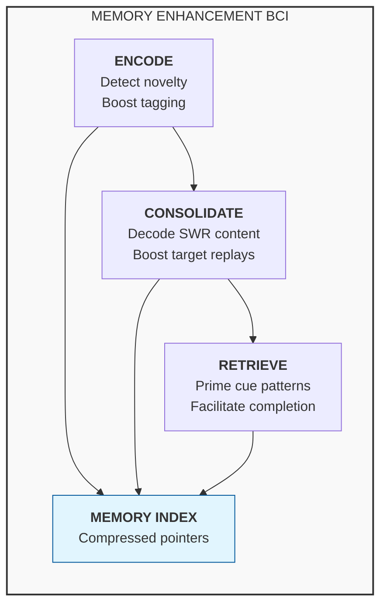
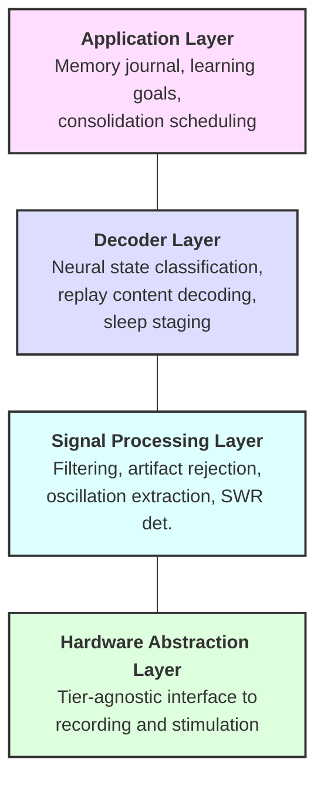
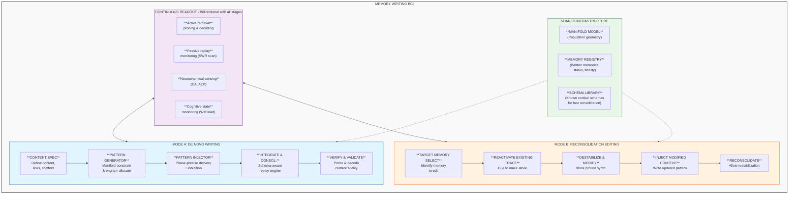
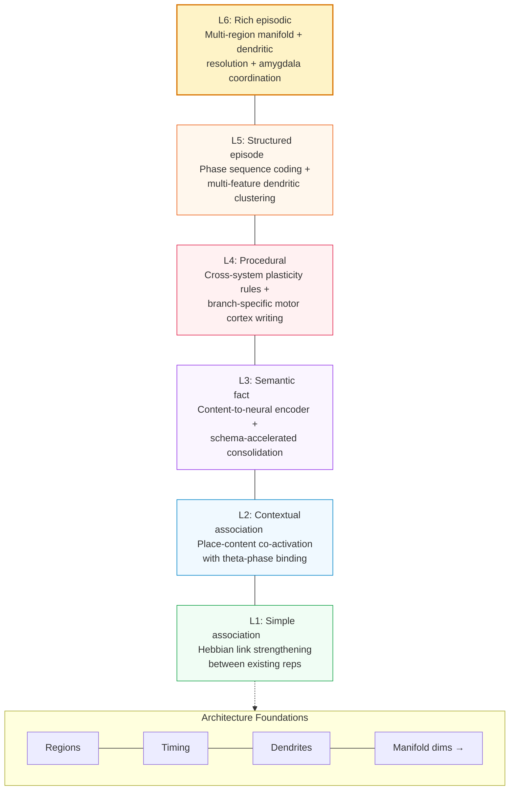

# This was written by a LLM, consider this content with skepticism

* Purpose: Test to see if AI can help with BCI research and development.

  
# Memory Enhancement BCI: Design Document

A multi-timescale, multi-modal brain-computer interface architecture for augmenting human episodic memory across encoding, consolidation, and retrieval.

---

## 1. Overview & Motivation

Human episodic memory is powerful but unreliable. We forget most of what we experience within hours, consolidation is fragile, and retrieval fails unpredictably. Existing memory BCIs target single mechanisms (e.g., replay detection or workload monitoring) but none address the full lifecycle of a memory trace from initial encoding through consolidation to retrieval.

This design proposes a **three-phase architecture** that intervenes at each stage of memory formation:

| Phase | Mechanism | Intervention |
|-------|-----------|-------------|
| **Encode** | Prediction-error detection + theta-gamma coupling | Boost attention and synaptic tagging at moments of high novelty |
| **Consolidate** | Sharp-wave ripple replay during sleep and rest | Selectively amplify content-decoded replays of target memories |
| **Retrieve** | Hippocampal index reactivation | Stimulate retrieval cues via cortical reinstatement patterns |

The system is designed in two hardware tiers (invasive and non-invasive) sharing a common software pipeline, allowing deployment across clinical and consumer contexts.

---

## 2. Neuroscience Foundations

### 2.1 Hippocampal Circuits

The hippocampus is the central hub for episodic memory. CA3 recurrent connections form an autoassociative network capable of pattern completion from partial cues ([Le Duigou et al., 2014](References.md); [Sammons et al., 2024](Memory.md); [Watson et al., 2024](Memory.md)). CA1 serves as the output stage, routing consolidated representations to neocortex via the subiculum and entorhinal cortex ([Takehara-Nishiuchi, 2014](Memory.md)).

**Design implication:** The system must monitor CA3/CA1 dynamics to detect encoding events and replay sequences. The CA3 autoassociative network is the primary target for prosthetic memory support.

### 2.2 Engrams and Memory Traces

Memory engrams are distributed ensembles of neurons whose reactivation drives recall ([Josselyn & Tonegawa, 2020](Memory.md); [Guskjolen & Cembrowski, 2023](Memory.md)). Engram cells are allocated during encoding via CREB-dependent mechanisms and are preferentially reactivated during retrieval. Recent work shows that astrocyte ensembles also participate in memory recall ([Williamson et al., 2025](Memory.md)).

**Design implication:** Rather than stimulating arbitrary neurons, interventions should target identified engram populations. Astrocytic calcium signals may serve as an additional readout of consolidation state.

### 2.3 Replay and Consolidation

Hippocampal replay compresses extended experiences into ~100ms sharp-wave ripple (SWR) events during sleep and quiet wakefulness ([Davidson et al., 2009](Memory.md); [Carr et al., 2011](Memory.md)). Replay can be forward or reverse ([Foster & Wilson, 2006](Memory.md)), occurs after even single experiences ([Berners-Lee et al., 2022](Memory.md)), and reflects specific past experiences rather than future plans ([Gillespie et al., 2021](Memory.md)).

Cortical replay of spiking sequences occurs during human memory retrieval ([Vaz et al., 2020](Memory.md)), with high-gamma reinstatement in temporal and prefrontal cortex ([Yaffe et al., 2017](Memory.md)).

**Design implication:** The consolidation module must detect SWRs in real-time, decode their content, and selectively boost replays of target memories while leaving others undisturbed.

### 2.4 Spatial Scaffolds and Cognitive Maps

Grid cells in the entorhinal cortex form toroidal population manifolds ([Gardner et al., 2022](Memory.md)) that provide a metric scaffold for both spatial and non-spatial memories ([Chandra et al., 2025](Memory.md)). Vector coding and place coding share common directional signals ([Zhou et al., 2024](Memory.md)), and theta sweeps alternate between hemispheres during navigation ([Vollan et al., 2025](Memory.md)).

**Design implication:** Grid cell scaffolds can be leveraged as "memory palaces" - artificial spatial frameworks onto which non-spatial memories are mapped, exploiting the brain's evolved spatial memory infrastructure.

### 2.5 Prefrontal-Hippocampal Interactions

Prefrontal cortex drives memory recall through feature representations ([Yadav et al., 2022](Memory.md)) and interacts with the medial temporal lobe for long-term storage ([Simons & Spiers, 2003](Memory.md)). Working memory maintenance depends on prefrontal circuitry ([Lara & Wallis, 2015](Memory.md)) while the ventromedial prefrontal cortex integrates memory with decision-making and schemas ([Weilbacher & Gluth, 2016](Memory.md); [Hebscher & Gilboa, 2016](Memory.md)).

**Design implication:** Retrieval assistance must engage prefrontal-hippocampal dialogue. The system can prime prefrontal feature representations to facilitate hippocampal pattern completion.

### 2.6 Oscillatory Signatures

Memory operations have distinct oscillatory signatures:

| Oscillation | Frequency | Role in Memory |
|-------------|-----------|---------------|
| Theta | 4-8 Hz | Encoding gate; phase-locks new information |
| Gamma | 30-100 Hz | Feature binding; content representation |
| Theta-gamma PAC | Theta phase / gamma amplitude | Organizes multi-item sequences in working memory |
| Sharp-wave ripples | 150-250 Hz | Replay and consolidation during sleep/rest |
| High gamma | 70-150 Hz | Cortical reinstatement during retrieval |
| Slow oscillations | 0.5-1 Hz | Sleep-stage gating of consolidation |

Cortical oscillations show a spectrolaminar motif across primate cortex ([Mendoza-Halliday et al., 2024](Memory.md)), and oscillatory rhythmicity itself carries information about cortical architecture ([Myrov et al., 2024](Memory.md)).

---

## 3. System Architecture

The system operates in three phases aligned with the natural memory lifecycle:



### 3.1 Phase 1: Encoding Optimization

**Goal:** Identify high-value encoding moments and strengthen synaptic tagging.

| Component | Function |
|-----------|----------|
| Prediction-error detector | Monitors mismatch between expected and actual neural activity (a proxy for novelty/surprise) |
| Theta-gamma PAC tracker | Measures phase-amplitude coupling as an index of active encoding |
| Synaptic tagging window | Detects the ~1-2 hour post-encoding window during which tagged synapses can capture plasticity-related proteins |
| Stimulation controller | Delivers timed neuromodulatory input (dopaminergic/noradrenergic) to strengthen tagging |

**Mechanism:** When the prediction-error signal exceeds threshold during strong theta-gamma coupling, the system marks this as an encoding event. Within the subsequent synaptic tagging window (~30-120 min), it delivers low-intensity stimulation to promote protein synthesis-dependent consolidation at the tagged synapses. This exploits the synaptic tagging and capture (STC) hypothesis: weak synaptic changes can be stabilized if plasticity-related proteins arrive within a critical window.

### 3.2 Phase 2: Consolidation Boosting

**Goal:** Selectively strengthen target memories during sleep and quiet rest.

| Component | Function |
|-----------|----------|
| SWR detector | Real-time detection of sharp-wave ripple events (150-250 Hz) |
| Content decoder | Classifies replay content using pre-trained neural decoders |
| Replay booster | Closed-loop stimulation timed to SWR events containing target content |
| Sleep stage monitor | Tracks slow oscillations and spindles to time interventions to NREM sleep |
| TMR controller | Delivers auditory/olfactory cues during slow-wave sleep to bias replay toward target memories |

**Mechanism:** Rather than blindly amplifying all SWRs (which could strengthen unwanted memories or interfere with natural forgetting), the system decodes replay content in real-time. Only replays matching target memory signatures receive boosting stimulation. This is combined with targeted memory reactivation (TMR) - presenting learning-associated sensory cues during NREM sleep to bias which memories get replayed.

The system also coordinates with the slow oscillation up-state and sleep spindles (the SO-spindle-ripple coupling sequence) to ensure stimulation arrives at the optimal phase for synaptic consolidation.

### 3.3 Phase 3: Retrieval Assistance

**Goal:** Facilitate recall by priming hippocampal index codes and cortical reinstatement.

| Component | Function |
|-----------|----------|
| Context detector | Identifies retrieval attempts from prefrontal activation patterns |
| Index activator | Stimulates hippocampal index codes to initiate pattern completion |
| Reinstatement monitor | Tracks cortical high-gamma reinstatement to verify successful retrieval |
| Confidence estimator | Assesses retrieval strength and provides graded assistance |

**Mechanism:** The hippocampus stores compressed "pointers" (index codes) that, when reactivated, drive reinstatement of distributed cortical representations. The system detects retrieval attempts, identifies the target memory from partial cues, and provides graded stimulation to the hippocampal index. This is more efficient than trying to reactivate the full distributed trace directly - manipulate the pointer, not the data.

---

## 4. Hardware Tiers

### 4.1 Tier 1: Invasive (Clinical/Research)

For participants with clinical indications (e.g., epilepsy patients with depth electrodes, or future implant recipients).

| Component | Specification |
|-----------|--------------|
| Recording | High-density Utah arrays or Neuropixels in hippocampus (CA1/CA3), entorhinal cortex, prefrontal cortex |
| Stimulation | Microstimulation via same electrode arrays; temporal interference (TI) for deeper targets |
| Processing | On-implant neuromorphic chip for SWR detection and spike sorting ([Liu et al., 2025](References.md)); memristor-based adaptive decoding |
| Communication | Wireless via inductive link ([Won et al., 2023](References.md)) to external processing unit |
| Power | Wireless power transfer; target <50mW for implanted components |

This tier leverages the BRAND platform for real-time closed-loop processing ([Ali et al., 2024](References.md)), which provides the infrastructure for asynchronous neural decoding with deep network models.

### 4.2 Tier 2: Non-Invasive (Consumer/Wellness)

For healthy individuals seeking memory enhancement.

| Component | Specification |
|-----------|--------------|
| Recording | High-density EEG (64-256 channels) + fNIRS for hemodynamic confirmation |
| Stimulation | Transcranial temporal interference stimulation (tTIS) for focal deep-brain targeting; transcranial alternating current stimulation (tACS) for oscillatory entrainment |
| Processing | Edge compute module (wearable) running compressed decoder models |
| Sensors | Wrist-worn autonomic monitoring (heart rate variability, skin conductance) for arousal/sleep staging |
| Form factor | Behind-ear EEG + forehead patch; sleep headband variant |

This tier trades spatial resolution for accessibility. It cannot decode individual replay content but can:
- Detect SWR-band power increases and overall consolidation state
- Entrain theta-gamma coupling during encoding via tACS
- Deliver TMR cues during detected NREM sleep
- Monitor working memory load in real-time ([Mora-Sanchez et al., 2020](References.md); [Asgher et al., 2020](References.md))

### 4.3 Shared Software Architecture

Both tiers run the same software stack, differing only in signal quality and available interventions:


---

## 5. Software Pipeline

### 5.1 Real-Time Signal Processing

| Stage | Latency Budget | Method |
|-------|---------------|--------|
| Bandpass filtering | <1 ms | IIR filters; separate theta (4-8 Hz), gamma (30-100 Hz), ripple (150-250 Hz) bands |
| Artifact rejection | <2 ms | Template matching for movement/EMG artifacts; adaptive thresholding |
| SWR detection | <10 ms | Ripple-band power threshold + duration criterion (>25 ms); validated against offline detection |
| Spike sorting | <5 ms | Neuromorphic on-chip sorting (Tier 1); not available in Tier 2 |
| Phase estimation | <5 ms | Hilbert transform on buffered theta signal for PAC computation |

**Total closed-loop latency target:** <25 ms (Tier 1), <50 ms (Tier 2)

### 5.2 Neural Decoders

| Decoder | Input | Output | Architecture |
|---------|-------|--------|-------------|
| Encoding state | Theta-gamma PAC + prediction error | Binary: encoding/not-encoding | Lightweight CNN on spectrogram features |
| Replay content | CA1 population vectors during SWR | Memory identity (from learned library) | LFADS-based latent factor model ([Ali et al., 2024](References.md)) |
| Sleep stage | EEG slow oscillations + spindles + EMG | Wake/N1/N2/N3/REM | Random forest on spectral features |
| Retrieval state | PFC activation + hippocampal theta | Retrieval attempt + target memory | Sequence-to-sequence model on neural trajectories |
| Working memory load | Frontal theta + parietal alpha | Load level (0-7 items) | LSTM ([Asgher et al., 2020](References.md)) |

All decoders use a calibration session to learn participant-specific neural signatures, then adapt online via memristor-based co-evolutionary learning ([Liu et al., 2025](References.md)).

### 5.3 Stimulation Protocols

| Protocol | Target | Parameters | Phase |
|----------|--------|-----------|-------|
| Theta entrainment | Hippocampus | 6 Hz tACS, 1-2 mA | Encoding |
| Gamma burst | Entorhinal-hippocampal | 40 Hz bursts locked to theta trough | Encoding |
| SWR boost | CA1 | Single-pulse microstim at ripple onset, 50-100 uA | Consolidation |
| SO up-state targeting | Frontal cortex | tDCS pulse at SO up-state, 0.5 mA | Consolidation |
| TMR cue | Auditory/olfactory | Learning-associated sensory cue during N3 | Consolidation |
| Index reactivation | CA3 | Patterned microstim matching index code, 20-50 uA | Retrieval |

---

## 6. Novel Design Elements

### 6.1 Hippocampal Indexing as Compression

Rather than attempting to read or write full memory traces (which are distributed across cortex), the system treats hippocampal representations as **compressed pointers**. This is inspired by hippocampal indexing theory: the hippocampus stores a sparse index code that, when reactivated, reinstates the full distributed cortical pattern.

**Advantage:** The system only needs to decode and manipulate a low-dimensional index space (~100-1000 dimensions) rather than the full cortical representation. This dramatically reduces the decoder complexity and stimulation precision required.

### 6.2 Synaptic Tagging Window Exploitation

The synaptic tagging and capture (STC) mechanism creates a ~1-2 hour window after initial encoding during which weak synaptic traces can be stabilized by plasticity-related proteins. The system detects encoding events and schedules neuromodulatory stimulation within this window.

**Protocol:**
1. Detect encoding event (prediction error + theta-gamma PAC)
2. Log timestamp and estimated trace strength
3. Within 30-120 minutes, deliver dopaminergic/noradrenergic stimulation to promote protein synthesis
4. Verify consolidation via subsequent replay detection

This exploits a natural biological mechanism that is normally governed by behavioral state (arousal, reward) but can be artificially triggered.

### 6.3 Content-Decoded Replay Boosting

Existing closed-loop SWR systems boost all detected ripples indiscriminately. This design adds a **content decoder** that classifies replay content before deciding whether to boost.

**Why this matters:**
- Not all replays are beneficial (some may maintain traumatic or irrelevant memories)
- Natural forgetting serves a function; indiscriminate boosting could cause interference
- Users can specify which memories to prioritize for consolidation

### 6.4 Grid Cell Memory Palace

Grid cells provide a metric scaffold for both spatial and conceptual representations ([Gardner et al., 2022](Memory.md); [Chandra et al., 2025](Memory.md)). The system creates artificial "memory palaces" by:

1. During encoding, pairing new information with spatial trajectories through a virtual environment
2. Stimulating grid cell patterns corresponding to specific locations during consolidation
3. During retrieval, reactivating the spatial scaffold to provide additional retrieval cues

This leverages the method of loci (a mnemonic technique dating to ancient Greece) with direct neural implementation rather than relying on voluntary imagination.

### 6.5 Predictive Coding for Novelty Detection

The system monitors prediction error signals as a natural index of information novelty. High prediction error indicates surprising, potentially important information that warrants enhanced encoding. Low prediction error indicates redundant input that can be safely compressed.

This uses the brain's own computational framework (predictive coding across the cortical hierarchy; [Felleman & Van Essen, 1991](Memory.md); [Rvachev, 2024](Memory.md)) as a relevance signal, rather than requiring the user to manually tag important moments.

### 6.6 Multi-Timescale Integration

The architecture uniquely spans three timescales:

| Timescale | Duration | Process | System Action |
|-----------|----------|---------|--------------|
| Fast | 10-100 ms | SWR replay, gamma bursts | Real-time closed-loop stimulation |
| Medium | Minutes to hours | Synaptic tagging window, working memory | Scheduled neuromodulatory support |
| Slow | Hours to days | Systems consolidation, sleep cycles | Overnight consolidation scheduling, TMR |

No existing system integrates across all three timescales with a unified memory model.

---

## 7. Risk Analysis & Open Questions

### 7.1 Safety Risks

| Risk | Severity | Mitigation |
|------|----------|-----------|
| Seizure induction from closed-loop stimulation | High | Afterdischarge detection with immediate stimulation halt; conservative current limits; epileptologist oversight |
| Unwanted memory strengthening (e.g., traumatic content) | Medium | Content decoder acts as filter; user blacklist for memory categories; default-off for emotionally tagged events |
| Interference with natural forgetting | Medium | Selective boosting (not blanket amplification); periodic "natural consolidation" windows without intervention |
| Long-term neural adaptation reducing efficacy | Medium | Adaptive stimulation parameters; periodic recalibration; stimulation holidays |
| Tissue damage from chronic implant (Tier 1) | High | Biocompatible materials; wireless power to minimize implant size; regular impedance monitoring |

### 7.2 Ethical Considerations

| Issue | Consideration |
|-------|--------------|
| Memory authenticity | Enhanced memories may feel more vivid than warranted by the original experience; users must be informed |
| Consent for consolidation targets | Who decides which memories get boosted? Must remain under user control |
| Cognitive liberty | Potential for coercive use (e.g., employer-mandated memory enhancement); requires regulatory framework |
| Equity of access | Tier 1 is surgical; Tier 2 is consumer. Performance gap creates potential inequality |
| Data privacy | Neural recordings contain intimate cognitive data; requires on-device processing and strong encryption |

### 7.3 Open Technical Questions

| Question | Current Status | Path Forward |
|----------|---------------|-------------|
| Can replay content be decoded with sufficient accuracy for selective boosting? | Demonstrated in rodents; limited human data ([Vaz et al., 2020](Memory.md)) | Piggyback on epilepsy monitoring studies for human validation |
| Does tTIS achieve sufficient focal depth for hippocampal targeting? | Promising in simulation and early trials | Requires systematic dose-finding studies |
| How long does the synaptic tagging window last in humans? | ~1-2 hours in rodent slice preparations | Human studies with behavioral + neural markers needed |
| Can theta-gamma PAC be reliably entrained non-invasively? | Inconsistent results with tACS alone | Combine tACS with behavioral task design; closed-loop phase tracking |
| Will chronic replay boosting cause runaway potentiation? | Unknown | Long-term animal studies with consolidation monitoring; homeostatic mechanisms |
| How does the system handle overlapping memory traces? | Untested | Pattern separation metrics as quality control; user disambiguation interface |

---

## 8. References

This design draws on papers catalogued in this repository:

- **[References.md](References.md)** - BCI platforms, neural decoding, speech neuroprostheses, neuromorphic hardware, memory-BCI interfaces, and workload monitoring
- **[Memory.md](Memory.md)** - Hippocampal circuits, engrams, replay dynamics, grid cells, spatial memory, prefrontal-hippocampal interactions, oscillations, and cortical organization

### Key papers by topic

| Topic | Key References |
|-------|---------------|
| Hippocampal circuits | Le Duigou et al. 2014; Sammons et al. 2024; Watson et al. 2024 |
| Engrams | Josselyn & Tonegawa 2020; Guskjolen & Cembrowski 2023; Williamson et al. 2025 |
| Replay | Davidson et al. 2009; Carr et al. 2011; Vaz et al. 2020; Berners-Lee et al. 2022; Gillespie et al. 2021 |
| Spatial scaffolds | Gardner et al. 2022; Chandra et al. 2025; Sargolini et al. 2006; Zhou et al. 2024 |
| Prefrontal memory | Yadav et al. 2022; Simons & Spiers 2003; Lara & Wallis 2015 |
| Oscillations | Mendoza-Halliday et al. 2024; Myrov et al. 2024 |
| Memory circuits | Ferguson et al. 2019; Raslau et al. 2015; Tingley & Buzsaki 2018 |
| BCI platforms | Ali et al. 2024 (BRAND); Liu et al. 2025 (memristor decoder) |
| Wireless/implant | Won et al. 2023 |
| Memory BCI | Burke et al. 2015; Mora-Sanchez et al. 2020; Asgher et al. 2020 |
| Cortical organization | Felleman & Van Essen 1991; Pang et al. 2023; Rvachev 2024 |

### Additional sources informing the design

- **MIMO hippocampal prosthesis:** Berger, Song, et al. - multi-input multi-output model replacing damaged hippocampal circuitry
- **Synaptic tagging and capture:** Frey & Morris, 1997 - the STC hypothesis for late-phase LTP
- **Targeted memory reactivation:** Rasch et al., 2007 - odor cues during sleep boost declarative memory
- **Temporal interference stimulation:** Grossman et al., 2017 - non-invasive deep brain stimulation via interfering electric fields
- **Predictive coding:** Rao & Ballard, 1999; Friston, 2005 - hierarchical prediction error as a cortical organizing principle

# Memory Reading and Writing BCI: Design Document

A brain-computer interface architecture for writing artificial memories — implanting experiences, knowledge, and skills that were never naturally encoded — via targeted neural pattern injection, integration, and verification.

---

## 1. Overview & Motivation

Memory enhancement boosts natural encoding, consolidation, and retrieval. But enhancement cannot help when there is **no natural encoding event to boost**. Anterograde amnesia patients cannot form new memories. Skill acquisition requires months of practice. Traumatic memories resist overwriting. These problems require a fundamentally different approach: **writing memories from scratch**.

Memory writing must solve six problems that enhancement never faces:

| Stage | Problem | Approach |
|-------|---------|----------|
| **Specify** | Content must be externally defined in a machine-readable format | Memory descriptor language with associative link maps |
| **Generate** | Content must be translated into participant-specific neural patterns | Manifold-constrained content-to-engram encoder |
| **Inject** | Patterns must be delivered to the correct neurons at the correct time | Multi-site patterned microstimulation with phase-precise timing |
| **Integrate** | The artificial trace must link to existing memory networks | Artificial replay injection during NREM sleep; schema-primed consolidation |
| **Read/Observe** | The stored trace must be decodable and its consolidation trackable | Multi-modal readout via retrieval probing, spontaneous replay monitoring, and neurochemical sensing |
| **Verify** | The written memory must be confirmed accurate and non-destructive | Retrieval probe with content decoding and fidelity scoring |

Reading and writing are fundamentally coupled: the system must read neural activity to calibrate the write process, monitor injection effects in real time, decode content during verification, and track consolidation over days to weeks. This bidirectional requirement — write patterns in, read content out — shapes every layer of the architecture, from electrode hardware to software pipelines. Systems neuroengineering provides the integrative framework for understanding and interacting with neural circuits at this level of bidirectional control ([Edelman et al., 2015](References.md)).

Clinical applications include prosthetic memory for hippocampal damage ([Burke et al., 2015](References.md)), PTSD memory replacement via reconsolidation editing, accelerated skill acquisition, and educational content delivery. More broadly, neuromodulation for neurological and psychiatric disorders has matured as a field ([Johnson et al., 2013](References.md)), and memory writing represents its logical extension — from modulating ongoing neural dynamics to specifying new ones. The feasibility of artificial engram creation has been demonstrated in rodents, where false place memories were optogenetically implanted in hippocampal ensembles ([Ramirez et al., 2013](#9-references)), and memory engram theory provides the conceptual framework ([Josselyn & Tonegawa, 2020](Memory.md)). Sensory neuroprostheses have already demonstrated that patterned stimulation can produce coherent percepts — from phosphene-based shape perception in visual cortex ([Chen et al., 2020](References.md)) to subretinal photovoltaic implants restoring vision ([Holz et al., 2026](References.md)) — establishing the principle that artificial neural patterns can be functionally meaningful.

A central insight of this design is that memory writing has **two modes**, not one:

| Mode | Mechanism | Best For |
|------|-----------|----------|
| **De novo writing** | Create new engram in unoccupied neural territory | Novel content with no existing trace |
| **Reconsolidation editing** | Reactivate existing memory → destabilize → inject modified content | Updating, correcting, or replacing existing memories |

---

## 2. Neuroscience Foundations

### 2.1 Engram Theory, CREB Allocation & Neurogenesis

Memory engrams are sparse, distributed neuron ensembles whose reactivation drives recall ([Josselyn & Tonegawa, 2020](Memory.md); [Guskjolen & Cembrowski, 2023](Memory.md)). During natural encoding, neurons with high CREB levels are preferentially recruited into engrams — a competitive allocation process ([Han et al., 2007](#9-references)). Engram membership is not random; it is governed by the excitability state of neurons at the time of encoding.

Critically, artificial manipulation of CREB levels can bias which neurons join an engram, and optogenetic reactivation of engram-allocated neurons is sufficient to drive recall even for events that never occurred. Ramirez et al. (2013) demonstrated this by labeling place-cell ensembles active in context A, then reactivating them during fear conditioning in context B, creating a false fear memory for context A ([Ramirez et al., 2013](#9-references)).

A particularly important class of allocatable neurons are **adult-born granule cells** in the dentate gyrus. Increasing adult neurogenesis is sufficient to improve pattern separation ([Sahay et al., 2011](#9-references)).

**Design implication:** The memory writing system should preferentially target two neuron populations: (1) high-CREB mature neurons identified via excitability profiling, and (2) adult-born DG granule cells in their critical period. The system should track neurogenesis markers to identify optimal write windows. Writing to mature, low-excitability neurons will produce weak, unstable traces.

### 2.2 CA3 Autoassociation & Pattern Completion

CA3 recurrent connections form an autoassociative network: partial input patterns are completed to full stored attractors ([Le Duigou et al., 2014](Memory.md); [Sammons et al., 2024](Memory.md); [Watson et al., 2024](Memory.md)). Human CA3 uses specific functional connectivity rules that make this completion highly efficient — approximately 20-30% of the pattern is sufficient to drive convergence to the full attractor.

However, CA3 does not simply complete patterns. The dentate gyrus upstream performs **pattern separation** — orthogonalizing similar inputs before they reach CA3 — and the balance between separation (DG) and completion (CA3) is regulated by neuromodulatory state and the relative contribution of newborn vs. mature granule cells. A written pattern that bypasses DG and enters CA3 directly will encounter the completion machinery without the orthogonalization step, risking convergence to an existing attractor rather than formation of a new one.

**Design implication:** The system can exploit CA3 pattern completion by writing only a **seed pattern** (20-30% of the target engram) and allowing autoassociative dynamics to fill in the remainder. But the seed must be sufficiently orthogonal to existing attractors — a condition that DG normally ensures but that artificial injection must verify computationally. The pattern generator must simulate attractor dynamics against the participant's known memory landscape before injection. If the seed falls within the basin of attraction of an existing engram, the write will silently overwrite or blend with that memory.

### 2.3 Hippocampal Indexing & Schema-Accelerated Consolidation

The hippocampus stores compressed index codes — sparse pointers (~100-1000 dimensions) that, when reactivated, reinstate distributed cortical representations. The full richness of a memory lives in cortex, not hippocampus. The hippocampal trace is a lookup key.

The standard model of systems consolidation holds that hippocampal-to-cortical transfer takes weeks. But this timeline is **dramatically compressed when new content matches an existing cortical schema**. Tse et al. (2007) showed that rats with an established spatial schema could consolidate new paired associations within 48 hours — compared to weeks without a schema ([Tse et al., 2007](#9-references)). The mechanism involves immediate neocortical gene activation (zif268, Arc) at encoding time when schemas exist ([Tse et al., 2011](#9-references)), bypassing the slow offline consolidation normally required.

**Design implication:** The system should implement two consolidation strategies: (1) **Schema-absent consolidation** — write the hippocampal index, then drive artificial replay over multiple nights to gradually build the cortical trace. (2) **Schema-primed consolidation** — when the written content maps onto an existing cortical schema, write the hippocampal index and deliver a single concentrated replay session. Schema-primed writes may consolidate in hours rather than days. The content specification module must assess schema compatibility and route memories to the appropriate consolidation pathway. This is the single largest efficiency gain available: schema-compatible memories are 10-100x faster to consolidate.

### 2.4 Replay, Sequence Ordering & Preplay

Sharp-wave ripple (SWR) replay compresses experiences into ~100ms bursts during sleep and quiet rest ([Davidson et al., 2009](Memory.md); [Carr et al., 2011](Memory.md)). Replay occurs after even single experiences ([Berners-Lee et al., 2022](Memory.md)) and drives cortical spiking reinstatement during retrieval ([Vaz et al., 2020](Memory.md)).

Critically, replay is not a monolithic phenomenon. **Forward replay** (events replayed in experienced order) dominates during quiet wakefulness and is associated with planning and evaluation. **Reverse replay** (events replayed backwards) dominates during reward-associated pauses and is associated with credit assignment and value updating ([Foster & Wilson, 2006](Memory.md)). The temporal ordering of cells within a ripple determines the content and function of the replay event.

Furthermore, the hippocampus generates **preplay** — sequences representing trajectories not yet experienced. Preplay suggests the hippocampal network spontaneously explores its state space, generating candidate experiences that can be "confirmed" or "rejected" by subsequent real experience.

**Design implication:** The artificial replay engine must control **sequence direction and content**, not merely trigger SWR-like bursts. For episodic memories (sequences of events), forward replay preserves narrative order and supports later sequential retrieval. For associative memories (causal relationships, skill-reward links), reverse replay from outcome to cause may be more effective for consolidation. The system should deliver a mixture of forward and reverse replays, with the ratio determined by memory type. Preplay could also be exploited: rather than writing a memory de novo, the system could detect spontaneous preplay sequences that approximate the target content and selectively reinforce them, converting exploration into memory.

### 2.5 Synaptic Plasticity & Tagging

Long-term memory formation requires protein synthesis-dependent synaptic modification. The synaptic tagging and capture (STC) mechanism creates a ~1-2 hour window: initial stimulation creates "tags" at activated synapses, and plasticity-related proteins (PRPs) must arrive within this window to stabilize the trace ([Kennedy, 2013](Memory.md)).

For memory writing, pattern injection creates the tags, but PRP delivery is not guaranteed — the brain's natural neuromodulatory systems (dopamine, norepinephrine) may not engage because no behaviorally relevant event occurred.

**Design implication:** The injection protocol must be paired with neuromodulatory support. Options include: (1) pharmacological priming (low-dose dopamine agonist to raise baseline PRP availability), (2) electrical co-stimulation of VTA/LC neuromodulatory nuclei, or (3) pairing injection with a behaviorally salient event (e.g., reward signal). The STC window constrains timing: all injection and stabilization must complete within ~1-2 hours. Multiple writing sessions may be needed for complex memories, with each session targeting a subset of the engram.

### 2.6 Spatial & Contextual Scaffolds

Grid cells in entorhinal cortex provide toroidal metric scaffolds ([Gardner et al., 2022](Memory.md)) that organize both spatial and non-spatial memories ([Chandra et al., 2025](Memory.md)). Every episodic memory has spatial and contextual components — even abstract knowledge is encoded relative to a spatial/temporal framework.

For written memories, this context must be supplied artificially. A memory without spatial context will lack the scaffolding that makes natural memories navigable and retrievable.

**Design implication:** The memory specification must include a spatial/contextual scaffold. The system can leverage the grid cell "memory palace" approach: assign each written memory a location within a virtual spatial framework, and co-activate the corresponding grid cell patterns during injection. The toroidal topology of grid cell manifolds ([Gardner et al., 2022](Memory.md)) means that relational structure (not just spatial location) can be encoded — memories that are "conceptually nearby" can be assigned adjacent positions on the torus, creating a navigable semantic topology. This goes beyond the classical method of loci: it is a general-purpose relational scaffold.

### 2.7 Inhibitory Sculpting & Disinhibition Gates

Memory engrams are defined not only by which excitatory neurons fire, but by which are **prevented** from firing. Inhibitory interneurons play three distinct roles in engram formation:

- **PV+ (parvalbumin) interneurons** provide fast perisomatic inhibition that regulates the temporal precision of pyramidal cell firing. They define the temporal window within which engram neurons must co-activate to form Hebbian associations.
- **SST+ (somatostatin) interneurons** target dendrites and regulate the size of the engram through lateral inhibition. Silencing DG SST+ interneurons during encoding increases engram size; activating them shrinks it ([Stefanelli et al., 2016](#9-references)). This is competitive exclusion: active engram cells recruit SST+ interneurons that suppress their neighbors.
- **VIP+ (vasoactive intestinal peptide) interneurons** inhibit SST+ and PV+ interneurons, creating **disinhibitory windows** that permit plasticity in target pyramidal cells ([Letzkus et al., 2015](#9-references)). Salient events trigger VIP+ activation, which releases projection neurons from inhibition.

Lovett-Barron et al. (2014) showed that during fear conditioning, cholinergic input activates dendrite-targeting interneurons in CA1, gating which sensory information is incorporated into the memory trace ([Lovett-Barron et al., 2014](#9-references)).

**Design implication:** Memory writing cannot simply activate the target excitatory neurons — it must simultaneously engineer the appropriate inhibitory landscape. This means: (1) co-activating VIP+ interneurons to open a disinhibitory plasticity window at the injection site, (2) allowing SST+ interneurons to constrain engram size to natural proportions (preventing pathologically large engrams that degrade pattern separation), and (3) timing injection to PV+ interneuron rhythms that gate the temporal precision of Hebbian binding. Ignoring the inhibitory context will produce engrams with wrong size, wrong temporal precision, and wrong integration with surrounding networks.

### 2.8 Dendritic Computation & Branch-Specific Plasticity

Memory traces are not stored at the level of whole neurons — they are stored at **individual dendritic branches**. Each pyramidal neuron has dozens of branches, and different branches can participate in different memory traces through local NMDA spikes, branch-specific calcium events, and clustered synaptic plasticity.

Govindarajan et al. (2006) proposed that translation-dependent plasticity at synapses clustered within a dendritic branch is the elementary unit of long-term memory storage ([Govindarajan et al., 2006](#9-references)). Cichon & Bhatt (2015) demonstrated this directly: different motor learning tasks induce dendritic calcium spikes on different apical tuft branches of the same layer V neuron, with branch-specific potentiation persisting for days ([Cichon & Bhatt, 2015](#9-references)). Kastellakis et al. (2015) showed that synaptic clustering within dendrites dramatically increases memory capacity and enables feature binding — related features of a memory are stored on the same branch ([Kastellakis et al., 2015](#9-references)).

**Design implication:** The standard model of memory writing — "activate neuron X" — is too coarse. True high-fidelity writing requires engaging specific **dendritic branches** within target neurons, activating clustered synapses that bind the correct features together. This has profound hardware implications: electrode or optogenetic resolution must reach the dendritic scale (~1-10 μm), not merely the somatic scale (~10-50 μm). In the near term, somatic-resolution writing is feasible but will produce low-resolution memories (correct gist, imprecise details). Dendritic-resolution writing is a prerequisite for Level 5-6 memories (§6) where sensory detail and feature binding matter.

### 2.9 Neural Manifold Constraints

Neural population activity does not occupy the full high-dimensional space of possible firing patterns. Instead, it is confined to **low-dimensional manifolds** — surfaces defined by the intrinsic connectivity of the network ([Gallego et al., 2017](#9-references)). These manifolds are stable over months even as individual neuron tuning changes ([Gallego et al., 2020](#9-references)).

Critically, Sadtler et al. (2014) demonstrated in a closed-loop BCI paradigm that when subjects are required to produce neural activity patterns **within** their intrinsic manifold, learning is rapid. When required to produce patterns **outside** the manifold, learning is severely impaired within a single session ([Sadtler et al., 2014](#9-references)). The network's recurrent connectivity acts as a filter: off-manifold perturbations are rapidly corrected back toward the manifold by recurrent dynamics.

**Design implication:** This is a fundamental constraint on memory writing that the field has not adequately addressed. Any injected pattern must lie **on the intrinsic manifold** of the target neural population, or it will be rejected by recurrent dynamics within milliseconds. The pattern generator must learn the participant's hippocampal and cortical manifolds during calibration and constrain all generated patterns to this subspace. A pattern that is semantically correct but geometrically off-manifold is as useless as random noise. This also means memory writing capacity is bounded by the dimensionality of the intrinsic manifold — you cannot write more distinct memories than the manifold has degrees of freedom to represent.

### 2.10 Phase Precession & Temporal Coding

Hippocampal place cells do not merely fire at higher rates in their preferred locations — they systematically shift their spike timing relative to the ongoing theta oscillation as the animal traverses the place field ([O'Keefe & Recce, 1993](#9-references)). This **phase precession** means that the phase of a spike relative to theta encodes the animal's position within the field with higher resolution than rate coding alone.

At the population level, phase precession compresses behavioral sequences (spanning seconds) into single theta cycles (~125 ms), bringing representations of temporally distant events into the ~20 ms window required for spike-timing-dependent plasticity (STDP) ([Skaggs et al., 1996](#9-references)). This theta-cycle compression is how the hippocampus binds sequential experiences into associative chains.

**Design implication:** Writing episodic or sequential memories requires controlling not just **which** neurons fire but **when within the theta cycle** they fire. A rate-coded injection (correct neurons, wrong timing) will produce a snapshot memory — a static scene without temporal structure. A phase-coded injection (correct neurons at correct theta phases) will produce a sequence memory — an experience with narrative flow. The injection controller must deliver stimulation pulses with theta-phase precision (~5-10 ms resolution within the ~125 ms theta cycle), with earlier phases encoding earlier events in the sequence. This doubles the information bandwidth of injection: rate encodes content identity, phase encodes temporal order.

### 2.11 Memory Readout & Retrieval Signatures

Writing a memory is only half the problem — **observing** the written trace is essential for calibration, verification, and long-term monitoring. Memory readout exploits three distinct neural signatures:

**Content-specific cortical reinstatement.** Successful retrieval reactivates the same distributed cortical patterns that were active during encoding. The fidelity of this reinstatement predicts memory accuracy and confidence. fMRI brain decoding has demonstrated that perceptual, semantic, and episodic content can be reconstructed from activity patterns across visual, temporal, and prefrontal cortex ([Du et al., 2022](References.md)). While fMRI provides spatial coverage across the whole brain, electrophysiological readout from implanted arrays provides the temporal resolution (<10 ms) required for real-time content verification during and after injection.

**Hippocampal pattern completion dynamics.** Retrieval begins with CA3 pattern completion (§2.2): a partial cue activates the stored attractor, which reinstates the full hippocampal index. The speed and fidelity of completion are directly observable readout signatures — a well-consolidated memory completes rapidly (<200 ms) and produces a high-fidelity pattern match. A weak or degrading trace shows slower completion, partial activation, or convergence to the wrong attractor. By monitoring CA3 dynamics during controlled cue delivery, the system can assess memory strength without requiring subjective report.

**Spontaneous replay reactivation.** Written memories that have been successfully consolidated should appear in spontaneous sharp-wave ripple replay during sleep and quiet wakefulness (§2.4). Their presence in replay confirms that the hippocampal network has incorporated the trace into its normal memory cycling. Conversely, absence of spontaneous replay after expected consolidation time signals a failed or degrading write. The content decoder can passively monitor for reactivation of written memory patterns, providing verification without active probing.

**Neurochemical correlates.** Memory encoding and consolidation produce measurable neurochemical signatures — dopamine release in hippocampus signals novelty and promotes plasticity, acetylcholine modulation shifts between encoding (high ACh) and consolidation (low ACh) modes. Carbon fiber electrode threads can measure neurochemical activity in deep brain structures with sub-second resolution ([Xia et al., 2023](References.md)), providing a complementary readout channel that captures neuromodulatory state rather than spiking patterns. This neurochemical readout informs whether the brain is in a state conducive to memory formation and whether the written trace triggered the expected neuromodulatory response.

**Cognitive state monitoring.** The quality of memory readout depends on the participant's cognitive state at the time of probing. Real-time monitoring of working memory load ([Mora-Sánchez et al., 2020](References.md); [Asgher et al., 2020](References.md)) can optimize the timing of verification probes — testing recall when cognitive resources are available rather than during periods of high mental workload that would impair retrieval and produce false-negative verification results.

**Design implication:** The system must implement both **active** and **passive** readout. Active readout uses controlled cue delivery and content decoding during retrieval. Passive readout monitors spontaneous replay for evidence of written memory reactivation. Neurochemical sensing provides a third, orthogonal readout channel reflecting neuromodulatory state rather than content. These three channels — electrophysiological content decoding, replay monitoring, and neurochemical sensing — are complementary: each captures information the others miss. A written memory should produce converging evidence across all three channels; divergence signals a problem.

---

## 3. System Architecture

The system operates in two modes — **de novo writing** and **reconsolidation editing** — that share infrastructure but differ in their entry point and biological mechanism:



### 3.1 Content Specification

The content specification module translates human-readable memory descriptions into machine-processable formats.

| Component | Function |
|-----------|----------|
| Memory descriptor | Structured specification of memory content: semantic content, sensory features, emotional valence, temporal sequence (with phase-coding annotations for sequential memories). Natural input modalities including inner speech ([Kunz et al., 2025](References.md)) could serve as a high-bandwidth content specification channel — the participant describes the memory they want written, and motor-cortical speech representations are decoded into the descriptor format. Imagined speech decoding using graph contrastive learning on brain dynamics ([Niu et al., 2025](References.md)) extends this to naturalistic BCI settings where overt speech is not possible |
| Associative link map | Defines which existing memories the new memory should connect to (retrieval routes) |
| Spatial/relational scaffold | Grid cell manifold coordinates — position on the toroidal scaffold encoding both spatial location and conceptual topology |
| Schema compatibility checker | Assesses whether content maps onto an existing cortical schema (routes to fast or slow consolidation pathway) |
| Complexity class | Assigns the memory to a complexity level (see §6) which determines the writing protocol |

### 3.2 Neural Pattern Generation

The pattern generator translates content specifications into participant-specific neural activation patterns, subject to manifold constraints.

| Component | Function |
|-----------|----------|
| Manifold-constrained encoder | Generative model (VAE/diffusion) that outputs patterns guaranteed to lie on the participant's intrinsic neural manifold; rejects off-manifold solutions. The architecture draws on latent diffusion approaches that have demonstrated bidirectional mapping between semantic content and neural representations ([Takagi & Nishimoto, 2023](References.md); [Lu et al., 2023](References.md)) — here applied in the generative (content→neural) direction rather than the reconstructive (neural→content) direction |
| Engram allocator | Identifies write-eligible neurons: high-CREB mature neurons + critical-period newborn DGCs; avoids neurons committed to existing engrams |
| Partial-pattern optimizer | Computes minimal seed pattern (~20-30% of engram) sufficient for CA3 autoassociative completion; verifies orthogonality to existing attractors |
| Phase-sequence encoder | For sequential memories, assigns theta-phase timing to each element; earlier events → earlier theta phases |
| Inhibitory context generator | Specifies the required VIP+/SST+/PV+ interneuron activation pattern to create the appropriate disinhibitory window and constrain engram size |
| Index synthesizer | Generates compressed hippocampal index code (~100-1000 dims) encoding the content pointers |

The encoder leverages the BRAND platform for real-time neural computation ([Ali et al., 2024](References.md)), running the generative model with manifold projection as a hard constraint.

### 3.3 Pattern Injection

| Component | Function |
|-----------|----------|
| Multi-site stimulator | Delivers patterned microstimulation to target neuron populations across hippocampus and entorhinal cortex |
| Phase-precise timer | Locks injection to specific theta phases: content identity at theta trough (maximal plasticity), sequence position encoded by phase offset within cycle |
| Inhibitory co-stimulator | Activates VIP+ interneurons to open disinhibitory window at injection site; allows SST+ lateral inhibition to regulate engram boundaries |
| Dosage regulator | Controls stimulation intensity based on real-time neural response; prevents over-excitation |
| State monitor | Verifies brain state is receptive (awake-quiet for initial injection; NREM for replay consolidation) |
| Manifold tracker | Real-time verification that evoked population activity remains on the intrinsic manifold; aborts if activity is pushed off-manifold |

### 3.4 Integration & Consolidation

| Component | Function |
|-----------|----------|
| Artificial replay generator | Creates synthetic ~100ms SWR-like sequences with controlled forward/reverse ordering and phase structure |
| Schema router | Directs schema-compatible memories to fast consolidation pathway; schema-absent memories to standard multi-night replay |
| Sleep-stage coordinator | Times replay delivery to NREM SO-spindle-ripple coupling windows |
| Cortical distribution monitor | Tracks emergence of cortical traces via high-gamma reinstatement patterns |
| Interference detector | Monitors for degradation of existing memories during consolidation |

### 3.5 Reconsolidation Editor (Mode B)

| Component | Function |
|-----------|----------|
| Memory reactivator | Delivers cues that reactivate the target memory, opening the reconsolidation window (~5-6 hours) |
| Lability detector | Confirms the trace has destabilized (signatures: AMPA receptor internalization, protein synthesis dependence) |
| Content modifier | Injects updated pattern elements during the labile phase, overwriting specific engram components |
| Restabilization monitor | Tracks protein synthesis-dependent restabilization; verifies modified content is incorporated |

This mode exploits the reconsolidation mechanism ([Nader et al., 2000](#9-references); [Monfils et al., 2009](#9-references); [Schiller et al., 2010](#9-references)): retrieved memories become transiently labile and protein synthesis-dependent, creating a window during which the trace can be modified before restabilization.

### 3.6 Verification & Validation

| Component | Function |
|-----------|----------|
| Retrieval probe | Presents cues designed to trigger recall of the written memory |
| Content decoder | Decodes neural activity during retrieval to verify content matches specification |
| Fidelity scorer | Quantifies match between intended and actual memory content (see §5.3) |
| Manifold consistency checker | Verifies the written trace occupies a stable point on the neural manifold (not a transient off-manifold perturbation that will decay) |
| Side-effect detector | Checks for unintended changes to existing memories or neural function |

The verification system uses adaptive decoding with memristor-based co-evolutionary learning ([Liu et al., 2025](References.md)) for real-time content assessment. The decoder architecture leverages advances in neural-to-content reconstruction — latent diffusion models can reconstruct high-resolution perceptual content from brain activity ([Takagi & Nishimoto, 2023](References.md)), and controlled reconstruction methods can decode both semantic and structural features ([Lu et al., 2023](References.md)). These approaches, originally developed for fMRI, provide the architectural template for the electrophysiological content decoder used in verification. The broader landscape of fMRI brain decoding methods ([Du et al., 2022](References.md)) informs the multi-modal decoding strategy: different content types (visual, semantic, spatial, temporal) require different decoder architectures, and the verification system must deploy the appropriate decoder based on the memory's complexity class (§6).

### 3.7 Memory Reading & Continuous Observation

Unlike write-once-verify-once paradigms, memory writing requires **continuous observation** across three timescales:

| Timescale | Readout Mode | What It Reveals |
|-----------|-------------|-----------------|
| **Real-time** (ms) | Evoked response monitoring during injection | Whether stimulation produced the intended activation pattern; manifold adherence; immediate off-target effects |
| **Session** (minutes–hours) | Active retrieval probing + neurochemical sensing | Whether the written trace is accessible via cue-driven recall; whether neuromodulatory state supports stabilization |
| **Longitudinal** (days–weeks) | Passive replay monitoring + periodic retrieval probes | Whether the trace is consolidating normally; whether schema-driven drift remains within tolerance; whether existing memories are degrading |

| Component | Function |
|-----------|----------|
| Spontaneous replay scanner | Monitors SWR content during sleep and quiet rest for reactivation of written memory patterns; uses the content decoder to identify written-memory replay events among natural replay |
| Neurochemical state monitor | Tracks dopamine and acetylcholine dynamics via carbon fiber electrode threads ([Xia et al., 2023](References.md)) to verify neuromodulatory support for plasticity; confirms encoding-state (high ACh) during injection and consolidation-state (low ACh) during replay |
| Cognitive state tracker | Monitors working memory load ([Mora-Sánchez et al., 2020](References.md); [Asgher et al., 2020](References.md)) to time verification probes for periods of low cognitive load, avoiding false-negative assessments caused by retrieval competition |
| Consolidation progress estimator | Tracks the emergence of cortical reinstatement patterns over multiple sessions; estimates consolidation percentage based on cortical trace strength relative to hippocampal index strength |
| Longitudinal drift tracker | Compares decoded content at each readout session against the original specification; quantifies schema-mediated drift and flags when content has shifted beyond acceptable tolerance |
| Memory registry updater | Records all readout results in the memory registry (§3 shared infrastructure); updates memory status (injected → consolidating → consolidated → verified; or degrading → re-injection needed) |

The continuous observation system serves a dual purpose: it verifies individual written memories **and** it monitors the health of the broader memory ecosystem. A written memory that consolidates correctly but causes subtle interference with existing memories would be missed by write-only verification. Longitudinal observation catches these second-order effects.

---

## 4. Hardware Requirements

Artificial memory writing is **Tier 1 (invasive) only**. Non-invasive approaches (EEG, tACS, tTIS) lack the spatial resolution to write specific neural patterns to identified neuron populations. Tier 2 supports enhancement because it only needs to modulate ongoing activity; writing requires specifying and delivering precise activation patterns.

### 4.1 Write-Capable Electrode Arrays

| Specification | Memory Writing | Memory Enhancement |
|--------------|----------------|-------------------------------|
| Channel count | 1000+ per hemisphere | 100-256 (Tier 1) |
| Electrode pitch | <50 μm (somatic); <10 μm (dendritic, future) | ~400 μm (Utah array) |
| Coverage | Bilateral hippocampus (CA1, CA3, DG) + entorhinal cortex + prefrontal cortex | Unilateral hippocampus + prefrontal cortex |
| Stimulation capability | Patterned multi-site microstimulation (independent current per channel) + phase-precise timing (<5 ms jitter) | Single-site or paired-site stimulation |
| Read/write ratio | Simultaneous read-write on adjacent channels | Primarily read; occasional write |
| Interneuron access | Cell-type-specific channels for VIP+/SST+ co-stimulation | Not required |
| Neurochemical sensing | Carbon fiber electrode threads for dopamine/acetylcholine monitoring ([Xia et al., 2023](References.md)) | Not required |
| Readout channels | Dedicated high-impedance recording channels for content decoding during and after injection; must operate simultaneously with stimulation on adjacent channels | Primarily recording only |

Hardware platforms are converging on the specifications required for memory writing. The wireless subdural array by Jung et al. (2025) achieves 65,536 electrodes with 1,024 simultaneous recording channels in a fully wireless, subdural-contained form factor ([Jung et al., 2025](References.md)) — approaching the channel count needed for bilateral hippocampal coverage. Hettick et al. (2025) demonstrate minimally invasive implantation of scalable high-density cortical microelectrode arrays capable of both multimodal neural decoding and stimulation ([Hettick et al., 2025](References.md)), directly addressing the simultaneous read-write requirement. Flexible substrate technologies ([Tang et al., 2023](References.md)) improve chronic biocompatibility and conformability to hippocampal geometry, and wireless power/data architectures ([Won et al., 2023](References.md)) eliminate transcutaneous connectors. Bio-inspired and biohybrid neural interfaces ([Boufidis et al., 2025](References.md)) offer a path toward electrodes that integrate with neural tissue rather than merely contacting it — soft, living interfaces that reduce chronic immune response and may improve long-term signal stability for the years-long implantation periods memory writing requires. The key remaining constraint is achieving read-write interleaving at the required spatial density within deep structures — current high-density arrays target cortical surface, not hippocampal depth.

### 4.2 Optogenetic Delivery

Cell-type-specific activation provides precision that electrical stimulation cannot achieve. Optogenetic approaches use viral vectors (AAV) to express light-sensitive opsins (e.g., ChR2, ChRmine) in target neuron populations. For memory writing, cell-type specificity is not a luxury — it is essential for independently controlling excitatory engram neurons and inhibitory interneuron subtypes.

| Approach | Precision | Speed | Cell-Type Specificity | Suitability |
|----------|-----------|-------|-----------------------|-------------|
| Electrical microstimulation | ~50-100 μm radius | <1 ms | None (activates all nearby cells) | Broad-field activation; cannot selectively target interneuron subtypes |
| Optogenetic (ChR2/AAV) | Single-cell-type | ~1-5 ms | Yes (promoter-dependent) | Separate opsins for excitatory (CaMKII) and inhibitory (PV-Cre, VIP-Cre) populations |
| Two-photon holographic optogenetics | Single-cell (~1 μm) | ~5-10 ms | Yes | Highest precision; dendritic-scale targeting possible; limited to superficial tissue |
| Combined electrical + multi-opsin | Cell-type writing + broad-field read | <1-5 ms | Yes (multi-opsin) | Optimal for memory writing: excitatory engram + inhibitory context + electrical readout |

Recent work has clarified how intracortical microstimulation (ICMS) engages neural circuits at the mechanistic level. Hughes et al. (2026) characterize the neural mechanisms underlying ICMS for sensory restoration, showing that stimulation activates both direct and polysynaptic pathways with distinct temporal profiles ([Hughes et al., 2026](References.md)). Understanding these propagation dynamics is critical for memory writing: the injected pattern will spread through local circuits via these same mechanisms, and the pattern generator must account for polysynaptic activation when computing the target stimulation pattern. Kim et al. (2025) advance high-dimensional stimulation with flexible electrodes, demonstrating that precise synthetic neural codes can be delivered through multi-electrode patterns ([Kim et al., 2025](References.md)) — moving toward the kind of patterned, multi-site injection that memory writing requires. The precedent set by visual neuroprostheses — where patterned stimulation of visual cortex produces coherent shape perception ([Chen et al., 2020](References.md)) — demonstrates that artificial activation patterns can produce functionally meaningful neural representations, not merely noise.

### 4.3 Pharmacological Support Infrastructure

The synaptic tagging and capture mechanism (§2.5) requires neuromodulatory support that may not occur naturally during artificial memory injection. Pharmacological priming is one mitigation strategy, and delivery precision matters: systemic drug administration affects the entire brain, but memory writing requires region-specific neuromodulatory support. Carbon dots — biocompatible nanoparticles capable of crossing the blood-brain barrier — offer a potential targeted delivery vehicle for dopamine agonists or protein synthesis enhancers to hippocampal targets ([Zhang W et al., 2021](References.md)). While this approach remains preclinical, it addresses a genuine gap: the need for spatially targeted pharmacological support during a temporally precise writing procedure.

### 4.4 Processing Requirements

| Requirement | Memory Writing | Memory Enhancement |
|-------------|----------------|-------------------------------|
| Decoder type | Generative (content → manifold-constrained neural pattern) | Discriminative (neural pattern → label) |
| Latency budget | <10 ms (injection must lock to specific theta phase) | <25 ms (closed-loop stimulation) |
| Compute | On-implant neuromorphic + external GPU cluster; neuromorphic architectures designed for brain rewiring applications ([Chiappalone et al., 2022](References.md)) provide the on-implant substrate | On-implant neuromorphic chip |
| Model complexity | Manifold-constrained VAE/diffusion generative model + attractor landscape simulator | CNN/LFADS classifier |
| Calibration data | Paired (content, neural) recordings over weeks + manifold estimation from spontaneous activity | Neural recordings during task performance |
| Storage | Full memory registry + pattern library + manifold model + schema library | Memory index library |

---

## 5. Software Pipeline

### 5.1 Content-to-Neural Encoder

The encoder translates content specifications into neural activation patterns via a five-stage pipeline:

| Stage | Input | Output | Method |
|-------|-------|--------|--------|
| Content embedding | Memory descriptor (text, sensory features, associations, temporal sequence) | High-dimensional content vector (2048-dim) | Multimodal transformer encoder; architecture parallels the latent space used in neural reconstruction models ([Takagi & Nishimoto, 2023](References.md)) but operates in the inverse direction |
| Manifold projection | Content vector + participant manifold model | Target pattern constrained to intrinsic neural manifold | Manifold-constrained latent diffusion model; the diffusion process is conditioned on the content vector and constrained to the participant's neural manifold at each denoising step; rejection sampling for off-manifold proposals |
| Attractor verification | Manifold-constrained pattern + existing attractor landscape | Verified pattern with confirmed unique basin of attraction | Simulate CA3 recurrent dynamics; verify convergence to novel attractor, not blend with existing |
| Partial pattern extraction | Verified full engram pattern | Seed pattern (20-30% of neurons) with phase-timing annotations | CA3 attractor basin analysis; select minimal activating set; assign theta-phase positions |
| Index synthesis | Full engram pattern + associative link map | Compressed hippocampal index (~100-1000 dims) | Learned index compression matching participant's indexing statistics |

The manifold-constrained VAE is trained on two data sources: (1) paired (content, neural) recordings during natural encoding of known content (weeks of calibration), and (2) spontaneous activity recordings for manifold estimation (recorded during rest/sleep). The manifold model is updated continuously as the participant's neural geometry evolves.

### 5.2 Injection Controller

| Stage | Latency Budget | Method |
|-------|---------------|--------|
| Theta phase estimation | <2 ms | Real-time Hilbert transform on hippocampal LFP |
| Phase-sequence scheduling | <1 ms | Map temporal sequence elements to theta-phase positions; precompute per-cycle delivery schedule |
| Pattern loading | <1 ms | Pre-computed patterns buffered in on-implant memory |
| Inhibitory pre-activation | <2 ms | VIP+ opsin pulse to open disinhibitory window ~10 ms before excitatory injection |
| Stimulation delivery | <3 ms | Parallel current sources + optogenetic pulses; one per target channel |
| Manifold tracking | <1 ms | Project evoked population vector onto manifold; compute residual |
| Adaptation | <2 ms | Online adjustment of stimulation amplitude based on evoked response and manifold adherence; adaptive neuromodulation principles ([Lampert et al., 2025](References.md)) applied at the single-injection timescale |
| Polysynaptic propagation model | Pre-computed | Predicts how injected current will propagate through direct and polysynaptic pathways ([Hughes et al., 2026](References.md)); stimulation parameters are pre-compensated for downstream activation to ensure the net evoked pattern matches the target |

**Total injection latency target:** <10 ms (must complete within a single theta-phase window, delivering sequence elements across the ~125 ms theta cycle with ~5-10 ms phase precision). The injection controller implements the high-dimensional stimulation paradigm demonstrated by Kim et al. (2025), delivering independent current patterns across dozens of electrodes simultaneously to produce precise synthetic neural codes ([Kim et al., 2025](References.md)).

### 5.3 Verification Decoder

| Metric | Method | Threshold |
|--------|--------|-----------|
| Pattern similarity | Cosine similarity between target and evoked population vectors | >0.85 for initial injection; >0.90 after consolidation |
| Manifold residual | Distance of evoked pattern from nearest point on intrinsic manifold | <0.1 normalized manifold units (on-manifold) |
| Retrieval latency | Time from cue onset to hippocampal pattern completion | <500 ms (comparable to natural recall) |
| Content fidelity | Decoded content vs. specification using cross-validated decoder | >0.80 semantic similarity score |
| Sequence integrity | Phase-decoded temporal order vs. specified sequence | Kendall tau >0.90 for sequential memories |
| Interference check | Probe retrieval of 10 existing memories pre/post writing | <0.05 fidelity degradation on any existing memory |
| Subjective report | Participant describes the memory; scored against specification | Qualitative match on key content elements |

### 5.4 Artificial Replay Engine

The replay engine generates synthetic sharp-wave ripple sequences containing the written memory content, timed to the SO-spindle-ripple coupling window during NREM sleep.

| Parameter | Value | Rationale |
|-----------|-------|-----------|
| Replay duration | ~80-120 ms | Matches natural SWR duration ([Davidson et al., 2009](Memory.md)) |
| Replay rate | 1-3 per minute during target NREM periods | Conservative; natural rate is ~1-3 SWR/min |
| Timing lock | SO up-state → spindle trough → ripple | Matches natural SO-spindle-ripple coupling |
| Sequence direction | Forward (60%) + reverse (40%) for episodic; reverse-dominant (80%) for reward-associated | Forward preserves narrative; reverse supports credit assignment ([Foster & Wilson, 2006](Memory.md)) |
| Content | Compressed written memory content in SWR-band temporal code with theta-phase structure preserved | Derived from injection pattern via temporal compression |
| Schema-primed sessions | 1 concentrated session (2-3 hours) for schema-compatible memories | Tse et al. 2007/2011: schema-matching content consolidates in hours |
| Schema-absent sessions | Minimum 3 sleep cycles over 1-3 nights | Standard systems consolidation timeline |
| Interference avoidance | Suppress artificial replay when natural replay of other content is detected | Uses content decoder |

### 5.5 Memory Readout Pipeline

The readout pipeline operates continuously across three channels, producing a unified assessment of each written memory's status:

| Channel | Input | Output | Method |
|---------|-------|--------|--------|
| Electrophysiological content readout | Multi-channel hippocampal + cortical recordings during cue-driven retrieval or spontaneous replay | Decoded memory content + pattern similarity to specification | Content decoder (§5.3) applied to retrieval-evoked or replay-evoked activity; cosine similarity against stored target pattern |
| Neurochemical state readout | Carbon fiber electrode signals ([Xia et al., 2023](References.md)) from hippocampal DA and ACh channels | Neuromodulatory state classification (encoding-favorable / consolidation-favorable / neutral) | Real-time neurotransmitter concentration estimation; threshold-based state classification |
| Cognitive context readout | Broadband cortical recordings from prefrontal channels | Working memory load estimate; attention state | LSTM-based workload classifier ([Asgher et al., 2020](References.md)); used to gate verification probe timing |

**Readout scheduling:**

| Phase | Active Readout | Passive Readout | Neurochemical Readout |
|-------|---------------|----------------|----------------------|
| During injection | Evoked response decoding (real-time) | — | DA release confirmation |
| Post-injection (0-2 hrs) | Retrieval probe every 15 min | SWR content monitoring | ACh state tracking (encoding → consolidation transition) |
| First sleep cycle | — | Replay monitoring for written content in SWRs | ACh suppression confirmation (consolidation mode) |
| 24 hours | Full retrieval probe battery | Spontaneous replay scan during rest | — |
| 1 week | Retrieval probe + content fidelity scoring | Replay frequency tracking | — |
| 1 month | Long-term retention check | Replay frequency (expect decline as cortical trace strengthens) | — |

**Convergence criterion:** A memory is classified as "successfully written and consolidated" when: (1) active retrieval produces content fidelity >0.80, (2) spontaneous replay of the written content was detected in at least 2 of the first 3 post-injection sleep cycles, and (3) no existing memory shows fidelity degradation >0.05. If any channel reports failure while others report success, the memory is flagged for manual review — channel disagreement often indicates partial writes or unexpected integration patterns.

---

## 6. Memory Complexity Hierarchy

Not all artificial memories are equally difficult to write. The following hierarchy orders memory types from simplest to most complex, grounded in the specific circuit-level challenges at each level:

| Level | Memory Type | Example | Write Target | Key Circuit Challenge | Estimated Feasibility |
|-------|-------------|---------|-------------|----------------------|----------------------|
| 1 | Simple association | "X paired with Y" | CA3 Hebbian link between two existing representations | Minimal: strengthen single synapse population; no new engram needed | Near-term (demonstrated in rodents) |
| 2 | Contextual association | "X happened in place Y" | Place cell + content cell co-activation in CA1 | Requires coordinating place and content cells; phase timing matters for binding | Near-term (variant of Ramirez et al. 2013) |
| 3 | Semantic fact | "The capital of France is Paris" | Hippocampal index pointing to cortical semantic representations | Requires content-to-neural encoder; index must activate correct cortical targets via consolidation | Medium-term |
| 4 | Procedural skill | Motor sequence for a new task | Hippocampal-striatal-cerebellar circuit coordination | Multi-region writing with different plasticity rules per region; requires dendritic-branch precision in motor cortex ([Cichon & Bhatt, 2015](#9-references)) | Medium-term |
| 5 | Structured episode | Meeting with specific people, topics, outcomes | Multi-feature hippocampal index + theta-phase sequence coding | Phase precession structure required; multiple sensory modalities bound via dendritic clustering; inhibitory context must be precisely sculpted | Long-term |
| 6 | Rich episodic memory | Full sensory experience with emotion, context, narrative | Distributed hippocampal-cortical trace with amygdala involvement | Full manifold-constrained multi-region writing with dendritic resolution; emotional valence requires amygdala-hippocampal coordination; no current technology sufficient | Speculative |



The key insight is that each level adds a qualitatively different challenge, not merely a quantitative one. L1→L2 adds spatial binding. L2→L3 adds the encoding problem (content has no natural neural representation). L3→L4 adds multi-system coordination with incompatible plasticity rules. L4→L5 adds temporal structure (phase coding). L5→L6 adds emotional valence and the full manifold constraint across distributed cortex.

---

## 7. Novel Design Elements

### 7.1 Partial-Pattern Writing via CA3 Completion

Rather than writing every neuron of a target engram, the system writes only a 20-30% seed pattern and relies on CA3 autoassociative dynamics to complete the remainder (§2.2). This is the core efficiency insight of the architecture.

**Protocol:**
1. Generate full target engram pattern (pattern generator §3.2)
2. Verify the full pattern occupies a unique basin of attraction in CA3 (attractor verification, §5.1)
3. Compute minimal seed: the smallest subset that reliably converges to the full attractor in simulation
4. Inject seed pattern via patterned microstimulation with VIP+ disinhibitory pre-pulse
5. Monitor CA3 population dynamics for attractor convergence (within ~200 ms)
6. If convergence to wrong attractor: abort, adjust seed (increase size or reposition), retry

**Risk:** Wrong attractor convergence creates a blend or substitution memory. The probability of misconvergence increases with memory load — a hippocampus storing many memories has more crowded attractor basins. The system must maintain a running estimate of attractor density and refuse writes when basin spacing falls below a safety threshold.

### 7.2 Index-First Writing Strategy

Instead of writing a complete memory trace, write only the hippocampal index code and let natural consolidation build the cortical representation.

**Advantage:** Reduces the write problem to a single region (hippocampus) and leverages the brain's own consolidation machinery for cortical trace formation.

**Critical refinement — schema routing:** The consolidation timeline depends entirely on whether the written content matches an existing cortical schema. Schema-compatible writes (e.g., a new fact within a well-learned domain) can consolidate in hours via immediate neocortical gene activation ([Tse et al., 2011](#9-references)). Schema-absent writes (e.g., entirely novel content domain) require the standard multi-night replay pathway. The content specification module must assess schema compatibility and route accordingly.

**Limitation:** The cortical trace will be shaped by the participant's existing representations. Written memories may drift from specification as consolidation adapts them to prior knowledge. For schema-primed writes, this drift is a feature (rapid integration) but also means the written memory may be subtly transformed by the schema. Verification (§3.6) must track this drift across consolidation sessions.

### 7.3 Reconsolidation-Based Memory Editing

For many clinical applications (PTSD treatment, memory correction, phobia reduction), the goal is not to write a new memory from scratch but to **modify an existing one**. Reconsolidation editing exploits the finding that retrieved memories become transiently labile ([Nader et al., 2000](#9-references)), creating a window during which the trace can be updated.

**Protocol:**
1. Present cue to reactivate target memory; verify reactivation via hippocampal pattern decoding
2. Confirm lability onset (reconsolidation window: ~10 min to ~6 hours post-reactivation; [Monfils et al., 2009](#9-references))
3. Inject modified content pattern during the labile phase — updated elements only, preserving the existing trace scaffold
4. Allow restabilization (protein synthesis-dependent, ~6 hours)
5. Verify modified content via retrieval probe at 24 hours and 1 week

**Advantage over de novo writing:** Reconsolidation editing does not require engram allocation, manifold-novel patterns, or full consolidation — it modifies an existing trace in place. The modified memory inherits the original's associative connections, spatial context, and consolidation status. This makes it far more practical for near-term clinical applications than de novo writing.

**Key constraint:** Not all memories reconsolidate upon retrieval. Strong, well-consolidated memories and memories retrieved in routine contexts may resist destabilization. The system must confirm lability before proceeding, and abort if the trace remains stable.

### 7.4 Manifold-Constrained Injection

Every injected pattern must lie on the intrinsic manifold of the target neural population (§2.9). This is not merely a quality check — it is a hard physical constraint.

**Implementation:**
1. During calibration, estimate the neural manifold from spontaneous activity using dimensionality reduction (GPFA, LFADS, or autoencoder)
2. The generative model is trained with a manifold-consistency loss: proposed patterns are penalized for off-manifold residual
3. During injection, the manifold tracker projects the real-time evoked population vector onto the manifold and computes the residual
4. If the residual exceeds threshold, the system immediately adjusts stimulation parameters to bring activity back on-manifold

**Implication for capacity:** The dimensionality of the hippocampal manifold (estimated at ~20-50 independent dimensions in rodent CA1) sets a theoretical upper bound on the number of distinct writable memories. Memory capacity scales exponentially with manifold dimensionality but is further limited by attractor basin spacing. The system should estimate remaining capacity before each write and warn when approaching saturation.

### 7.5 Inhibitory Landscape Engineering

Memory writing requires sculpting the inhibitory surround, not just activating excitatory targets (§2.7).

**Three-phase inhibitory protocol:**
1. **Open the gate** — Activate VIP+ interneurons at the injection site ~10 ms before excitatory stimulation. VIP+ cells inhibit SST+ and PV+ interneurons, creating a transient disinhibitory window that permits plasticity in target pyramidal cells.
2. **Write the pattern** — Deliver excitatory stimulation during the disinhibitory window. Active pyramidal cells recruit local SST+ interneurons via lateral excitation.
3. **Close the gate** — Allow SST+ lateral inhibition to suppress surrounding non-target neurons, naturally constraining engram size to ~2-5% of the local population (matching natural engram sparsity; [Stefanelli et al., 2016](#9-references)).

Without inhibitory engineering, two failure modes emerge: (1) engrams that are too large (inadequate SST+ suppression), which degrade pattern separation and cause interference with existing memories, or (2) engrams that fail to stabilize (inadequate disinhibitory gating), which decay within hours.

### 7.6 Phase-Sequence Writing for Episodic Memory

Episodic memories are not static snapshots — they are temporal sequences. Writing them requires encoding temporal order via theta-phase precession (§2.10).

**Protocol:**
1. Decompose the episodic memory specification into an ordered sequence of scene elements (S₁, S₂, ... Sₙ)
2. Assign each element to a theta-phase position: S₁ at late theta phase (360°), Sₙ at early theta phase (~0°), intermediate elements linearly interpolated
3. During injection, deliver stimulation for each element at its assigned phase within a single theta cycle (~125 ms)
4. Repeat across multiple theta cycles to build STDP-mediated associative links between sequential elements
5. During artificial replay, preserve the phase structure in the compressed SWR-format sequence

**Capacity:** A single theta cycle can encode ~5-7 sequential elements (limited by the ~20 ms inter-element spacing required for STDP). Longer sequences require chaining across multiple theta cycles, with overlap at boundaries. This matches the known capacity limit of hippocampal sequence coding and explains why episodic memories have a natural "chunk" structure.

### 7.7 Associative Bridging

A written memory without connections to existing knowledge is an island — hard to retrieve and likely to be forgotten. Associative bridging creates retrieval routes by co-activating existing engrams during the consolidation phase.

**Protocol:**
1. Identify 3-5 existing memories that should associate with the new memory (specified in the associative link map, §3.1)
2. During artificial replay of the written memory, follow each replay with brief reactivation of the linked existing engrams
3. The temporal proximity (~200-500 ms) engages Hebbian association, creating synaptic links between the new and existing traces
4. Over multiple replay cycles, these links strengthen into stable retrieval routes

This mimics the natural process by which new experiences become integrated with prior knowledge through interleaved replay. For schema-compatible memories, bridging accelerates integration; for schema-absent memories, it is essential for preventing orphaned traces.

### 7.8 Memory Authentication Watermarks

Artificial memories should be distinguishable from natural ones — both for the participant's self-knowledge and for forensic/legal purposes. The system embeds neural "watermarks" during writing.

**Approach:** During injection, a subtle secondary pattern is co-activated alongside the memory content. This pattern is below the threshold for conscious awareness but detectable by the BCI during readout. The watermark encodes: (1) timestamp of writing, (2) content specification hash, (3) writing system version, (4) de novo vs. reconsolidation mode.

**Purpose:** Prevents artificial memories from being confused with natural experiences; enables participants to query "was this memory written?"; provides accountability in forensic and legal contexts where memory authenticity matters.

### 7.9 Closed-Loop Read-During-Write

The most powerful application of memory readout is **real-time content decoding during the injection itself** — reading the memory as it is being written.

**Protocol:**
1. During injection, a subset of recording channels continuously decode the evoked population pattern
2. The decoded content is compared against the target specification in real-time (<10 ms loop)
3. If the decoded content diverges from the target (e.g., the injected pattern is being pulled toward an existing attractor), the injection controller adjusts stimulation parameters within the same theta cycle
4. After each theta cycle, the system assesses whether the written content matches the specification or whether additional injection cycles are needed

**Advantage over post-hoc verification:** Post-hoc verification can detect failed writes but cannot prevent them. Read-during-write closes the loop at the timescale of injection itself, turning memory writing from an open-loop procedure (inject, wait, check) into a closed-loop one (inject, read, adjust, repeat). This is analogous to the closed-loop BCI paradigm that BRAND enables for motor decoding ([Ali et al., 2024](References.md)), but applied in the generative (write) direction.

**Hardware requirement:** Simultaneous stimulation and recording on spatially interleaved channels. Stimulation artifacts must be suppressed within ~1 ms to allow readout on adjacent channels. This is the most demanding specification in the system — current artifact rejection methods introduce ~2-5 ms dead time, which is acceptable for the ~10 ms phase windows used in injection.

### 7.10 Preplay Exploitation

Rather than writing a memory entirely de novo, the system can exploit the hippocampal network's tendency to generate **preplay** — spontaneous sequences representing trajectories not yet experienced (§2.4).

**Protocol:**
1. During calibration, monitor spontaneous hippocampal sequences during quiet rest
2. Identify preplay sequences that approximate target memory content (using the content decoder in reverse: does any spontaneous sequence resemble the specification?)
3. When a close-match preplay event is detected, deliver a reinforcing stimulation pulse that strengthens the spontaneous trace
4. Repeat over multiple rest periods, selectively reinforcing preplay that converges toward the target content

**Advantage:** This approach works **with** the hippocampal network's intrinsic dynamics rather than against them. The resulting memory trace is guaranteed to be on-manifold (because it was generated by the network itself) and is less likely to interfere with existing memories (because the network's own competitive allocation processes selected the neurons). The tradeoff is speed: preplay exploitation may take hours to days, while de novo writing can be completed in a single session. For non-urgent writes (e.g., educational content), preplay exploitation may produce more natural, better-integrated memories.

---

## 8. Risk Analysis & Ethics

### 8.1 Safety Risks

| Risk | Severity | Mitigation |
|------|----------|-----------|
| Incorrect content written | **Critical** | Multi-stage verification (§3.6); content decoded after injection, after first consolidation, and after 1 week; abort and erase protocol if fidelity <0.80 |
| Off-manifold injection causing unstable trace | **High** | Manifold tracker with real-time residual monitoring; automatic abort if residual exceeds threshold; pattern is guaranteed on-manifold before delivery |
| Seizure from patterned multi-site stimulation | **High** | Afterdischarge detection with <5 ms halt; conservative current limits; never exceed 100 μA per channel; epileptologist oversight; inhibitory pre-activation (§7.5) provides seizure-protective effect |
| Overwriting existing memories | **Critical** | Engram allocator avoids committed neurons; attractor basin verification ensures orthogonality; interference check probes 10+ existing memories before and after writing; immediate halt if degradation >0.05 |
| Wrong attractor convergence | **High** | Pre-injection attractor landscape simulation; real-time convergence monitoring; automatic abort if trajectory deviates from target basin; attractor density tracking to refuse writes when basins are crowded |
| Pathological engram size (too large or too small) | **High** | SST+ interneuron-mediated size regulation via inhibitory landscape engineering (§7.5); real-time engram size estimation; abort if outside 1-8% of local population |
| Tissue damage from chronic high-density stimulation | **High** | Biocompatible electrode materials; charge-balanced biphasic pulses; impedance monitoring; stimulation holidays between writing sessions |
| Uncontrolled replay propagation | **Medium** | Monitor replay content for unintended spreading activation; throttle artificial replay rate; sleep-stage gating prevents replay during REM |
| Schema-driven content distortion | **Medium** | Verification at 24h and 1 week to track schema-mediated drift from specification; re-inject corrections via reconsolidation editing if drift exceeds tolerance |
| Reconsolidation editing destabilizes non-target memories | **Medium** | Narrow reactivation cue design targeting only the intended trace; verify non-target memory integrity post-edit |

### 8.2 Ethical Considerations

| Issue | Consideration |
|-------|--------------|
| Memory authenticity & identity | Written memories may feel indistinguishable from lived experience. This challenges the participant's sense of self and the authenticity of their autobiographical narrative. Watermarking (§7.8) partially addresses this but cannot prevent subjective confusion. The philosophical question — are you the sum of your experiences if some were never experienced? — has no technical answer. |
| Consent complexity | A participant cannot give informed consent about a memory they haven't yet experienced. The written memory may change their preferences, beliefs, or personality in ways they cannot anticipate. Reconsolidation editing is particularly fraught: modifying an existing memory alters the person's relationship to their own past. Staged consent protocols required. |
| Coercive implantation | Military, employer, or state-mandated memory writing could constitute a profound violation of cognitive liberty. Strict regulatory frameworks must prohibit non-voluntary memory writing. Reconsolidation editing raises the additional risk of covert memory modification — altering someone's memories without their knowledge. |
| False confessions & forensic risk | Written memories could be used to implant false confessions or fabricated eyewitness testimony. Memory authentication watermarks (§7.8) and legal frameworks must address this. Courts must develop standards for distinguishing natural from artificial memories. |
| Irreversibility | Unlike data on a hard drive, a consolidated memory cannot be cleanly deleted. Reconsolidation-based disruption ([Nader et al., 2000](#9-references)) may partially address this, but complete erasure of a written memory is not guaranteed — especially after schema integration has distributed the trace across cortex. |
| Unequal access | Memory writing is Tier 1 only (surgical). This creates extreme inequality between those with access to cognitive augmentation and those without. |
| Therapeutic vs. enhancement boundary | Writing memories for an amnesic patient is therapeutic. Writing them for a healthy student is enhancement. The line between these is blurry and must be drawn through clinical and regulatory consensus. |
| Informed consent paradox | The memory itself may alter the participant's capacity or willingness to consent to future writing. Recursive consent frameworks needed. |

### 8.3 Open Technical Questions

| Question | Current Status | Path Forward |
|----------|---------------|-------------|
| Hippocampal manifold dimensionality in humans | Estimated ~20-50 dims in rodent CA1; unknown in human | Map manifold structure in epilepsy monitoring patients with high-density recordings |
| Manifold stability under repeated writing | Manifolds stable over months for natural activity ([Gallego et al., 2020](#9-references)); unknown for artificial perturbation | Longitudinal tracking in animal models with repeated optogenetic engram creation |
| Engram allocation precision | CREB manipulation demonstrated in rodents; no human equivalent | Develop excitability profiling biomarkers; calcium imaging in surgical patients |
|  | Adult DG neurogenesis confirmed but extent debated |  |
| Replay cycles needed for consolidation | Unknown for artificial content; 50-200 natural replays per night | Parametric studies in animal models with optogenetic replay injection |
| Schema compatibility assessment | No automated method; requires domain knowledge | Train schema-matching models on participant's semantic knowledge base |
| Dendritic-resolution writing feasibility | Two-photon holographic optogenetics achieves ~1 μm in superficial cortex; not in deep hippocampus; scalable high-density arrays now achieving electrode pitches compatible with dendritic-scale targeting in cortex ([Hettick et al., 2025](References.md)) | Develop deep-tissue holographic approaches; microLED arrays on electrode shanks; leverage minimally invasive high-density arrays for cortical dendritic writing as a stepping stone |
| Reconsolidation boundary conditions | Not all memories reconsolidate upon retrieval; conditions unclear | Systematic parametric studies varying memory age, strength, retrieval context |
| Minimum viable partial pattern | ~20-30% estimated from CA3 connectivity studies | Empirical testing in rodent CA3 with optogenetic partial-pattern activation |
| Selective erasure of failed writes | Reconsolidation disruption partially effective | Targeted reconsolidation-based erasure protocols; combine with optogenetic inactivation |
| Phase-sequence fidelity | Phase precession well-characterized for spatial coding; unknown whether it can be artificially induced | Test whether externally driven phase-structured stimulation produces STDP-linked sequences in hippocampal slices |

---

## 9. References

This design draws on papers catalogued in this repository:

- **[References.md](References.md)** — BCI platforms, neural decoding, neuromorphic hardware, wireless systems, memory-BCI interfaces
- **[Memory.md](Memory.md)** — Hippocampal circuits, engrams, replay dynamics, grid cells, spatial memory, synaptic plasticity, oscillations

### Key papers by topic

| Topic | Key References |
|-------|---------------|
| Engrams & CREB allocation | Josselyn & Tonegawa 2020; Guskjolen & Cembrowski 2023; Han et al. 2007; Ramirez et al. 2013 |
| CA3 autoassociation | Le Duigou et al. 2014; Sammons et al. 2024; Watson et al. 2024 |
| Replay & consolidation | Davidson et al. 2009; Carr et al. 2011; Berners-Lee et al. 2022; Vaz et al. 2020; Foster & Wilson 2006 |
| Spatial scaffolds | Gardner et al. 2022; Chandra et al. 2025 |
| Synaptic plasticity | Kennedy 2013; Nader et al. 2000 |
| Prefrontal memory | Yadav et al. 2022; Simons & Spiers 2003 |
| Inhibitory circuits | Stefanelli et al. 2016; Letzkus et al. 2015; Lovett-Barron et al. 2014 |
| Dendritic computation | Govindarajan et al. 2006; Kastellakis et al. 2015; Cichon & Bhatt 2015 |
| Neural manifolds | Gallego et al. 2017; Gallego et al. 2020; Sadtler et al. 2014 |
| Phase coding | O'Keefe & Recce 1993; Skaggs et al. 1996 |
| Schema consolidation | Tse et al. 2007; Tse et al. 2011 |
| Reconsolidation | Nader et al. 2000; Monfils et al. 2009; Schiller et al. 2010 |
| Neurogenesis & memory | Sahay et al. 2011; Aimone et al. 2011 |
| BCI platforms | Ali et al. 2024 (BRAND); Liu et al. 2025 (memristor decoder) |
| High-density electrode arrays | Jung et al. 2025 (65K-electrode wireless); Hettick et al. 2025 (minimally invasive, multimodal decode+stim) |
| Flexible/wireless implants | Tang et al. 2023; Won et al. 2023 |
| Neural content reconstruction | Takagi & Nishimoto 2023 (latent diffusion); Lu et al. 2023 (MindDiffuser) |
| Neuromorphic neuroprostheses | Chiappalone et al. 2022 |
| Adaptive neuromodulation | Lampert et al. 2025; Johnson et al. 2013 |
| Inner speech decoding | Kunz et al. 2025; Niu et al. 2025 |
| Memory BCI | Burke et al. 2015 |
| Cortical oscillations | Mendoza-Halliday et al. 2024; Yaffe et al. 2017 |
| ICMS mechanisms & high-dim stimulation | Hughes et al. 2026; Kim et al. 2025 |
| Sensory neuroprostheses | Chen et al. 2020; Holz et al. 2026 |
| Bio-inspired neural interfaces | Boufidis et al. 2025 |
| Neurochemical sensing | Xia et al. 2023 |
| Targeted drug delivery | Zhang W et al. 2021 |
| Brain decoding survey | Du et al. 2022 |
| Cognitive state monitoring | Mora-Sánchez et al. 2020; Asgher et al. 2020 |
| Systems neuroengineering | Edelman et al. 2015 |

### Additional sources informing the design

- **False memory creation:** Ramirez, S., Liu, X., Lin, P.A., et al. (2013). Creating a false memory in the hippocampus. *Science*, 341(6144), 387-391. doi:10.1126/science.1239073
- **CREB neuronal allocation:** Han, J.H., Kushner, S.A., Yiu, A.P., et al. (2007). Neuronal competition and selection during memory formation. *Science*, 316(5823), 457-460. doi:10.1126/science.1139438
- **Reconsolidation:** Nader, K., Schafe, G.E., & Le Doux, J.E. (2000). Fear memories require protein synthesis in the amygdala for reconsolidation after retrieval. *Nature*, 406(6797), 722-726. doi:10.1038/35021052
- **Reconsolidation update:** Monfils, M.F., Cowansage, K.K., Klann, E., & LeDoux, J.E. (2009). Extinction-reconsolidation boundaries: key to persistent attenuation of fear memories. *Molecular Psychiatry*, 14, 954-958.
- **Human reconsolidation:** Schiller, D., Monfils, M.F., Raio, C.M., et al. (2010). Preventing the return of fear in humans using reconsolidation update mechanisms. *Nature*, 463, 49-53. doi:10.1038/nature08637
- **Inhibitory engram sculpting:** Stefanelli, T., Bertollini, C., Lüscher, C., et al. (2016). Hippocampal somatostatin interneurons control the size of neuronal memory ensembles. *Neuron*, 89(5), 1074-1085.
- **Disinhibition and learning:** Letzkus, J.J., Wolff, S.B.E., & Lüthi, A. (2015). Disinhibition, a circuit mechanism for associative learning and memory. *Neuron*, 88, 264-276.
- **Dendritic inhibition:** Lovett-Barron, M., Kaifosh, P., Kheirbek, M.A., et al. (2014). Dendritic inhibition in the hippocampus supports fear learning. *Science*, 343, 857-863. doi:10.1126/science.1247485
- **Clustered plasticity:** Govindarajan, A., Kelleher, R.J., & Bhatt, S. (2006). A clustered plasticity model of long-term memory engrams. *Nature Reviews Neuroscience*, 7, 575-583.
- **Dendritic clustering:** Kastellakis, G., Cai, D.J., Mednick, S.C., Silva, A.J., & Bhatt, S. (2015). Synaptic clustering within dendrites: an emerging theory of memory formation. *Progress in Neurobiology*, 126, 19-35.
- **Branch-specific plasticity:** Cichon, J. & Bhatt, W.B. (2015). Branch-specific dendritic Ca²⁺ spikes cause persistent synaptic plasticity. *Nature*, 520, 180-185. doi:10.1038/nature14251
- **Neural manifolds:** Gallego, J.A., Perich, M.G., Miller, L.E., & Solla, S.A. (2017). Neural manifolds for the control of movement. *Neuron*, 94(5), 978-984.
- **Manifold stability:** Gallego, J.A., et al. (2020). Long-term stability of cortical population dynamics underlying consistent behavior. *Nature Neuroscience*, 23, 260-270.
- **Neural constraints on learning:** Sadtler, P.T., et al. (2014). Neural constraints on learning. *Nature*, 512, 423-426. doi:10.1038/nature13665
- **Phase precession:** O'Keefe, J. & Recce, M.L. (1993). Phase relationship between hippocampal place units and the EEG theta rhythm. *Hippocampus*, 3, 317-330.
- **Theta compression:** Skaggs, W.E., McNaughton, B.L., Wilson, M.A., & Barnes, C.A. (1996). Theta phase precession in hippocampal neuronal populations and the compression of temporal sequences. *Hippocampus*, 6, 149-172.
- **Schema consolidation:** Tse, D., Langston, R.F., Kakeyama, M., et al. (2007). Schemas and memory consolidation. *Science*, 316(5821), 76-82. doi:10.1126/science.1135935
- **Schema gene activation:** Tse, D., Takeuchi, T., Kakeyama, M., et al. (2011). Schema-dependent gene activation and memory encoding in neocortex. *Science*, 333(6044), 891-895.
- **Neurogenesis and pattern separation:** Sahay, A., Scobie, K.N., Hill, A.S., et al. (2011). Increasing adult hippocampal neurogenesis is sufficient to improve pattern separation. *Nature*, 472, 466-470.
- **Newborn neuron properties:** Aimone, J.B., Deng, W., & Gage, F.H. (2011). Resolving new memories: a critical look at the dentate gyrus, adult neurogenesis, and pattern separation. *Neuron*, 70, 589-596.
- **High-density wireless array:** Jung, T., Zeng, N., Fabbri, J.D., et al. (2025). A wireless subdural-contained brain–computer interface with 65,536 electrodes and 1,024 channels. *Nature Electronics*, 8, 1272-1288. doi:10.1038/s41928-025-01509-9
- **Minimally invasive high-density arrays:** Hettick, M., Ho, E., Poole, A.J., et al. (2025). Minimally invasive implantation of scalable high-density cortical microelectrode arrays for multimodal neural decoding and stimulation. *Nature Biomedical Engineering*. doi:10.1038/s41551-025-01501-w
- **Latent diffusion neural reconstruction:** Takagi, Y. & Nishimoto, S. (2023). High-resolution image reconstruction with latent diffusion models from human brain activity. *Proceedings of the IEEE/CVF Conference on Computer Vision and Pattern Recognition*, 14453-14463.
- **Controlled neural reconstruction:** Lu, Y., Du, C., Zhou, Q., Wang, D., & He, H. (2023). MindDiffuser: Controlled image reconstruction from human brain activity with semantic and structural diffusion. *Proceedings of the 31st ACM International Conference on Multimedia*, 5899-5908. doi:10.1145/3581783.3613832
- **Flexible BCIs:** Tang, X., Shen, H., Zhao, S., et al. (2023). Flexible brain–computer interfaces. *Nature Electronics*, 6, 109-118. doi:10.1038/s41928-022-00913-9
- **Neuromorphic neuroprostheses:** Chiappalone, M., Cota, V.R., Carè, M., et al. (2022). Neuromorphic-based neuroprostheses for brain rewiring: state-of-the-art and perspectives in neuroengineering. *Brain Sciences*, 12(11), 1578.
- **Adaptive neuromodulation:** Lampert, F., Baker, M.R., Jensen, M.A., et al. (2025). Adaptive neuromodulation dialogues: navigating current challenges and emerging innovations in neuromodulation system development. *Journal of Neural Engineering*, 22(6), 061005. doi:10.1088/1741-2552/ae2359
- **Neuromodulation for brain disorders:** Johnson, M.D., Lim, H.H., Netoff, T.I., et al. (2013). Neuromodulation for brain disorders: challenges and opportunities. *IEEE Transactions on Biomedical Engineering*, 60(3), 610-624. doi:10.1109/TBME.2013.2244890
- **Inner speech decoding:** Kunz, E.M., Abramovich Krasa, B., Kamdar, F., et al. (2025). Inner speech in motor cortex and implications for speech neuroprostheses. *Cell*, 188(17), 4658-4673.e17. doi:10.1016/j.cell.2025.06.015
- **ICMS neural mechanisms:** Hughes, C., Chen, X., Grill, W., et al. (2026). Neural mechanisms underlying intracortical microstimulation for sensory restoration. *Nature Biomedical Engineering*, 10, 197-213. doi:10.1038/s41551-025-01583-6
- **High-dimensional stimulation:** Kim, R., Liu, Y., Zhang, J., et al. (2025). Towards precise synthetic neural codes: high-dimensional stimulation with flexible electrodes. *npj Flexible Electronics*, 9, 68. doi:10.1038/s41528-025-00447-y
- **Visual neuroprosthesis:** Chen, X., Wang, F., Fernandez, E., & Roelfsema, P.R. (2020). Shape perception via a high-channel-count neuroprosthesis in monkey visual cortex. *Science*, 370(6521), 1191-1196. doi:10.1126/science.abd7435
- **Subretinal photovoltaic implant:** Holz, F.G., Le Mer, Y., Muqit, M.M.K., et al. (2026). Subretinal photovoltaic implant to restore vision in geographic atrophy due to AMD. *New England Journal of Medicine*, 394(3), 232-242. doi:10.1056/NEJMoa2501396
- **Bio-inspired neural interfaces:** Boufidis, D., Garg, R., Angelopoulos, E., et al. (2025). Bio-inspired electronics: Soft, biohybrid, and "living" neural interfaces. *Nature Communications*, 16, 1861. doi:10.1038/s41467-025-57016-0
- **Carbon fiber neurochemical sensing:** Xia, M., Agca, B.N., Yoshida, T., et al. (2023). Scalable, flexible carbon fiber electrode thread arrays for three-dimensional probing of neurochemical activity in deep brain structures of rodents. *Biosensors & Bioelectronics*, 241, 115625. doi:10.1016/j.bios.2023.115625
- **Carbon dots for BBB penetration:** Zhang, W., Sigdel, G., Mintz, K.J., et al. (2021). Carbon dots: a future blood-brain barrier penetrating nanomedicine and drug nanocarrier. *International Journal of Nanomedicine*, 16, 5003-5016. doi:10.2147/IJN.S318732
- **fMRI brain decoding survey:** Du, B., Cheng, X., Duan, Y., & Ning, H. (2022). fMRI brain decoding and its applications in brain-computer interface: a survey. *Brain Sciences*, 12(2), 228. doi:10.3390/brainsci12020228
- **Working memory load monitoring:** Mora-Sánchez, A., Pulini, A.A., Gaume, A., Dreyfus, G., & Vialatte, F.B. (2020). A brain-computer interface for the continuous, real-time monitoring of working memory load in real-world environments. *Cognitive Neurodynamics*, 14(3), 301-321. doi:10.1007/s11571-020-09573-x
- **Mental workload detection:** Asgher, U., Khalil, K., Khan, M.J., et al. (2020). Enhanced accuracy for multiclass mental workload detection using long short-term memory for brain-computer interface. *Frontiers in Neuroscience*, 14, 584. doi:10.3389/fnins.2020.00584
- **Imagined speech decoding:** Niu, Y., Li, Z., Yao, L., & Wu, X. (2025). BDR-GCL: Toward imagined speech decoding in naturalistic BCI systems via brain dynamics representation enhanced graph contrastive learning. *Expert Systems with Applications*, 129058.
- **Systems neuroengineering:** Edelman, B.J., Johnson, N., Sohrabpour, A., Tong, S., Thakor, N., & He, B. (2015). Systems neuroengineering: understanding and interacting with the brain. *Engineering*, 1(3), 292-308.
- **MIMO hippocampal prosthesis:** Berger, T.W., Song, D., et al. — multi-input multi-output model replacing damaged hippocampal circuitry; architecture used here in reverse (generative) mode


# Experiments

---

## Abstract

The creation of artificial memories — neural representations of experiences, associations, or knowledge that were never naturally encoded — represents a fundamental frontier in neuroscience and neuroengineering. While optogenetic studies in rodents have demonstrated that reactivation of engram cell ensembles can produce false fear memories (Ramirez et al., 2013), and hippocampal prosthetic devices have enhanced naturally encoded memories in humans by approximately 37% (Hampson et al., 2018), no translational pipeline exists for writing content-specific memories de novo. Three critical gaps remain: (1) the translation gap between cell-type-specific optogenetic methods available in mice and the electrical stimulation methods applicable in humans, (2) the content specificity gap between valence-based fear conditioning and writing arbitrary informational content, and (3) the verification gap between behavioral readouts and direct neural proof of memory formation. This article proposes three experiments designed to close these gaps sequentially. Experiment 1 establishes, in mice, that patterned electrical microstimulation of hippocampal CA1/CA3 — using multi-input multi-output (MIMO) model-derived neural codes constrained to the intrinsic population manifold — can create a de novo spatial-associative memory, verified by place preference behavior and sharp-wave ripple replay decoding. Experiment 2 translates this approach to humans, demonstrating that hippocampal patterned microstimulation in epilepsy surgery patients can implant content-specific associative memories (novel word-image pairs never presented), verified by pre/post behavioral testing and neural replay content decoding. Experiment 3 extends to multi-region coordinated stimulation of hippocampus and temporal cortex, creating artificial semantic memories with real-time read-during-write verification and semantic network integration testing. Together, these experiments establish a translational pipeline from rodent proof-of-concept to human memory writing, arguing that associative memory is the most immediately achievable target, followed by semantic memory, with episodic memory remaining a longer-term objective.

---

## 1. Introduction

Human memory is both remarkably powerful and profoundly fragile. The hippocampus and associated medial temporal lobe structures support the encoding, consolidation, and retrieval of declarative memories — both episodic (events) and semantic (facts) — through distributed neural circuits whose disruption produces devastating amnesia (Ferguson et al., 2019; Raslau et al., 2015). Approximately 50 million people worldwide live with dementia, and traumatic brain injury affects an additional 69 million annually, with memory impairment as a cardinal symptom. Beyond pathology, the fundamental bottleneck of human learning — the months to years required to acquire complex knowledge and skills — represents an enormous constraint on human potential.

The past decade has produced converging lines of evidence suggesting that artificial memory creation is not merely a theoretical possibility but an approaching experimental reality. Three landmark achievements define the current frontier.

First, Ramirez et al. (2013) demonstrated that optogenetic reactivation of hippocampal dentate gyrus neurons — labeled during exposure to a safe context — could, when co-activated during fear conditioning in a different context, produce a false fear memory for the original context. Mice froze in context A despite never experiencing an aversive stimulus there. This established the principle that artificial activation of engram cell ensembles is sufficient to generate a behaviorally expressed memory that never occurred naturally.

Second, the multi-input multi-output (MIMO) hippocampal prosthesis developed by Hampson, Song, Berger, and Deadwyler demonstrated that patterned electrical stimulation of hippocampal CA1, derived from computational models of CA3-to-CA1 transformations, could enhance memory performance by approximately 37% in human participants during delayed match-to-sample tasks (Hampson et al., 2018). A subsequent study extended this to decoding and facilitating memory for stimulus features and categories (Roeder et al., 2024). This established the principle that participant-specific hippocampal neural codes can be computationally modeled and delivered via electrical stimulation to support memory function in humans.

Third, engram biology has advanced from identifying memory-trace neurons to understanding their molecular, synaptic, and network-level organization. Memory engrams are sparse, distributed neuron ensembles whose reactivation drives recall (Josselyn & Tonegawa, 2020; Guskjolen & Cembrowski, 2023). Engram cells are allocated during encoding via CREB-dependent competitive mechanisms (Han et al., 2007), co-engage astrocyte ensembles that independently regulate memory recall (Williamson et al., 2025), and can be epigenetically edited at single genomic loci to switch memories on and off (Coda et al., 2025). The synaptic architecture of engrams has been mapped at nanoscale resolution, revealing that memory storage depends on multisynaptic bouton remodeling rather than simple synapse-count changes (Uytiepo et al., 2025). Most recently, Pouget et al. (2026) deconstructed the temporal architecture of a fear memory engram, demonstrating that distinct, non-overlapping CA1 neuronal ensembles are recruited at different phases of learning, and that subsets of these ensembles are independently sufficient to drive memory expression.

Despite these advances, three critical gaps prevent the translation of artificial memory creation from rodent demonstration to human application:

Closed-loop stimulation of temporal cortex has shown that detecting and intervening during poor encoding states can improve memory recall by approximately 15% (Ezzyat et al., 2018), but this approach enhances ongoing natural encoding rather than creating memories de novo.

**The translation gap.** Optogenetic methods used in mice require transgenic expression of light-sensitive opsins — an approach not currently applicable in humans. The most powerful rodent demonstrations of false memory creation rely entirely on optogenetics. To build a translational pipeline, artificial memory creation must be demonstrated using methods available in both species — specifically, patterned electrical microstimulation.

**The content specificity gap.** Nearly all demonstrations of artificial memory creation involve fear conditioning — pairing an engram representation with an aversive unconditioned stimulus. Creating a memory with specific informational content (a fact, an association, a spatial relationship) that was never naturally presented remains undemonstrated. Writing a fear memory is fundamentally different from writing "the capital of Ecuador is Quito."

**The verification gap.** Behavioral readouts (freezing, place preference) are indirect and interpretable in multiple ways. Rigorous proof of artificial memory creation requires direct neural evidence: decoding the content of the written memory from hippocampal activity during retrieval, detecting the written pattern in spontaneous sharp-wave ripple replay, and demonstrating that the pre-injection neural state contained no representation of the target content.

This article proposes three experiments that address these gaps sequentially, forming a translational pipeline from mouse proof-of-concept to human memory writing.

---

## 2. Background and Theoretical Framework

### 2.1 Engram Theory and CREB-Dependent Allocation

Memory engrams are defined as the enduring physical or chemical changes in neural tissue that store information and, when reactivated, support memory recall (Josselyn & Tonegawa, 2020). During natural encoding, neurons with elevated excitability — regulated primarily by cAMP response element-binding protein (CREB) levels — are preferentially recruited into engram ensembles through a competitive allocation process (Han et al., 2007). This allocation is not random: it is governed by the intrinsic excitability state of available neurons at the time of encoding, such that artificial elevation of CREB in a subset of lateral amygdala neurons is sufficient to bias their recruitment into a fear memory engram.

Engram neurons undergo coordinated synaptic remodeling during consolidation. At the dendritic level, memory traces are stored at individual branches through clustered synaptic plasticity, where related features of a memory are encoded on the same dendritic segment (Magee & Grienberger, 2020; Kennedy, 2013). Astrocyte ensembles participate as co-engrams alongside neuronal populations: learning-associated astrocytes marked by c-Fos expression form affiliated ensembles with engram neurons, and their reactivation independently stimulates memory recall (Williamson et al., 2025). The epigenetic state of engram cells is itself a causal regulator of memory expression — CRISPR-based editing of the Arc gene promoter specifically in engram cells is necessary and sufficient to control memory strength, and these effects are temporally reversible (Coda et al., 2025).

### 2.2 CA3 Autoassociation and Pattern Completion

The CA3 region of the hippocampus contains extensive recurrent collateral connections that form an autoassociative network capable of pattern completion from partial cues (Le Duigou et al., 2014; Sammons et al., 2024). Human CA3 uses specific functional connectivity rules that make this completion highly efficient: approximately 20–30% of the stored pattern is sufficient to drive convergence to the full attractor state (Watson et al., 2024). This property is fundamental to memory retrieval — a partial cue activates a subset of the stored representation, and recurrent dynamics complete the remainder.

For artificial memory creation, CA3 pattern completion offers a critical efficiency: the system need not write the entire engram. Instead, writing a seed pattern comprising 20–30% of the target engram, constrained to occupy a unique basin of attraction, allows autoassociative dynamics to complete the remainder. However, bypassing the dentate gyrus — which normally orthogonalizes similar inputs before they reach CA3 — risks convergence to an existing attractor rather than formation of a new one.

### 2.3 Hippocampal Indexing and Schema-Accelerated Consolidation

The hippocampal indexing theory posits that the hippocampus stores compressed index codes — sparse pointers that, when reactivated, reinstate distributed cortical representations (Teyler & Rudy, 2007). The full richness of a memory resides in neocortex; the hippocampal trace is a lookup key. This has a profound implication for memory writing: writing a hippocampal index may be sufficient to create a retrievable memory, provided that consolidation mechanisms subsequently build the corresponding cortical trace.

The standard model of systems consolidation holds that hippocampal-to-cortical transfer requires weeks. However, this timeline is dramatically compressed when new content matches an existing cortical schema. Tse et al. (2007) demonstrated that rats with an established spatial schema could consolidate new paired associations within 48 hours, compared to weeks without a schema. The mechanism involves immediate neocortical gene activation at encoding time when schemas exist (Tse et al., 2011), bypassing slow offline consolidation. Schema-primed consolidation is estimated to be 10–100× faster than schema-absent consolidation.

### 2.4 Sharp-Wave Ripple Replay and Consolidation

Sharp-wave ripple (SWR) events compress extended experiences into approximately 100 ms bursts during sleep and quiet wakefulness (Davidson et al., 2009; Carr et al., 2011). Replay occurs after even single experiences (Berners-Lee et al., 2022), reflects specific past experiences rather than future plans (Gillespie et al., 2021), and drives cortical spiking reinstatement during human memory retrieval (Vaz et al., 2020). Both forward replay (events in experienced order) and reverse replay (events backward) occur, with distinct functional roles: forward replay preserves narrative order, while reverse replay supports credit assignment (Foster & Wilson, 2006).

For artificial memory creation, the appearance of written-memory content in spontaneous SWR replay serves as a powerful verification signal — it indicates that the hippocampal network has incorporated the artificial trace into its normal memory consolidation cycling. Conversely, absence of replay after expected consolidation time signals a failed write.

### 2.5 Neural Manifold Constraints

Neural population activity occupies low-dimensional manifolds defined by intrinsic network connectivity (Gallego et al., 2017). These manifolds are stable over months (Gallego et al., 2020). Critically, Sadtler et al. (2014) demonstrated that when subjects are required to produce neural activity patterns within their intrinsic manifold, learning is rapid, but when required to produce patterns outside the manifold, learning is severely impaired. The network's recurrent connectivity acts as a filter: off-manifold perturbations are corrected back toward the manifold within milliseconds.

This constraint is fundamental to artificial memory creation. Any injected pattern must lie on the intrinsic manifold of the target neural population, or it will be rejected by recurrent dynamics. The pattern generator must learn the participant's hippocampal manifold during calibration and constrain all generated patterns to this subspace. A pattern that is semantically correct but geometrically off-manifold is functionally equivalent to random noise. Memory writing capacity is bounded by manifold dimensionality — estimated at approximately 20–50 independent dimensions in rodent CA1.

### 2.6 Phase Precession and Temporal Coding

Hippocampal place cells systematically shift their spike timing relative to the ongoing theta oscillation as an animal traverses a place field — a phenomenon known as phase precession (O'Keefe & Recce, 1993). At the population level, phase precession compresses behavioral sequences spanning seconds into single theta cycles of approximately 125 ms, bringing representations of temporally distant events into the approximately 20 ms window required for spike-timing-dependent plasticity (STDP) (Skaggs et al., 1996). Phase precession has been confirmed in human medial temporal lobe recordings during memory encoding and retrieval, where its strength predicts memory success independently of firing rate (Qasim et al., 2021).

For memory writing, this means that controlling which neurons fire is insufficient — controlling when within the theta cycle they fire determines whether the memory has temporal structure. Rate-coded injection produces a static snapshot; phase-coded injection produces a sequence memory with narrative flow.

### 2.7 Synaptic Tagging and Capture

Long-term memory formation requires protein synthesis-dependent synaptic modification. The synaptic tagging and capture (STC) mechanism creates a time-limited window of approximately 1–2 hours: initial stimulation creates molecular tags at activated synapses, and plasticity-related proteins (PRPs) must arrive within this window to stabilize the trace (Kennedy, 2013; Frey & Morris, 1997). The STC window can extend to 9 hours under certain conditions, with the strong-before-weak paradigm allowing late associativity across widely separated stimuli (Chong et al., 2025).

For artificial memory injection, STC constrains timing: all injection and stabilization must complete within the tagging window. Because no behaviorally salient event accompanies injection, PRP delivery is not guaranteed by natural neuromodulatory systems. Exogenous neuromodulatory support — electrical co-stimulation of dopaminergic or noradrenergic nuclei — may be required.

### 2.8 The MIMO Hippocampal Prosthesis Framework

The multi-input multi-output (MIMO) model, developed by Berger, Song, and colleagues, captures the nonlinear transformation performed by hippocampal CA3-to-CA1 circuitry during memory encoding (Hampson et al., 2018). The model uses Volterra-Poisson kernels fitted to simultaneously recorded CA3 (input) and CA1 (output) spike trains during a memory task. Once calibrated, the model can predict what the CA1 output pattern should be for a given CA3 input, and this predicted pattern can be delivered as patterned electrical stimulation to CA1 during encoding.

In humans with drug-resistant epilepsy, MIMO-derived stimulation enhanced memory performance by 37% during delayed match-to-sample tasks and improved encoding of specific stimulus features and categories (Hampson et al., 2018; Roeder et al., 2024). The distributed temporal coding of visual memory categories in human hippocampal neurons has been decoded using this framework, identifying content-specific neural signatures at the single-unit level (She et al., 2025).

Critically, the MIMO framework uses only electrical stimulation — not optogenetics — making it directly translatable across species. The experiments proposed here extend the MIMO framework from enhancing existing memories to creating new ones.

---

## 3. Experiment 1: Translational Artificial Spatial-Associative Memory in Mice

### 3.1 Rationale

This experiment addresses the translation gap by demonstrating artificial memory creation in mice using only methods available in human clinical settings: high-density electrode arrays and patterned electrical microstimulation guided by MIMO computational models. By deliberately avoiding optogenetics, the experiment establishes a translational proof-of-concept that directly informs the human experiments.

### 3.2 Hypothesis

Patterned multi-site electrical microstimulation of hippocampal CA1/CA3, delivering manifold-constrained activation patterns derived from MIMO-model neural codes, can create a de novo spatial-associative memory — specifically, a place-reward association for a maze arm that the mouse has never visited — that is behaviorally expressed as preferential exploration and verifiable via sharp-wave ripple replay content decoding.

### 3.3 Subjects

Adult male and female C57BL/6J mice (n = 48; 12 per group across four conditions), aged 10–14 weeks at surgery. All procedures will be conducted in accordance with institutional IACUC protocols. Bilateral high-density silicon probe arrays (e.g., Neuropixels 2.0; Ye et al., 2025) will be chronically implanted targeting CA1, CA3, and dentate gyrus, providing simultaneous recording from approximately 200–400 single units per hemisphere.

### 3.4 Experimental Design

**Phase 0 — MIMO Validation (Days 1–21).** Before attempting de novo memory creation, the MIMO model's capacity to drive memory-guided behavior via stimulation alone must be validated. This phase tests whether MIMO-derived neural codes for already-known associations can drive place preference when delivered in isolation — without the original stimulus present. A separate cohort of mice (n = 12) will be trained on a 4-arm rewarded maze for 14 days (identical to Phase 1 below). After calibration, mice will be placed in a modified maze where a known rewarded arm (Arm A) has been temporarily emptied of reward and reconfigured (visual cues changed). MIMO-coded stimulation for "Arm A = reward" will be delivered during quiet rest. On the subsequent test trial, if mice preferentially explore the reconfigured Arm A (which now looks unfamiliar but was paired with the MIMO code), this validates that the MIMO-derived pattern is sufficient to drive place preference independently of natural encoding. This validation is critical because the MIMO model was originally developed to enhance existing encoding (Hampson et al., 2018), not to generate representations de novo. If Phase 0 fails (stimulation-delivered codes do not drive behavior), the MIMO model must be augmented — for example, by incorporating dentate gyrus input patterns or by expanding the model to capture mossy fiber → CA3 transformations — before proceeding to Phase 1. Success criteria: Arm A preference in the MIMO-stimulation group significantly exceeds chance (p < 0.05 by one-sample t-test against 0.25 for 4-arm choice).

**Phase 1 — Calibration (Days 22–35).** In the primary cohort (n = 48), mice will explore a radial 8-arm maze with reward (sucrose solution) available in 4 of 8 arms. Two arms will be physically blocked (Arms X and Y), preventing the mouse from ever entering or experiencing them. Over 14 days of daily 30-minute sessions, hippocampal ensemble activity will be recorded during exploration, reward consumption, and quiet rest periods.

During calibration, the following will be extracted:

*Place field mapping.* Standard place field analysis will identify place cells with stable spatial firing fields across the accessible arms. Place cells will be characterized by their spatial information content and stability across sessions.

*MIMO model fitting.* The nonlinear CA3→CA1 transformation will be modeled using Volterra-Poisson kernels fitted to simultaneously recorded CA3 input and CA1 output spike trains during rewarded arm visits. For each rewarded arm, the MIMO model captures the spatiotemporal neural code that represents "this arm contains reward."

*Manifold estimation.* The intrinsic neural manifold will be estimated from spontaneous activity during quiet rest using Gaussian process factor analysis (GPFA). The manifold dimensionality (expected: 15–30 dimensions) will be determined by cross-validated log-likelihood.

**Phase 2 — Pattern Generation (Day 36).** Using the calibrated MIMO model and manifold estimate, a synthetic neural activation pattern will be generated representing "Arm X contains reward." This pattern is constructed by:

1. Identifying the place cells whose spatial firing fields, based on the overall spatial map, would correspond to the blocked Arm X (extrapolated from the geometry of existing place fields).
2. Using the MIMO model to generate the CA1 output pattern that would naturally accompany reward consumption in that spatial context.
3. Projecting this pattern onto the intrinsic manifold via orthogonal projection, ensuring all activation components lie within the learned subspace.

The generated pattern will be verified computationally before injection:

*Attractor verification.* CA3 recurrent dynamics will be simulated using the recorded connectivity statistics. The synthetic pattern will be tested for convergence: starting from the seed pattern (25% of target neurons), does the network converge to the full target pattern, or does it fall into the basin of an existing memory? The cosine similarity between the converged state and the target must exceed 0.90.

The pattern similarity between the injected pattern **p** and any existing memory pattern **m_i** is quantified as:

```math
\text{sim}(\mathbf{p}, \mathbf{m}_i) = \frac{\mathbf{p} \cdot \mathbf{m}_i}{\|\mathbf{p}\| \|\mathbf{m}_i\|}
```

where **p** and **m_i** are population activity vectors. The injected pattern must satisfy:

```math
\text{sim}(\mathbf{p}, \mathbf{m}_i) < 0.3 \quad \forall \, i \in \{1, \ldots, K\}
```

where *K* is the number of existing stored memories, ensuring orthogonality to all existing attractors.

*Manifold residual.* The distance from the synthetic pattern to the nearest point on the estimated manifold must satisfy:

```math
d_{\perp}(\mathbf{p}, \mathcal{M}) = \|\mathbf{p} - \text{proj}_{\mathcal{M}}(\mathbf{p})\| < \epsilon
```

where $\mathcal{M}$ is the estimated manifold, $\text{proj}_{\mathcal{M}}$ is orthogonal projection onto the manifold, and $\epsilon$ is set to 0.1 in normalized manifold units (the mean residual of naturally occurring activity).

**Phase 3 — Injection (Day 37).** During quiet wakefulness — verified by low theta/delta ratio in hippocampal LFP and absence of locomotion — patterned electrical microstimulation will be delivered to CA1 and CA3 contacts encoding the Arm X–reward association. Stimulation parameters:

- Current: 10–50 μA per channel, charge-balanced biphasic pulses
- Timing: Locked to the trough of the hippocampal theta oscillation (phase 180° ± 15°), the phase of maximal synaptic plasticity
- Duration: Each injection epoch comprises 20 theta cycles (approximately 3.3 seconds at 6 Hz theta)
- Repetition: 5 injection epochs separated by 15-minute intervals (within the STC window)
- Neuromodulatory support: Low-current (20 μA) stimulation of the ventral tegmental area (VTA) delivered 500 ms after each injection epoch to promote dopamine release and PRP synthesis

**Phase 4 — Verification (Days 38–42).**

*Behavioral verification (Day 38).* The barrier blocking Arm X will be removed. The mouse will be placed in the maze center with all 8 arms open (including previously blocked Arm Y as a control). Exploration will be tracked for 10 minutes without any reward present in any arm.

Primary behavioral measure: The proportion of time spent in Arm X versus Arm Y (matched blocked-arm control). Under the hypothesis, injected mice will preferentially explore Arm X (the arm associated with reward in the injected pattern) relative to Arm Y (the equally novel arm with no injected association).

*Neural verification (Days 38–42).* During quiet rest periods on each of the 5 post-injection days:

- **SWR replay decoding.** Sharp-wave ripple events (detected by ripple-band [150–250 Hz] power exceeding 3 SD above baseline for >25 ms) will be analyzed for replay content. A Bayesian decoder, trained on place field data from the calibration phase, will be applied to population activity during each SWR event. The proportion of SWR events containing Arm X content (decoded trajectory passing through Arm X's spatial position) will be compared to Arm Y content and chance level.

- **Retrieval pattern matching.** During the first exploration of Arm X, hippocampal ensemble activity will be decoded and compared to the injected pattern using cosine similarity. A match exceeding 0.85 indicates that exploration of the never-before-visited arm evokes the same neural pattern that was injected.

### 3.5 Control Groups

| Group | Treatment | Purpose |
|-------|-----------|---------|
| **Sham** (n=12) | Electrode insertion, anesthesia, VTA stimulation, but no hippocampal stimulation | Controls for surgical, arousal, and dopaminergic effects |
| **Random-manifold** (n=12) | Manifold-constrained random pattern (no spatial or reward content) delivered with identical parameters | Controls for non-specific stimulation effects; proves content-specificity is required |
| **Off-manifold** (n=12) | Same target content (Arm X–reward) but pattern forced off-manifold by adding orthogonal noise | Proves manifold adherence is necessary for memory formation |
| **Injection** (n=12) | Full protocol as described | Experimental group |

### 3.6 Statistical Analysis

The primary outcome — proportion of exploration time in Arm X versus Arm Y — will be analyzed using a mixed-effects model with group (4 levels) as a fixed effect and animal as a random effect. A significant Group × Arm interaction, with post-hoc tests showing Arm X preference only in the Injection group, constitutes support for the hypothesis. Effect size will be estimated by Cohen's d. Power analysis (α = 0.05, power = 0.80, expected d = 0.9 based on optogenetic false memory studies) yields n = 12 per group.

SWR replay content will be analyzed using a permutation test comparing the proportion of Arm X replay events in the Injection group versus shuffled data (500 shuffles per session).

### 3.7 Expected Results and Interpretation

If successful, injected mice will show (1) preferential exploration of the never-visited Arm X but not the equally novel Arm Y, (2) Arm X content appearing in spontaneous SWR replay, and (3) neural activity during Arm X exploration matching the injected pattern. Random-manifold and off-manifold controls should show no Arm X preference, demonstrating that both content specificity and manifold adherence are necessary.

### 3.8 Translational Significance

This experiment deliberately uses only electrical stimulation and computational modeling — no optogenetics, no transgenic animals, no viral vectors. Every component (electrode arrays, MIMO modeling, patterned stimulation, VTA co-stimulation) has a direct human analog available in epilepsy surgery patients with intracranial electrodes. Success here provides the rationale and methodological foundation for Experiment 2.

---

## 4. Experiment 2: Content-Specific Artificial Associative Memory in Humans

### 4.1 Rationale

This experiment addresses the content specificity gap by demonstrating that specific, verifiable informational content — novel word-image associations never presented to the participant — can be written into the human hippocampus via patterned microstimulation. It also addresses the verification gap by combining pre-injection behavioral baseline (proving the memory does not exist), post-injection behavioral testing (proving it now does), and neural replay content decoding (proving the specific neural pattern was formed).

### 4.2 Hypothesis

Hippocampal patterned microstimulation, delivering participant-specific MIMO-derived neural codes constrained to the intrinsic population manifold, can create a de novo associative memory — specifically, a novel word-image pairing never presented — that is (a) behaviorally accessible via cued recall and forced-choice recognition, and (b) verifiable via hippocampal content decoding and spontaneous sharp-wave ripple replay monitoring.

### 4.3 Participants

Adults (ages 18–65) with drug-resistant epilepsy undergoing intracranial EEG monitoring for seizure localization, with bilateral hippocampal depth electrodes providing contacts in CA1 and CA3, plus subdural or depth coverage of lateral temporal cortex. Target enrollment: n = 15, based on the precedent set by Hampson et al. (2018) who demonstrated significant effects with 8–15 participants. Informed consent will be obtained under IRB-approved protocols with specific provisions for the experimental nature of memory stimulation.

Inclusion criteria: (1) Bilateral hippocampal depth electrode placement with confirmed CA1/CA3 contacts, (2) no seizures in the 24 hours preceding each experimental session, (3) baseline memory performance within 1 SD of age-matched norms on standardized testing.

Exclusion criteria: (1) Bilateral hippocampal sclerosis, (2) prior hippocampal resection, (3) seizure during any experimental session (data excluded; session repeated if possible).

### 4.4 Experimental Design

**Phase 1 — Calibration (Days 1–3).** Participants perform a modified delayed match-to-sample (DMS) task with known word-image pairs. In each trial, a word cue is presented (e.g., "BRIDGE"), followed by a 10-second delay, then four images; the participant selects the image associated with the word. Twenty unique word-image pairs are used, with 10 repetitions each over 3 days.

During this phase, hippocampal ensemble activity (CA1 and CA3 contacts, 50–100 single units per hemisphere) is recorded. The MIMO model is fitted: for each word-image pair, the CA3 input pattern during word presentation is mapped to the CA1 output pattern during correct recall. The model captures participant-specific neural codes for each association.

The hippocampal manifold is estimated from spontaneous activity during inter-trial rest intervals and overnight recordings using GPFA.

**Phase 2 — Pre-Injection Baseline (Day 4).** Five target word-image pairs are selected — novel pairs constructed from words and images not used in calibration, drawn from normed stimulus databases (e.g., BOSS objects, SUBTLEXus word frequencies). The target associations (e.g., "LANTERN"–[image of a violin]) are semantically arbitrary to prevent guessing.

Baseline testing:
- **Forced-choice recognition:** For each target word, four images are presented. The participant selects which image "goes with" the word. With 4-alternative forced choice, chance performance is 25%.
- **Free recall:** The participant is asked to freely describe any image that comes to mind for each target word.
- **Neural baseline:** Hippocampal activity during target word presentation is recorded and analyzed for any coherent CA3 pattern completion or CA1 output. The absence of a structured pattern (cosine similarity with any calibrated memory template < 0.20) confirms that no representation of the target association exists.

This pre-injection baseline is the critical methodological contribution — it establishes with both behavioral and neural evidence that the target memory does not exist before injection.

**Phase 3 — Pattern Generation (Day 4, post-baseline).** For each target word-image pair, a synthetic MIMO code is generated:

1. The word component is mapped to a CA3 input pattern using the calibrated model's learned vocabulary embedding.
2. The MIMO model generates the predicted CA1 output pattern for this input.
3. The image component is incorporated by modulating the CA1 pattern according to the image category's learned neural signature (derived from calibration-phase image presentations).
4. The combined pattern is projected onto the participant's hippocampal manifold.
5. Attractor orthogonality is verified against all existing memories in the calibration set.

**Phase 4 — Injection (Day 5).** During awake quiet rest — verified by low working memory load (assessed via frontal theta power; Lara & Wallis, 2015) and stable hippocampal theta — patterned microstimulation is delivered encoding the 5 target word-image associations.

Protocol for each target pair:
- Present the target word on a screen (visual cue primes the word representation in cortex)
- After 2 seconds, deliver MIMO-coded CA1 stimulation (20–80 μA, charge-balanced biphasic, locked to theta trough) encoding the word-image association
- Each injection epoch: 15 theta cycles (approximately 2.5 s)
- 5 injection epochs per target pair, spaced 10 minutes apart (within STC window)
- Total injection time per pair: approximately 50 minutes
- All 5 pairs injected across a single day, with 30-minute breaks between pairs

No neuromodulatory co-stimulation is applied in the primary protocol (VTA stimulation is not standard in human epilepsy monitoring). Instead, injection is paired with a mild behavioral reward (juice delivery) following each epoch to naturally engage dopaminergic PRP synthesis.

**Phase 5 — Verification (Days 5–12).**

*Immediate behavioral verification (Day 5, 1 hour post-injection):*
- **Forced-choice recognition:** Same format as baseline. Performance above chance (>25%) on target pairs, with below-chance performance on matched control pairs (novel pairs not injected), constitutes evidence of memory formation.
- **Cued recall:** Participant freely describes the image associated with each target word. Responses scored by independent raters blind to condition.
- **Confidence rating:** 1–7 scale for each response. Artificially written memories may show systematically lower confidence than naturally learned memories, which is itself informative.

*Neural content decoding (Day 5, 1–6 hours post-injection):*
- **Retrieval pattern analysis:** During the forced-choice recognition test, hippocampal ensemble activity at the moment of correct selection is decoded. The cosine similarity between the retrieval-evoked pattern and the injected pattern is computed:

```math
\text{fidelity} = \frac{\mathbf{r} \cdot \mathbf{p}}{\|\mathbf{r}\| \|\mathbf{p}\|}
```

where **r** is the retrieval-evoked population vector and **p** is the injected pattern. Threshold for successful write: fidelity > 0.85.

- **SWR replay monitoring:** During quiet rest periods (participant instructed to relax with eyes closed), SWR events are detected and decoded in real time. A content decoder trained on calibration-phase memories is extended to include the injected pattern templates. The frequency of replay events containing target pair content is quantified and compared to the frequency expected by chance (estimated from pre-injection replay statistics).

The replay fidelity for each detected SWR event *k* is scored as:

```math
\text{replay\_fidelity}_k = \max_j \, \text{sim}(\mathbf{s}_k, \mathbf{p}_j)
```

where $\mathbf{s}_k$ is the population vector during SWR event *k* and $\mathbf{p}_j$ is the pattern for target pair *j*. Events with replay_fidelity > 0.70 are classified as containing target content.

*24-hour verification (Day 6):*
- Repeat forced-choice recognition and cued recall. Compare to Day 5 performance to assess overnight consolidation. Neural content decoding during retrieval.

*1-week verification (Day 12, if electrodes remain):*
- Repeat behavioral and neural verification. Assess long-term retention.

*Interference monitoring (Days 5–12):*
- At each verification timepoint, test retrieval of 10 calibration-phase memories (well-learned pairs). Content fidelity must remain within 0.05 of pre-injection levels. Significant degradation of existing memories would indicate interference and trigger safety protocols.

### 4.5 Control Conditions

Within each participant (crossover design across two sessions separated by ≥48 hours):

| Condition | Content | Stimulation | Purpose |
|-----------|---------|-------------|---------|
| **Target injection** | 5 novel word-image pairs | MIMO-coded, manifold-constrained | Primary experimental condition |
| **Sham injection** | 5 different novel word-image pairs | Word cue presented, no stimulation | Controls for word exposure alone |
| **Random stimulation** | 5 different novel word-image pairs | Manifold-constrained random pattern | Controls for non-specific stimulation |

Additionally, 5 naturally learned pairs (presented and practiced during Day 4) serve as a positive control for the content decoder.

### 4.6 Key Distinction from Prior Work

The Hampson et al. (2018) MIMO prosthesis enhanced existing memories by delivering correct CA1 output codes during natural encoding events. The participant experienced the stimulus, attempted to encode it naturally, and stimulation boosted the quality of the natural code. The present experiment fundamentally differs: the participant never sees the target word-image pairing. The word cue is presented to prime the word representation, but the image association is delivered entirely via stimulation. The pre-injection baseline at chance performance — combined with the neural baseline showing no existing representation — is the critical proof that any post-injection memory was artificially created, not enhanced.

### 4.7 Expected Results

If successful: (1) forced-choice recognition performance on target pairs will exceed chance (>25%) at the immediate timepoint, (2) neural content decoding during retrieval will show fidelity > 0.85 between the evoked pattern and the injected pattern, (3) SWR replay events containing target pair content will be detected at above-chance frequency during post-injection rest, and (4) sham and random-stimulation controls will remain at chance. The magnitude of the behavioral effect is expected to be modest (perhaps 40–60% accuracy versus 25% chance) for this first demonstration, given the technical challenges of electrical stimulation specificity.

---

## 5. Experiment 3: Multi-Region Artificial Semantic Memory Formation in Humans

### 5.1 Rationale

This experiment addresses the remaining technical gaps by demonstrating that artificial memory formation can extend beyond simple associations to structured semantic knowledge, using more complex multi-region stimulation techniques with real-time closed-loop verification. Where Experiment 2 writes a hippocampal index code for an associative pair, Experiment 3 simultaneously writes the hippocampal index and the temporal cortex semantic content representation, creating a memory with richer representational structure. Where Experiment 2 verifies via post-hoc decoding, Experiment 3 implements read-during-write closed-loop verification — decoding the evoked pattern in real time and adjusting stimulation within-cycle. And where Experiment 2 tests only recall accuracy, Experiment 3 tests semantic network integration — whether the written fact produces priming effects on related concepts, demonstrating that it has been incorporated into the participant's existing knowledge structure.

### 5.2 Hypothesis

Coordinated multi-site patterned stimulation of hippocampus (index code) and lateral temporal cortex (semantic content representation), delivered during awake theta-gamma coupling windows with manifold-constrained patterns and real-time read-during-write verification, can create a verifiable semantic memory for a factual association that was never naturally encoded, as evidenced by (a) behavioral recall, (b) neural content decoding from both hippocampal and cortical sites, (c) semantic priming effects on related concepts, and (d) cortical high-gamma reinstatement during retrieval.

### 5.3 Participants

Adults (ages 18–65) with drug-resistant epilepsy undergoing intracranial EEG monitoring with electrode coverage spanning both hippocampus (bilateral depth electrodes with CA1/CA3 contacts) AND lateral/anterior temporal cortex (subdural grid or strip electrodes). This dual-coverage requirement is more restrictive than Experiment 2, reducing the eligible patient pool. Target enrollment: n = 12.

### 5.4 Experimental Design

**Phase 1 — Schema Mapping (Days 1–2).** The participant's existing semantic knowledge is assessed in a defined domain selected based on their educational background and interests (e.g., world geography, biological taxonomy, historical chronology). This serves two purposes: (1) it maps the neural signatures of semantic processing in temporal cortex, and (2) it identifies schema-compatible "gaps" — facts that would fit naturally within the participant's existing knowledge framework but that they do not know.

*Semantic retrieval task.* The participant answers factual questions in the chosen domain (e.g., "What is the capital of Thailand?") while hippocampal and temporal cortex activity is recorded. For each correctly answered question, the temporal cortex activation pattern during retrieval is extracted — this captures the neural representation of semantic knowledge in that domain.

*Schema topology mapping.* The neural patterns for known facts are organized using representational similarity analysis (RSA). Semantically related facts (e.g., capitals of neighboring countries) produce more similar neural patterns than unrelated facts. This similarity structure defines the participant's semantic schema topology.

*Gap identification.* A set of 8 candidate target facts is identified — facts in the same domain that the participant does not know, verified by a pre-test. From these, 4 are selected as injection targets and 4 as matched controls.

**Phase 2 — Pattern Generation (Day 3).** For each target fact, two coordinated patterns are generated:

*Hippocampal index code.* Using the calibrated MIMO model, a hippocampal index pattern is generated that represents the target fact. The index is constrained to the hippocampal manifold and verified for attractor orthogonality.

*Temporal cortex semantic pattern.* Using the schema topology from Phase 1, the expected semantic representation of the target fact is generated by interpolation within the semantic manifold. If the target fact is "The capital of Laos is Vientiane," and the participant knows the capitals of neighboring countries (Thailand–Bangkok, Vietnam–Hanoi, Cambodia–Phnom Penh), the target pattern is computed as a schema-consistent extrapolation — a point in the temporal cortex manifold that is geometrically consistent with the existing semantic neighborhood.

The semantic pattern generation uses the following schema-interpolation approach. Let $\mathbf{c}_1, \ldots, \mathbf{c}_n$ be the temporal cortex patterns for *n* known facts semantically related to the target. The target pattern is:

```math
\mathbf{t} = \text{proj}_{\mathcal{M}_c}\left(\sum_{i=1}^{n} w_i \mathbf{c}_i + \mathbf{\delta}\right)
```

where $w_i$ are weights reflecting semantic similarity between the target and each known fact (e.g., geographical proximity), $\mathbf{\delta}$ is a learned offset vector that distinguishes the target from its neighbors (derived from the pattern differences between other known-fact pairs), and $\text{proj}_{\mathcal{M}_c}$ projects the result onto the temporal cortex manifold.

*Cross-region coherence verification.* The hippocampal index and cortical content patterns must be coherently linked — reactivating the hippocampal index should, through the natural hippocampal-cortical projection, preferentially reinstate the cortical pattern. This coherence is verified by computing the expected cortical activation given the hippocampal index, using the hippocampal-cortical transfer function estimated from calibration data, and confirming that the predicted cortical activation has high similarity (>0.75) to the generated cortical pattern.

**Phase 3 — Multi-Region Coordinated Injection (Day 4).** During awake quiet state with confirmed theta-gamma phase-amplitude coupling (PAC):

*Step 1 — Hippocampal index injection.* Patterned microstimulation delivered to CA1/CA3 contacts encoding the hippocampal index, locked to the theta trough (180° ± 15°). Current: 20–60 μA, charge-balanced biphasic.

*Step 2 — Temporal cortex semantic content stimulation.* Within the same theta cycle, patterned stimulation delivered to temporal cortex contacts encoding the semantic content, locked to the gamma burst nested within the theta cycle (phase 270° ± 30° — the gamma trough that follows the theta trough). Current: 30–80 μA, charge-balanced biphasic.

*Step 3 — Read-during-write verification.* Recording channels interleaved with stimulation channels decode the evoked population activity in real time (<10 ms loop). The decoded pattern is compared to the target:

```math
e_t = 1 - \text{sim}(\mathbf{r}_t, \mathbf{p}_{\text{target}})
```

where $e_t$ is the instantaneous error at time *t*, $\mathbf{r}_t$ is the decoded real-time activity, and $\mathbf{p}_{\text{target}}$ is the target pattern. If $e_t$ exceeds a threshold (0.30), stimulation amplitudes are adjusted for the next theta cycle according to:

```math
\Delta I_i = -\eta \frac{\partial e_t}{\partial I_i}
```

where $I_i$ is the current on channel *i* and $\eta$ is a learning rate (0.05). This closed-loop adjustment ensures the evoked pattern converges toward the target across successive theta cycles.

*Repetition.* Each injection epoch comprises 20 theta cycles with real-time adjustment. 5 epochs per target fact, spaced 15 minutes apart (STC window). 4 target facts injected across a single day, with 45-minute breaks between facts. Mild behavioral reward (juice) follows each epoch.

**Phase 4 — Comprehensive Formation Verification (Days 4–11).**

*Immediate behavioral verification (Day 4, 1–2 hours post-injection):*
- **Cued recall:** "What is the capital of Laos?" — scored as correct, partially correct, incorrect, or no response.
- **Forced-choice recognition:** Target answer plus 3 plausible distractors from the same domain. Chance = 25%.
- **Confidence rating:** 1–7 scale.

*Neural content decoding (Day 4, 2–4 hours post-injection):*
- **Dual-region retrieval decoding.** During cued recall, activity is decoded from both hippocampal and temporal cortex sites. Hippocampal fidelity (cosine similarity between retrieval-evoked hippocampal pattern and injected index) and cortical fidelity (cosine similarity between retrieval-evoked cortical pattern and injected semantic pattern) are computed independently. Both must exceed 0.80 for the write to be classified as successful.
- **Cortical reinstatement analysis.** High-gamma (70–150 Hz) power in temporal cortex during retrieval of written facts is compared to high-gamma power during retrieval of naturally known facts. Equivalent reinstatement patterns indicate that the written fact engages the same cortical retrieval mechanism as natural memories (Yaffe et al., 2017; Vaz et al., 2020).

*Semantic integration test (Day 4, 4–6 hours post-injection):*
- **Semantic priming paradigm.** The written fact is used as a prime for a lexical decision task. If "The capital of Laos is Vientiane" was written, the word "Vientiane" is presented as a prime followed by a target word that is either semantically related to Laos/Southeast Asia (e.g., "MEKONG" — should show facilitation) or unrelated (e.g., "GLACIER" — no facilitation). Priming effect (reaction time difference between related and unrelated targets) is compared to priming effects produced by naturally known facts in the same domain.

The presence of a semantic priming effect is critical evidence of network integration. A written memory that produces recall but no priming would be an isolated trace — retrievable but not connected to the semantic network. A written memory that produces priming demonstrates that it has been incorporated into the participant's knowledge structure, generating spreading activation to related concepts, as predicted by models of semantic memory organization (Binder & Desai, 2011).

*Neural replay monitoring (Days 4–5, during quiet rest):*
- SWR content decoding during awake rest periods (NOT during sleep, per design specification). Replay events containing target fact content, identified by the content decoder, are quantified. The presence of spontaneous replay for written content during wakefulness indicates hippocampal network incorporation.

*24-hour and 1-week verification (Days 5 and 11):*
- Repeat all behavioral tests (cued recall, forced-choice, confidence, semantic priming) and neural decoding at each timepoint. Track the trajectory of memory strength and semantic integration over time.

*Interference monitoring:*
- At each timepoint, test retrieval of 10 naturally known facts from the same domain. Content fidelity must remain within 0.05 of pre-injection levels. This is particularly important for Experiment 3 because multi-region stimulation has greater potential for off-target effects.

### 5.5 Control Conditions

Within-participant crossover:

| Condition | Content | Stimulation | Purpose |
|-----------|---------|-------------|---------|
| **Multi-region injection** | 4 target facts | Hippocampal + temporal cortex, coordinated | Primary experimental condition |
| **Hippocampal-only injection** | 4 different target facts | Hippocampal only (no cortical stim) | Tests whether cortical co-stimulation adds value |
| **Sham** | 4 different target facts | No stimulation | Controls for exposure to question format |
| **Naturally learned** | 4 facts from calibration | None (already known) | Positive control for decoder and priming measures |

The hippocampal-only control is a key comparison: it tests whether the additional complexity of multi-region stimulation produces meaningfully better memories (faster consolidation, stronger semantic integration, higher cortical reinstatement) compared to writing only the hippocampal index and relying on natural consolidation to build the cortical trace.

### 5.6 Expected Results

If successful: (1) Cued recall accuracy for multi-region injection targets will significantly exceed chance, and exceed hippocampal-only injection performance. (2) Neural content decoding will show high fidelity at both hippocampal and cortical sites for multi-region injection, but cortical fidelity will be lower for hippocampal-only injection (since cortical trace must build through natural consolidation). (3) Semantic priming effects will be present for multi-region injection targets, potentially absent or weaker for hippocampal-only targets, and absent for sham. (4) Cortical high-gamma reinstatement for multi-region injection will approach the level observed for naturally known facts.

The most informative outcome is the comparison between multi-region and hippocampal-only injection. If multi-region injection produces significantly stronger semantic integration (priming, cortical reinstatement) at the immediate timepoint but the difference diminishes by Day 11 (as natural consolidation catches up), this would demonstrate that multi-region stimulation accelerates a process that hippocampal-only injection can also achieve given time — analogous to schema-primed consolidation.

---

## 6. Discussion

### 6.1 What the Three Experiments Collectively Prove

The experimental pipeline presented here addresses the three critical gaps preventing artificial memory creation in humans:

Experiment 1 closes the **translation gap** by demonstrating that patterned electrical microstimulation — without optogenetics — can create a de novo spatial-associative memory in mice. Every component used (electrode arrays, MIMO modeling, patterned stimulation, VTA co-stimulation) has a direct human analog.

Experiment 2 closes the **content specificity gap** by demonstrating that specific, arbitrary informational content (novel word-image associations) can be written into the human hippocampus, with pre-injection baseline proving the memory did not exist before. This goes beyond fear conditioning to writing structured informational content.

Experiment 3 closes the **verification gap** and advances the technical frontier by demonstrating multi-region coordinated writing with real-time closed-loop verification, semantic network integration testing, and cortical reinstatement measurement. The semantic priming test provides particularly strong evidence — it demonstrates not merely that the memory was formed, but that it was incorporated into the participant's existing knowledge structure.

### 6.2 Feasibility Assessment: Which Memory Types Are Most Achievable?

Based on the neuroscience foundations reviewed and the experimental designs proposed, memory types can be ranked by current feasibility for artificial creation:

**1. Associative memory (most achievable).** Simple paired associations (A→B) require writing a Hebbian link between two existing representations. CA3 autoassociative dynamics can be exploited for partial-pattern writing. The MIMO framework already demonstrates that associative codes can be modeled and delivered electrically (Hampson et al., 2018). Experiments 1 and 2 directly target this level.

**2. Semantic memory (achievable with multi-region approaches).** Semantic facts require writing both a hippocampal index and a cortical content representation. Schema-primed consolidation offers a shortcut when the content fits within an existing knowledge framework (Tse et al., 2007, 2011). Non-invasive approaches show promise: transcranial focused ultrasound targeting the ventromedial anterior temporal lobe has enhanced semantic task performance by modulating brain morphology, neurochemistry, and neural dynamics (Jung et al., 2026), and temporal interference stimulation has achieved focal hippocampal targeting non-invasively (Violante et al., 2023). Experiment 3 targets this level using invasive approaches for maximal precision. The key advance needed is reliable semantic pattern generation — extrapolating cortical representations from known-fact neighborhoods to novel facts.

**3. Episodic memory (longer-term objective).** Rich episodic memories require multi-feature hippocampal index + theta-phase sequence coding + multi-modal sensory binding + emotional valence via amygdala-hippocampal coordination. Phase precession must be artificially induced to encode temporal order (O'Keefe & Recce, 1993; Skaggs et al., 1996). No current technology achieves the required combination of multi-region, temporally precise, manifold-constrained stimulation with dendritic-scale resolution. Episodic memory writing remains speculative but is informed by the framework established here.

### 6.3 Clinical Implications

**Prosthetic memory for hippocampal damage.** Patients with bilateral hippocampal damage (e.g., following encephalitis, anoxia, or surgical resection for epilepsy) lose the ability to form new declarative memories. A memory writing system could restore this capacity by artificially performing the encoding function that the damaged hippocampus can no longer execute. The MIMO framework is well-suited to this application, as it was originally designed to replace damaged hippocampal circuitry (Hampson et al., 2018).

**Accelerated learning.** Schema-primed semantic memory writing (Experiment 3) could dramatically accelerate the acquisition of structured knowledge — languages, technical domains, medical training — by writing hippocampal index codes and cortical content patterns that integrate with existing schemas.

**Memory modification for PTSD.** Reconsolidation-based editing — reactivating an existing traumatic memory to render it labile, then injecting modified content during the reconsolidation window — offers a potential therapeutic avenue. This approach modifies an existing trace rather than creating one de novo, exploiting the finding that retrieved memories become transiently protein synthesis-dependent (Nader et al., 2000).

### 6.4 Ethical Considerations

Artificial memory creation raises profound ethical questions that must be addressed alongside technical development. Memory authenticity — whether an artificial memory feels subjectively indistinguishable from a natural one — challenges the participant's sense of self and autobiographical integrity. The experiments proposed here include verification protocols that can detect artificial memories, but participants may not always have access to these tools. Informed consent is complicated by the fact that the written memory may itself alter the participant's preferences or beliefs in ways they cannot anticipate before the procedure. Cognitive liberty — the right to freedom from non-consensual mental manipulation — must be protected through regulatory frameworks that prohibit coercive memory writing. These ethical dimensions require ongoing engagement with neuroethics communities as the technology develops.

### 6.5 Limitations

Several limitations constrain the proposed experiments. First, all human experiments are conducted in epilepsy surgery patients — a population with known hippocampal and temporal lobe pathology — which may limit generalizability. Second, the MIMO model captures CA3→CA1 transformations but may not fully represent the complexity of memory encoding in intact circuits. Third, electrical stimulation lacks the cell-type specificity of optogenetics, meaning that injection activates both excitatory and inhibitory neurons via both direct and polysynaptic pathways (Hughes et al., 2026) — the resulting memory may be noisier than one written with optogenetic precision. Fourth, the STC window constrains the number of memories that can be written per session. Fifth, long-term stability of written memories beyond the electrode monitoring period cannot be assessed in the human experiments.

---

## 7. Open Questions

Several unresolved scientific questions will shape the next generation of artificial memory creation research:

1. **Hippocampal manifold dimensionality in humans.** Estimated at 20–50 dimensions in rodent CA1, but unknown in human hippocampus. This sets the theoretical upper bound on the number of distinct writable memories and can be mapped in epilepsy monitoring patients with high-density recordings.

2. **Minimum viable partial pattern.** CA3 pattern completion from approximately 20–30% of the pattern has been estimated from connectivity studies (Watson et al., 2024), but the minimum seed pattern for artificial writing has not been empirically determined. Rodent experiments with parametric variation of seed pattern size can address this.

3. **Long-term manifold stability under repeated writing.** Neural manifolds are stable over months under natural conditions (Gallego et al., 2020), but whether they remain stable under repeated artificial perturbation is unknown. Chronic animal studies with longitudinal manifold tracking during repeated injection sessions are needed.

4. **Schema compatibility assessment.** Experiment 3 requires determining whether a target fact fits within an existing cortical schema. Currently, this requires domain knowledge and manual assessment. Automated schema-matching models trained on a participant's semantic knowledge base would enable scaling.

5. **Inhibitory landscape requirements for electrical writing.** Optogenetic approaches can selectively target VIP+, SST+, and PV+ interneuron populations to engineer the inhibitory context required for engram formation. Electrical stimulation activates all nearby neurons indiscriminately. Understanding how to approximate the required inhibitory sculpting with electrical stimulation — or developing cell-type-selective electrical approaches — is a key engineering challenge.

6. **Astrocyte contribution to artificial engrams.** Williamson et al. (2025) demonstrated that learning-associated astrocyte ensembles are required for natural memory recall. Whether artificial injection engages astrocyte co-engrams, and whether failure to do so limits the durability of written memories, is unknown.

7. **Epigenetic stability of artificial traces.** Natural memory expression is regulated by locus-specific epigenetic dynamics (Coda et al., 2025). Whether artificially created engrams establish the same epigenetic signatures, and whether their stability over time follows the same trajectory as natural memories, is an important question for long-term durability.

---

## 8. References

* [Memory.md](Memory.md)


## Additional References 

- Uytiepo, M., Zhu, Y., Bushong, E., Chou, K., Polli, F. S., Zhao, E., Kim, K. Y., Luu, D., Chang, L., Yang, D., Ma, T. C., Kim, M., Zhang, Y., Walton, G., Quach, T., Haberl, M., Patapoutian, L., Shahbazi, A., Zhang, Y., Beutter, E., … Maximov, A. (2025). Synaptic architecture of a memory engram in the mouse hippocampus. Science (New York, N.Y.), 387(6740), eado8316. https://doi.org/10.1126/science.ado8316

- Frey, U., & Morris, R. G. (1997). Synaptic tagging and long-term potentiation. Nature, 385(6616), 533–536. https://doi.org/10.1038/385533a0

- Gallego, J. A., Perich, M. G., Miller, L. E., & Solla, S. A. (2017). Neural Manifolds for the Control of Movement. Neuron, 94(5), 978–984. https://doi.org/10.1016/j.neuron.2017.05.025

- Gallego, J. A., Perich, M. G., Chowdhury, R. H., Solla, S. A., & Miller, L. E. (2020). Long-term stability of cortical population dynamics underlying consistent behavior. Nature neuroscience, 23(2), 260–270. https://doi.org/10.1038/s41593-019-0555-4

- Han, J. H., Kushner, S. A., Yiu, A. P., Cole, C. J., Matynia, A., Brown, R. A., Neve, R. L., Guzowski, J. F., Silva, A. J., & Josselyn, S. A. (2007). Neuronal competition and selection during memory formation. Science (New York, N.Y.), 316(5823), 457–460. https://doi.org/10.1126/science.1139438

- Hampson, R. E., Song, D., Robinson, B. S., Fetterhoff, D., Dakos, A. S., Roeder, B. M., She, X., Wicks, R. T., Witcher, M. R., Couture, D. E., Laxton, A. W., Munger-Clary, H., Popli, G., Sollman, M. J., Whitlow, C. T., Marmarelis, V. Z., Berger, T. W., & Deadwyler, S. A. (2018). Developing a hippocampal neural prosthetic to facilitate human memory encoding and recall. Journal of neural engineering, 15(3), 036014. https://doi.org/10.1088/1741-2552/aaaed7

- Qasim, S. E., Fried, I., & Jacobs, J. (2021). Phase precession in the human hippocampus and entorhinal cortex. Cell, 184(12), 3242–3255.e10. https://doi.org/10.1016/j.cell.2021.04.017

- Nader, K., Schafe, G. E., & Le Doux, J. E. (2000). Fear memories require protein synthesis in the amygdala for reconsolidation after retrieval. Nature, 406(6797), 722-726.

- O'Keefe, J., & Recce, M. L. (1993). Phase relationship between hippocampal place units and the EEG theta rhythm. Hippocampus, 3(3), 317–330. https://doi.org/10.1002/hipo.450030307

- Pouget, C., Morier, F., Autore, L., Treiber, N., Fernández García, P., Mazza, N., Zhang, R., Reeves, I. L., Winston, S. M., Brimble, M. A., Kim, C. K., & Vetere, G. (2026). Deconstruction of a memory engram reveals distinct ensembles recruited at learning. Nature neuroscience, 10.1038/s41593-026-02230-2. Advance online publication. https://doi.org/10.1038/s41593-026-02230-2

- Ramirez, S., Liu, X., Lin, P. A., Suh, J., Pignatelli, M., Redondo, R. L., Ryan, T. J., & Tonegawa, S. (2013). Creating a false memory in the hippocampus. Science (New York, N.Y.), 341(6144), 387–391. https://doi.org/10.1126/science.1239073

- Roeder, B. M., She, X., Dakos, A. S., Moore, B., Wicks, R. T., Witcher, M. R., Couture, D. E., Laxton, A. W., Clary, H. M., Popli, G., Liu, C., Lee, B., Heck, C., Nune, G., Gong, H., Shaw, S., Marmarelis, V. Z., Berger, T. W., Deadwyler, S. A., Song, D., … Hampson, R. E. (2024). Developing a hippocampal neural prosthetic to facilitate human memory encoding and recall of stimulus features and categories. Frontiers in computational neuroscience, 18, 1263311. https://doi.org/10.3389/fncom.2024.1263311

- Sadtler, P. T., Quick, K. M., Golub, M. D., Chase, S. M., Ryu, S. I., Tyler-Kabara, E. C., Yu, B. M., & Batista, A. P. (2014). Neural constraints on learning. Nature, 512(7515), 423–426. https://doi.org/10.1038/nature13665

- Sahay, A., Scobie, K. N., Hill, A. S., O'Carroll, C. M., Kheirbek, M. A., Burghardt, N. S., Fenton, A. A., Dranovsky, A., & Hen, R. (2011). Increasing adult hippocampal neurogenesis is sufficient to improve pattern separation. Nature, 472(7344), 466–470. https://doi.org/10.1038/nature09817

- She, X., Moore, B. J., Roeder, B. M., Nune, G., Robinson, B. S., Lee, B., ... & Song, D. (2025). Distributed Temporal Coding of Visual Memory Categories in Human Hippocampal Neurons Revealed by an Interpretable Decoding Model. Advanced Science, 12(38), e02047.

- Chong, Y. S., Ang, S. R., & Sajikumar, S. (2025). Beyond boundaries: extended temporal flexibility in synaptic tagging and capture. Communications biology, 8(1), 553. https://doi.org/10.1038/s42003-025-07998-w

- Skaggs, W. E., McNaughton, B. L., Wilson, M. A., & Barnes, C. A. (1996). Theta phase precession in hippocampal neuronal populations and the compression of temporal sequences. Hippocampus, 6(2), 149–172. https://doi.org/10.1002/(SICI)1098-1063(1996)6:2<149::AID-HIPO6>3.0.CO;2-K

- Tse, D., Langston, R. F., Kakeyama, M., Bethus, I., Spooner, P. A., Wood, E. R., Witter, M. P., & Morris, R. G. (2007). Schemas and memory consolidation. Science (New York, N.Y.), 316(5821), 76–82. https://doi.org/10.1126/science.1135935

- Tse, D., Takeuchi, T., Kakeyama, M., Kajii, Y., Okuno, H., Tohyama, C., Bito, H., & Morris, R. G. (2011). Schema-dependent gene activation and memory encoding in neocortex. Science (New York, N.Y.), 333(6044), 891–895. https://doi.org/10.1126/science.1205274

- Violante, I. R., Alania, K., Cassarà, A. M., Neufeld, E., Acerbo, E., Carron, R., Williamson, A., Kurtin, D. L., Rhodes, E., Hampshire, A., Kuster, N., Boyden, E. S., Pascual-Leone, A., & Grossman, N. (2023). Non-invasive temporal interference electrical stimulation of the human hippocampus. Nature neuroscience, 26(11), 1994–2004. https://doi.org/10.1038/s41593-023-01456-8

- Jung, J., Atkinson-Clement, C., Kaiser, M., & Lambon Ralph, M. A. (2026). Transcranial focused ultrasound stimulation enhances semantic memory by modulating brain morphology, neurochemistry and neural dynamics. Nature communications, 17(1), 2833. https://doi.org/10.1038/s41467-026-69579-7

- Ezzyat, Y., Wanda, P. A., Levy, D. F., Kadel, A., Aka, A., Pedisich, I., Sperling, M. R., Sharan, A. D., Lega, B. C., Burks, A., Gross, R. E., Inman, C. S., Jobst, B. C., Gorenstein, M. A., Davis, K. A., Worrell, G. A., Kucewicz, M. T., Stein, J. M., Gorniak, R., Das, S. R., … Kahana, M. J. (2018). Closed-loop stimulation of temporal cortex rescues functional networks and improves memory. Nature communications, 9(1), 365. https://doi.org/10.1038/s41467-017-02753-0

- Hughes, C., Chen, X., Grill, W., & Kozai, T. D. (2026). Neural mechanisms underlying intracortical microstimulation for sensory restoration. Nature Biomedical Engineering, 1-17.

- Ye, Z., Shelton, A. M., Shaker, J. R., Boussard, J., Colonell, J., Birman, D., Manavi, S., Chen, S., Windolf, C., Hurwitz, C., Yu, H., Namima, T., Pedraja, F., Weiss, S., Raducanu, B. C., Ness, T. V., Jia, X., Mastroberardino, G., Rossi, L. F., Carandini, M., … Steinmetz, N. A. (2025). Ultra-high-density Neuropixels probes improve detection and identification in neuronal recordings. Neuron, 113(23), 3966–3982.e12. https://doi.org/10.1016/j.neuron.2025.08.030
