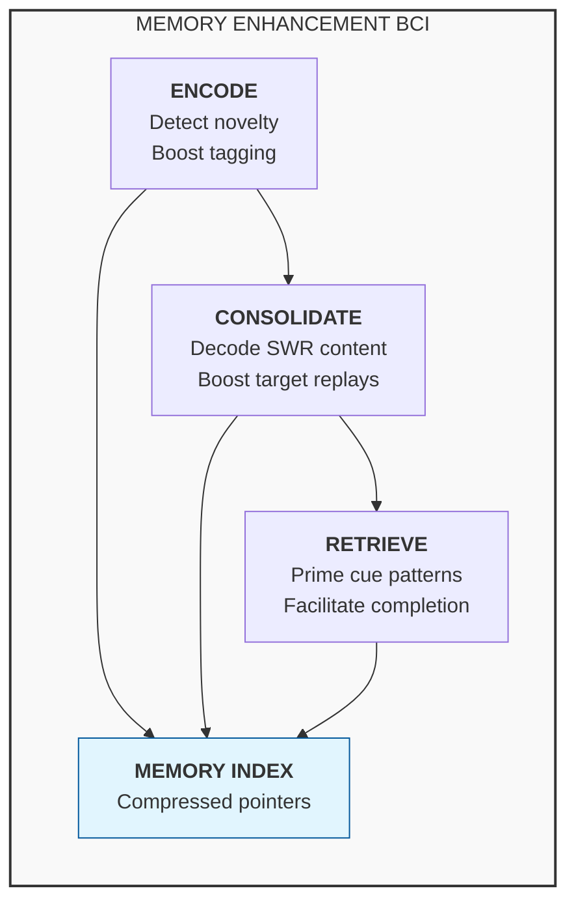
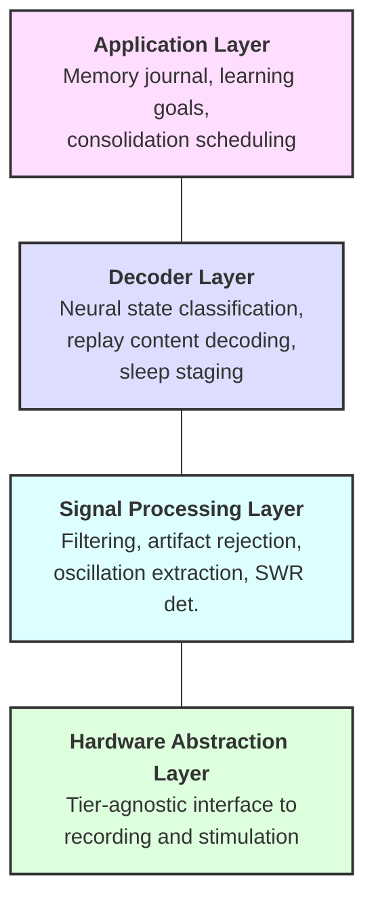
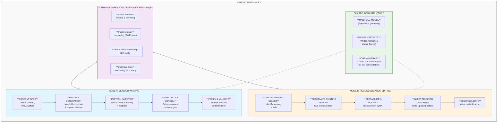
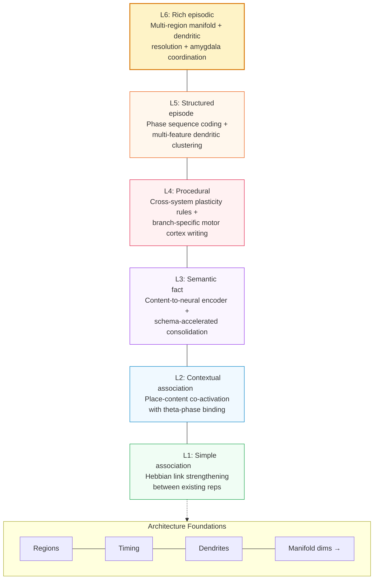

# This was written with a LLM, consider this content with skepticism

* Purpose: Test to see if AI can help with BCI research and development.

  
# Memory Enhancement BCI: Design Document

A multi-timescale, multi-modal brain-computer interface architecture for augmenting human episodic memory across encoding, consolidation, and retrieval.

---

## 1. Overview & Motivation

Human episodic memory is powerful but unreliable. We forget most of what we experience within hours, consolidation is fragile, and retrieval fails unpredictably. Existing memory BCIs target single mechanisms (e.g., replay detection or workload monitoring) but none address the full lifecycle of a memory trace from initial encoding through consolidation to retrieval.

This design proposes a **three-phase architecture** that intervenes at each stage of memory formation:

| Phase | Mechanism | Intervention |
|-------|-----------|-------------|
| **Encode** | Prediction-error detection + theta-gamma coupling | Boost attention and synaptic tagging at moments of high novelty |
| **Consolidate** | Sharp-wave ripple replay during sleep and rest | Selectively amplify content-decoded replays of target memories |
| **Retrieve** | Hippocampal index reactivation | Stimulate retrieval cues via cortical reinstatement patterns |

The system is designed in two hardware tiers (invasive and non-invasive) sharing a common software pipeline, allowing deployment across clinical and consumer contexts.

---

## 2. Neuroscience Foundations

### 2.1 Hippocampal Circuits

The hippocampus is the central hub for episodic memory. CA3 recurrent connections form an autoassociative network capable of pattern completion from partial cues ([Le Duigou et al., 2014](References.md); [Sammons et al., 2024](Memory.md); [Watson et al., 2024](Memory.md)). CA1 serves as the output stage, routing consolidated representations to neocortex via the subiculum and entorhinal cortex ([Takehara-Nishiuchi, 2014](Memory.md)).

**Design implication:** The system must monitor CA3/CA1 dynamics to detect encoding events and replay sequences. The CA3 autoassociative network is the primary target for prosthetic memory support.

### 2.2 Engrams and Memory Traces

Memory engrams are distributed ensembles of neurons whose reactivation drives recall ([Josselyn & Tonegawa, 2020](Memory.md); [Guskjolen & Cembrowski, 2023](Memory.md)). Engram cells are allocated during encoding via CREB-dependent mechanisms and are preferentially reactivated during retrieval. Recent work shows that astrocyte ensembles also participate in memory recall ([Williamson et al., 2025](Memory.md)).

**Design implication:** Rather than stimulating arbitrary neurons, interventions should target identified engram populations. Astrocytic calcium signals may serve as an additional readout of consolidation state.

### 2.3 Replay and Consolidation

Hippocampal replay compresses extended experiences into ~100ms sharp-wave ripple (SWR) events during sleep and quiet wakefulness ([Davidson et al., 2009](Memory.md); [Carr et al., 2011](Memory.md)). Replay can be forward or reverse ([Foster & Wilson, 2006](Memory.md)), occurs after even single experiences ([Berners-Lee et al., 2022](Memory.md)), and reflects specific past experiences rather than future plans ([Gillespie et al., 2021](Memory.md)).

Cortical replay of spiking sequences occurs during human memory retrieval ([Vaz et al., 2020](Memory.md)), with high-gamma reinstatement in temporal and prefrontal cortex ([Yaffe et al., 2017](Memory.md)).

**Design implication:** The consolidation module must detect SWRs in real-time, decode their content, and selectively boost replays of target memories while leaving others undisturbed.

### 2.4 Spatial Scaffolds and Cognitive Maps

Grid cells in the entorhinal cortex form toroidal population manifolds ([Gardner et al., 2022](Memory.md)) that provide a metric scaffold for both spatial and non-spatial memories ([Chandra et al., 2025](Memory.md)). Vector coding and place coding share common directional signals ([Zhou et al., 2024](Memory.md)), and theta sweeps alternate between hemispheres during navigation ([Vollan et al., 2025](Memory.md)).

**Design implication:** Grid cell scaffolds can be leveraged as "memory palaces" - artificial spatial frameworks onto which non-spatial memories are mapped, exploiting the brain's evolved spatial memory infrastructure.

### 2.5 Prefrontal-Hippocampal Interactions

Prefrontal cortex drives memory recall through feature representations ([Yadav et al., 2022](Memory.md)) and interacts with the medial temporal lobe for long-term storage ([Simons & Spiers, 2003](Memory.md)). Working memory maintenance depends on prefrontal circuitry ([Lara & Wallis, 2015](Memory.md)) while the ventromedial prefrontal cortex integrates memory with decision-making and schemas ([Weilbacher & Gluth, 2016](Memory.md); [Hebscher & Gilboa, 2016](Memory.md)).

**Design implication:** Retrieval assistance must engage prefrontal-hippocampal dialogue. The system can prime prefrontal feature representations to facilitate hippocampal pattern completion.

### 2.6 Oscillatory Signatures

Memory operations have distinct oscillatory signatures:

| Oscillation | Frequency | Role in Memory |
|-------------|-----------|---------------|
| Theta | 4-8 Hz | Encoding gate; phase-locks new information |
| Gamma | 30-100 Hz | Feature binding; content representation |
| Theta-gamma PAC | Theta phase / gamma amplitude | Organizes multi-item sequences in working memory |
| Sharp-wave ripples | 150-250 Hz | Replay and consolidation during sleep/rest |
| High gamma | 70-150 Hz | Cortical reinstatement during retrieval |
| Slow oscillations | 0.5-1 Hz | Sleep-stage gating of consolidation |

Cortical oscillations show a spectrolaminar motif across primate cortex ([Mendoza-Halliday et al., 2024](Memory.md)), and oscillatory rhythmicity itself carries information about cortical architecture ([Myrov et al., 2024](Memory.md)).

---

## 3. System Architecture

The system operates in three phases aligned with the natural memory lifecycle:



### 3.1 Phase 1: Encoding Optimization

**Goal:** Identify high-value encoding moments and strengthen synaptic tagging.

| Component | Function |
|-----------|----------|
| Prediction-error detector | Monitors mismatch between expected and actual neural activity (a proxy for novelty/surprise) |
| Theta-gamma PAC tracker | Measures phase-amplitude coupling as an index of active encoding |
| Synaptic tagging window | Detects the ~1-2 hour post-encoding window during which tagged synapses can capture plasticity-related proteins |
| Stimulation controller | Delivers timed neuromodulatory input (dopaminergic/noradrenergic) to strengthen tagging |

**Mechanism:** When the prediction-error signal exceeds threshold during strong theta-gamma coupling, the system marks this as an encoding event. Within the subsequent synaptic tagging window (~30-120 min), it delivers low-intensity stimulation to promote protein synthesis-dependent consolidation at the tagged synapses. This exploits the synaptic tagging and capture (STC) hypothesis: weak synaptic changes can be stabilized if plasticity-related proteins arrive within a critical window.

### 3.2 Phase 2: Consolidation Boosting

**Goal:** Selectively strengthen target memories during sleep and quiet rest.

| Component | Function |
|-----------|----------|
| SWR detector | Real-time detection of sharp-wave ripple events (150-250 Hz) |
| Content decoder | Classifies replay content using pre-trained neural decoders |
| Replay booster | Closed-loop stimulation timed to SWR events containing target content |
| Sleep stage monitor | Tracks slow oscillations and spindles to time interventions to NREM sleep |
| TMR controller | Delivers auditory/olfactory cues during slow-wave sleep to bias replay toward target memories |

**Mechanism:** Rather than blindly amplifying all SWRs (which could strengthen unwanted memories or interfere with natural forgetting), the system decodes replay content in real-time. Only replays matching target memory signatures receive boosting stimulation. This is combined with targeted memory reactivation (TMR) - presenting learning-associated sensory cues during NREM sleep to bias which memories get replayed.

The system also coordinates with the slow oscillation up-state and sleep spindles (the SO-spindle-ripple coupling sequence) to ensure stimulation arrives at the optimal phase for synaptic consolidation.

### 3.3 Phase 3: Retrieval Assistance

**Goal:** Facilitate recall by priming hippocampal index codes and cortical reinstatement.

| Component | Function |
|-----------|----------|
| Context detector | Identifies retrieval attempts from prefrontal activation patterns |
| Index activator | Stimulates hippocampal index codes to initiate pattern completion |
| Reinstatement monitor | Tracks cortical high-gamma reinstatement to verify successful retrieval |
| Confidence estimator | Assesses retrieval strength and provides graded assistance |

**Mechanism:** The hippocampus stores compressed "pointers" (index codes) that, when reactivated, drive reinstatement of distributed cortical representations. The system detects retrieval attempts, identifies the target memory from partial cues, and provides graded stimulation to the hippocampal index. This is more efficient than trying to reactivate the full distributed trace directly - manipulate the pointer, not the data.

---

## 4. Hardware Tiers

### 4.1 Tier 1: Invasive (Clinical/Research)

For participants with clinical indications (e.g., epilepsy patients with depth electrodes, or future implant recipients).

| Component | Specification |
|-----------|--------------|
| Recording | High-density Utah arrays or Neuropixels in hippocampus (CA1/CA3), entorhinal cortex, prefrontal cortex |
| Stimulation | Microstimulation via same electrode arrays; temporal interference (TI) for deeper targets |
| Processing | On-implant neuromorphic chip for SWR detection and spike sorting ([Liu et al., 2025](References.md)); memristor-based adaptive decoding |
| Communication | Wireless via inductive link ([Won et al., 2023](References.md)) to external processing unit |
| Power | Wireless power transfer; target <50mW for implanted components |

This tier leverages the BRAND platform for real-time closed-loop processing ([Ali et al., 2024](References.md)), which provides the infrastructure for asynchronous neural decoding with deep network models.

### 4.2 Tier 2: Non-Invasive (Consumer/Wellness)

For healthy individuals seeking memory enhancement.

| Component | Specification |
|-----------|--------------|
| Recording | High-density EEG (64-256 channels) + fNIRS for hemodynamic confirmation |
| Stimulation | Transcranial temporal interference stimulation (tTIS) for focal deep-brain targeting; transcranial alternating current stimulation (tACS) for oscillatory entrainment |
| Processing | Edge compute module (wearable) running compressed decoder models |
| Sensors | Wrist-worn autonomic monitoring (heart rate variability, skin conductance) for arousal/sleep staging |
| Form factor | Behind-ear EEG + forehead patch; sleep headband variant |

This tier trades spatial resolution for accessibility. It cannot decode individual replay content but can:
- Detect SWR-band power increases and overall consolidation state
- Entrain theta-gamma coupling during encoding via tACS
- Deliver TMR cues during detected NREM sleep
- Monitor working memory load in real-time ([Mora-Sanchez et al., 2020](References.md); [Asgher et al., 2020](References.md))

### 4.3 Shared Software Architecture

Both tiers run the same software stack, differing only in signal quality and available interventions:


---

## 5. Software Pipeline

### 5.1 Real-Time Signal Processing

| Stage | Latency Budget | Method |
|-------|---------------|--------|
| Bandpass filtering | <1 ms | IIR filters; separate theta (4-8 Hz), gamma (30-100 Hz), ripple (150-250 Hz) bands |
| Artifact rejection | <2 ms | Template matching for movement/EMG artifacts; adaptive thresholding |
| SWR detection | <10 ms | Ripple-band power threshold + duration criterion (>25 ms); validated against offline detection |
| Spike sorting | <5 ms | Neuromorphic on-chip sorting (Tier 1); not available in Tier 2 |
| Phase estimation | <5 ms | Hilbert transform on buffered theta signal for PAC computation |

**Total closed-loop latency target:** <25 ms (Tier 1), <50 ms (Tier 2)

### 5.2 Neural Decoders

| Decoder | Input | Output | Architecture |
|---------|-------|--------|-------------|
| Encoding state | Theta-gamma PAC + prediction error | Binary: encoding/not-encoding | Lightweight CNN on spectrogram features |
| Replay content | CA1 population vectors during SWR | Memory identity (from learned library) | LFADS-based latent factor model ([Ali et al., 2024](References.md)) |
| Sleep stage | EEG slow oscillations + spindles + EMG | Wake/N1/N2/N3/REM | Random forest on spectral features |
| Retrieval state | PFC activation + hippocampal theta | Retrieval attempt + target memory | Sequence-to-sequence model on neural trajectories |
| Working memory load | Frontal theta + parietal alpha | Load level (0-7 items) | LSTM ([Asgher et al., 2020](References.md)) |

All decoders use a calibration session to learn participant-specific neural signatures, then adapt online via memristor-based co-evolutionary learning ([Liu et al., 2025](References.md)).

### 5.3 Stimulation Protocols

| Protocol | Target | Parameters | Phase |
|----------|--------|-----------|-------|
| Theta entrainment | Hippocampus | 6 Hz tACS, 1-2 mA | Encoding |
| Gamma burst | Entorhinal-hippocampal | 40 Hz bursts locked to theta trough | Encoding |
| SWR boost | CA1 | Single-pulse microstim at ripple onset, 50-100 uA | Consolidation |
| SO up-state targeting | Frontal cortex | tDCS pulse at SO up-state, 0.5 mA | Consolidation |
| TMR cue | Auditory/olfactory | Learning-associated sensory cue during N3 | Consolidation |
| Index reactivation | CA3 | Patterned microstim matching index code, 20-50 uA | Retrieval |

---

## 6. Novel Design Elements

### 6.1 Hippocampal Indexing as Compression

Rather than attempting to read or write full memory traces (which are distributed across cortex), the system treats hippocampal representations as **compressed pointers**. This is inspired by hippocampal indexing theory: the hippocampus stores a sparse index code that, when reactivated, reinstates the full distributed cortical pattern.

**Advantage:** The system only needs to decode and manipulate a low-dimensional index space (~100-1000 dimensions) rather than the full cortical representation. This dramatically reduces the decoder complexity and stimulation precision required.

### 6.2 Synaptic Tagging Window Exploitation

The synaptic tagging and capture (STC) mechanism creates a ~1-2 hour window after initial encoding during which weak synaptic traces can be stabilized by plasticity-related proteins. The system detects encoding events and schedules neuromodulatory stimulation within this window.

**Protocol:**
1. Detect encoding event (prediction error + theta-gamma PAC)
2. Log timestamp and estimated trace strength
3. Within 30-120 minutes, deliver dopaminergic/noradrenergic stimulation to promote protein synthesis
4. Verify consolidation via subsequent replay detection

This exploits a natural biological mechanism that is normally governed by behavioral state (arousal, reward) but can be artificially triggered.

### 6.3 Content-Decoded Replay Boosting

Existing closed-loop SWR systems boost all detected ripples indiscriminately. This design adds a **content decoder** that classifies replay content before deciding whether to boost.

**Why this matters:**
- Not all replays are beneficial (some may maintain traumatic or irrelevant memories)
- Natural forgetting serves a function; indiscriminate boosting could cause interference
- Users can specify which memories to prioritize for consolidation

### 6.4 Grid Cell Memory Palace

Grid cells provide a metric scaffold for both spatial and conceptual representations ([Gardner et al., 2022](Memory.md); [Chandra et al., 2025](Memory.md)). The system creates artificial "memory palaces" by:

1. During encoding, pairing new information with spatial trajectories through a virtual environment
2. Stimulating grid cell patterns corresponding to specific locations during consolidation
3. During retrieval, reactivating the spatial scaffold to provide additional retrieval cues

This leverages the method of loci (a mnemonic technique dating to ancient Greece) with direct neural implementation rather than relying on voluntary imagination.

### 6.5 Predictive Coding for Novelty Detection

The system monitors prediction error signals as a natural index of information novelty. High prediction error indicates surprising, potentially important information that warrants enhanced encoding. Low prediction error indicates redundant input that can be safely compressed.

This uses the brain's own computational framework (predictive coding across the cortical hierarchy; [Felleman & Van Essen, 1991](Memory.md); [Rvachev, 2024](Memory.md)) as a relevance signal, rather than requiring the user to manually tag important moments.

### 6.6 Multi-Timescale Integration

The architecture uniquely spans three timescales:

| Timescale | Duration | Process | System Action |
|-----------|----------|---------|--------------|
| Fast | 10-100 ms | SWR replay, gamma bursts | Real-time closed-loop stimulation |
| Medium | Minutes to hours | Synaptic tagging window, working memory | Scheduled neuromodulatory support |
| Slow | Hours to days | Systems consolidation, sleep cycles | Overnight consolidation scheduling, TMR |

No existing system integrates across all three timescales with a unified memory model.

---

## 7. Risk Analysis & Open Questions

### 7.1 Safety Risks

| Risk | Severity | Mitigation |
|------|----------|-----------|
| Seizure induction from closed-loop stimulation | High | Afterdischarge detection with immediate stimulation halt; conservative current limits; epileptologist oversight |
| Unwanted memory strengthening (e.g., traumatic content) | Medium | Content decoder acts as filter; user blacklist for memory categories; default-off for emotionally tagged events |
| Interference with natural forgetting | Medium | Selective boosting (not blanket amplification); periodic "natural consolidation" windows without intervention |
| Long-term neural adaptation reducing efficacy | Medium | Adaptive stimulation parameters; periodic recalibration; stimulation holidays |
| Tissue damage from chronic implant (Tier 1) | High | Biocompatible materials; wireless power to minimize implant size; regular impedance monitoring |

### 7.2 Ethical Considerations

| Issue | Consideration |
|-------|--------------|
| Memory authenticity | Enhanced memories may feel more vivid than warranted by the original experience; users must be informed |
| Consent for consolidation targets | Who decides which memories get boosted? Must remain under user control |
| Cognitive liberty | Potential for coercive use (e.g., employer-mandated memory enhancement); requires regulatory framework |
| Equity of access | Tier 1 is surgical; Tier 2 is consumer. Performance gap creates potential inequality |
| Data privacy | Neural recordings contain intimate cognitive data; requires on-device processing and strong encryption |

### 7.3 Open Technical Questions

| Question | Current Status | Path Forward |
|----------|---------------|-------------|
| Can replay content be decoded with sufficient accuracy for selective boosting? | Demonstrated in rodents; limited human data ([Vaz et al., 2020](Memory.md)) | Piggyback on epilepsy monitoring studies for human validation |
| Does tTIS achieve sufficient focal depth for hippocampal targeting? | Promising in simulation and early trials | Requires systematic dose-finding studies |
| How long does the synaptic tagging window last in humans? | ~1-2 hours in rodent slice preparations | Human studies with behavioral + neural markers needed |
| Can theta-gamma PAC be reliably entrained non-invasively? | Inconsistent results with tACS alone | Combine tACS with behavioral task design; closed-loop phase tracking |
| Will chronic replay boosting cause runaway potentiation? | Unknown | Long-term animal studies with consolidation monitoring; homeostatic mechanisms |
| How does the system handle overlapping memory traces? | Untested | Pattern separation metrics as quality control; user disambiguation interface |

---

## 8. References

This design draws on papers catalogued in this repository:

- **[References.md](References.md)** - BCI platforms, neural decoding, speech neuroprostheses, neuromorphic hardware, memory-BCI interfaces, and workload monitoring
- **[Memory.md](Memory.md)** - Hippocampal circuits, engrams, replay dynamics, grid cells, spatial memory, prefrontal-hippocampal interactions, oscillations, and cortical organization

### Key papers by topic

| Topic | Key References |
|-------|---------------|
| Hippocampal circuits | Le Duigou et al. 2014; Sammons et al. 2024; Watson et al. 2024 |
| Engrams | Josselyn & Tonegawa 2020; Guskjolen & Cembrowski 2023; Williamson et al. 2025 |
| Replay | Davidson et al. 2009; Carr et al. 2011; Vaz et al. 2020; Berners-Lee et al. 2022; Gillespie et al. 2021 |
| Spatial scaffolds | Gardner et al. 2022; Chandra et al. 2025; Sargolini et al. 2006; Zhou et al. 2024 |
| Prefrontal memory | Yadav et al. 2022; Simons & Spiers 2003; Lara & Wallis 2015 |
| Oscillations | Mendoza-Halliday et al. 2024; Myrov et al. 2024 |
| Memory circuits | Ferguson et al. 2019; Raslau et al. 2015; Tingley & Buzsaki 2018 |
| BCI platforms | Ali et al. 2024 (BRAND); Liu et al. 2025 (memristor decoder) |
| Wireless/implant | Won et al. 2023 |
| Memory BCI | Burke et al. 2015; Mora-Sanchez et al. 2020; Asgher et al. 2020 |
| Cortical organization | Felleman & Van Essen 1991; Pang et al. 2023; Rvachev 2024 |

### Additional sources informing the design

- Berger, T. W., Song, D., Chan, R. H., Marmarelis, V. Z., LaCoss, J., Wills, J., Hampson, R. E., Deadwyler, S. A., & Granacki, J. J. (2012). A hippocampal cognitive prosthesis: multi-input, multi-output nonlinear modeling and VLSI implementation. IEEE transactions on neural systems and rehabilitation engineering : a publication of the IEEE Engineering in Medicine and Biology Society, 20(2), 198–211. https://doi.org/10.1109/TNSRE.2012.2189133
  - Multi-input multi-output model replacing damaged hippocampal circuitry.
- Frey, U., & Morris, R. G. (1997). Synaptic tagging and long-term potentiation. Nature, 385(6616), 533–536. https://doi.org/10.1038/385533a07
  - The STC hypothesis for late-phase LTP.
- Rasch, Björn, and Jan Born. "Reactivation and consolidation of memory during sleep." Current Directions in Psychological Science 17.3 (2008): 188-192.
  - Odor cues during sleep boost declarative memory.
- Grossman, N., Bono, D., Dedic, N., Kodandaramaiah, S. B., Rudenko, A., Suk, H. J., ... & Boyden, E. S. (2017). Noninvasive deep brain stimulation via temporally interfering electric fields. cell, 169(6), 1029-1041.
  - Non-invasive deep brain stimulation via interfering electric fields.
- Rao, R. P., & Ballard, D. H. (1999). Predictive coding in the visual cortex: a functional interpretation of some extra-classical receptive-field effects. Nature neuroscience, 2(1), 79-87.
- Friston, K. (2005). A theory of cortical responses. Philosophical transactions of the Royal Society B: Biological sciences, 360(1456), 815-836.
  - Hierarchical prediction error as a cortical organizing principle.

# Memory Reading and Writing BCI: Design Document

A brain-computer interface architecture for writing artificial memories — implanting experiences, knowledge, and skills that were never naturally encoded — via targeted neural pattern injection, integration, and verification.

---

## 1. Overview & Motivation

Memory enhancement boosts natural encoding, consolidation, and retrieval. But enhancement cannot help when there is **no natural encoding event to boost**. Anterograde amnesia patients cannot form new memories. Skill acquisition requires months of practice. Traumatic memories resist overwriting. These problems require a fundamentally different approach: **writing memories from scratch**.

Memory writing must solve six problems that enhancement never faces:

| Stage | Problem | Approach |
|-------|---------|----------|
| **Specify** | Content must be externally defined in a machine-readable format | Memory descriptor language with associative link maps |
| **Generate** | Content must be translated into participant-specific neural patterns | Manifold-constrained content-to-engram encoder |
| **Inject** | Patterns must be delivered to the correct neurons at the correct time | Multi-site patterned microstimulation with phase-precise timing |
| **Integrate** | The artificial trace must link to existing memory networks | Artificial replay injection during NREM sleep; schema-primed consolidation |
| **Read/Observe** | The stored trace must be decodable and its consolidation trackable | Multi-modal readout via retrieval probing, spontaneous replay monitoring, and neurochemical sensing |
| **Verify** | The written memory must be confirmed accurate and non-destructive | Retrieval probe with content decoding and fidelity scoring |

Reading and writing are fundamentally coupled: the system must read neural activity to calibrate the write process, monitor injection effects in real time, decode content during verification, and track consolidation over days to weeks. This bidirectional requirement — write patterns in, read content out — shapes every layer of the architecture, from electrode hardware to software pipelines. Systems neuroengineering provides the integrative framework for understanding and interacting with neural circuits at this level of bidirectional control ([Edelman et al., 2015](References.md)).

Clinical applications include prosthetic memory for hippocampal damage ([Burke et al., 2015](References.md)), PTSD memory replacement via reconsolidation editing, accelerated skill acquisition, and educational content delivery. More broadly, neuromodulation for neurological and psychiatric disorders has matured as a field ([Johnson et al., 2013](References.md)), and memory writing represents its logical extension — from modulating ongoing neural dynamics to specifying new ones. The feasibility of artificial engram creation has been demonstrated in rodents, where false place memories were optogenetically implanted in hippocampal ensembles ([Ramirez et al., 2013](#9-references)), and memory engram theory provides the conceptual framework ([Josselyn & Tonegawa, 2020](Memory.md)). Sensory neuroprostheses have already demonstrated that patterned stimulation can produce coherent percepts — from phosphene-based shape perception in visual cortex ([Chen et al., 2020](References.md)) to subretinal photovoltaic implants restoring vision ([Holz et al., 2026](References.md)) — establishing the principle that artificial neural patterns can be functionally meaningful.

A central insight of this design is that memory writing has **two modes**, not one:

| Mode | Mechanism | Best For |
|------|-----------|----------|
| **De novo writing** | Create new engram in unoccupied neural territory | Novel content with no existing trace |
| **Reconsolidation editing** | Reactivate existing memory → destabilize → inject modified content | Updating, correcting, or replacing existing memories |

---

## 2. Neuroscience Foundations

### 2.1 Engram Theory, CREB Allocation & Neurogenesis

Memory engrams are sparse, distributed neuron ensembles whose reactivation drives recall ([Josselyn & Tonegawa, 2020](Memory.md); [Guskjolen & Cembrowski, 2023](Memory.md)). During natural encoding, neurons with high CREB levels are preferentially recruited into engrams — a competitive allocation process ([Han et al., 2007](#9-references)). Engram membership is not random; it is governed by the excitability state of neurons at the time of encoding.

Critically, artificial manipulation of CREB levels can bias which neurons join an engram, and optogenetic reactivation of engram-allocated neurons is sufficient to drive recall even for events that never occurred. Ramirez et al. (2013) demonstrated this by labeling place-cell ensembles active in context A, then reactivating them during fear conditioning in context B, creating a false fear memory for context A ([Ramirez et al., 2013](#9-references)).

A particularly important class of allocatable neurons are **adult-born granule cells** in the dentate gyrus. Increasing adult neurogenesis is sufficient to improve pattern separation ([Sahay et al., 2011](#9-references)).

**Design implication:** The memory writing system should preferentially target two neuron populations: (1) high-CREB mature neurons identified via excitability profiling, and (2) adult-born DG granule cells in their critical period. The system should track neurogenesis markers to identify optimal write windows. Writing to mature, low-excitability neurons will produce weak, unstable traces.

### 2.2 CA3 Autoassociation & Pattern Completion

CA3 recurrent connections form an autoassociative network: partial input patterns are completed to full stored attractors ([Le Duigou et al., 2014](Memory.md); [Sammons et al., 2024](Memory.md); [Watson et al., 2024](Memory.md)). Human CA3 uses specific functional connectivity rules that make this completion highly efficient — approximately 20-30% of the pattern is sufficient to drive convergence to the full attractor.

However, CA3 does not simply complete patterns. The dentate gyrus upstream performs **pattern separation** — orthogonalizing similar inputs before they reach CA3 — and the balance between separation (DG) and completion (CA3) is regulated by neuromodulatory state and the relative contribution of new vs. mature granule cells. A written pattern that bypasses DG and enters CA3 directly will encounter the completion machinery without the orthogonalization step, risking convergence to an existing attractor rather than formation of a new one.

**Design implication:** The system can exploit CA3 pattern completion by writing only a **seed pattern** (20-30% of the target engram) and allowing autoassociative dynamics to fill in the remainder. But the seed must be sufficiently orthogonal to existing attractors — a condition that DG normally ensures but that artificial injection must verify computationally. The pattern generator must simulate attractor dynamics against the participant's known memory landscape before injection. If the seed falls within the basin of attraction of an existing engram, the write will silently overwrite or blend with that memory.

### 2.3 Hippocampal Indexing & Schema-Accelerated Consolidation

The hippocampus stores compressed index codes — sparse pointers (~100-1000 dimensions) that, when reactivated, reinstate distributed cortical representations. The full richness of a memory lives in cortex, not hippocampus. The hippocampal trace is a lookup key.

The standard model of systems consolidation holds that hippocampal-to-cortical transfer takes weeks. But this timeline is **dramatically compressed when new content matches an existing cortical schema**. Tse et al. (2007) showed that rats with an established spatial schema could consolidate new paired associations within 48 hours — compared to weeks without a schema ([Tse et al., 2007](#9-references)). The mechanism involves immediate neocortical gene activation (zif268, Arc) at encoding time when schemas exist ([Tse et al., 2011](#9-references)), bypassing the slow offline consolidation normally required.

**Design implication:** The system should implement two consolidation strategies: (1) **Schema-absent consolidation** — write the hippocampal index, then drive artificial replay over multiple nights to gradually build the cortical trace. (2) **Schema-primed consolidation** — when the written content maps onto an existing cortical schema, write the hippocampal index and deliver a single concentrated replay session. Schema-primed writes may consolidate in hours rather than days. The content specification module must assess schema compatibility and route memories to the appropriate consolidation pathway. This is the single largest efficiency gain available: schema-compatible memories are 10-100x faster to consolidate.

### 2.4 Replay, Sequence Ordering & Preplay

Sharp-wave ripple (SWR) replay compresses experiences into ~100ms bursts during sleep and quiet rest ([Davidson et al., 2009](Memory.md); [Carr et al., 2011](Memory.md)). Replay occurs after even single experiences ([Berners-Lee et al., 2022](Memory.md)) and drives cortical spiking reinstatement during retrieval ([Vaz et al., 2020](Memory.md)).

Critically, replay is not a monolithic phenomenon. **Forward replay** (events replayed in experienced order) dominates during quiet wakefulness and is associated with planning and evaluation. **Reverse replay** (events replayed backwards) dominates during reward-associated pauses and is associated with credit assignment and value updating ([Foster & Wilson, 2006](Memory.md)). The temporal ordering of cells within a ripple determines the content and function of the replay event.

Furthermore, the hippocampus generates **preplay** — sequences representing trajectories not yet experienced. Preplay suggests the hippocampal network spontaneously explores its state space, generating candidate experiences that can be "confirmed" or "rejected" by subsequent real experience.

**Design implication:** The artificial replay engine must control **sequence direction and content**, not merely trigger SWR-like bursts. For episodic memories (sequences of events), forward replay preserves narrative order and supports later sequential retrieval. For associative memories (causal relationships, skill-reward links), reverse replay from outcome to cause may be more effective for consolidation. The system should deliver a mixture of forward and reverse replays, with the ratio determined by memory type. Preplay could also be exploited: rather than writing a memory de novo, the system could detect spontaneous preplay sequences that approximate the target content and selectively reinforce them, converting exploration into memory.

### 2.5 Synaptic Plasticity & Tagging

Long-term memory formation requires protein synthesis-dependent synaptic modification. The synaptic tagging and capture (STC) mechanism creates a ~1-2 hour window: initial stimulation creates "tags" at activated synapses, and plasticity-related proteins (PRPs) must arrive within this window to stabilize the trace ([Kennedy, 2013](Memory.md)).

For memory writing, pattern injection creates the tags, but PRP delivery is not guaranteed — the brain's natural neuromodulatory systems (dopamine, norepinephrine) may not engage because no behaviorally relevant event occurred.

**Design implication:** The injection protocol must be paired with neuromodulatory support. Options include: (1) pharmacological priming (low-dose dopamine agonist to raise baseline PRP availability), (2) electrical co-stimulation of VTA/LC neuromodulatory nuclei, or (3) pairing injection with a behaviorally salient event (e.g., reward signal). The STC window constrains timing: all injection and stabilization must complete within ~1-2 hours. Multiple writing sessions may be needed for complex memories, with each session targeting a subset of the engram.

### 2.6 Spatial & Contextual Scaffolds

Grid cells in entorhinal cortex provide toroidal metric scaffolds ([Gardner et al., 2022](Memory.md)) that organize both spatial and non-spatial memories ([Chandra et al., 2025](Memory.md)). Every episodic memory has spatial and contextual components — even abstract knowledge is encoded relative to a spatial/temporal framework.

For written memories, this context must be supplied artificially. A memory without spatial context will lack the scaffolding that makes natural memories navigable and retrievable.

**Design implication:** The memory specification must include a spatial/contextual scaffold. The system can leverage the grid cell "memory palace" approach: assign each written memory a location within a virtual spatial framework, and co-activate the corresponding grid cell patterns during injection. The toroidal topology of grid cell manifolds ([Gardner et al., 2022](Memory.md)) means that relational structure (not just spatial location) can be encoded — memories that are "conceptually nearby" can be assigned adjacent positions on the torus, creating a navigable semantic topology. This goes beyond the classical method of loci: it is a general-purpose relational scaffold.

### 2.7 Inhibitory Sculpting & Disinhibition Gates

Memory engrams are defined not only by which excitatory neurons fire, but by which are **prevented** from firing. Inhibitory interneurons play three distinct roles in engram formation:

- **PV+ (parvalbumin) interneurons** provide fast perisomatic inhibition that regulates the temporal precision of pyramidal cell firing. They define the temporal window within which engram neurons must co-activate to form Hebbian associations.
- **SST+ (somatostatin) interneurons** target dendrites and regulate the size of the engram through lateral inhibition. Silencing DG SST+ interneurons during encoding increases engram size; activating them shrinks it ([Stefanelli et al., 2016](#9-references)). This is competitive exclusion: active engram cells recruit SST+ interneurons that suppress their neighbors.
- **VIP+ (vasoactive intestinal peptide) interneurons** inhibit SST+ and PV+ interneurons, creating **disinhibitory windows** that permit plasticity in target pyramidal cells ([Letzkus et al., 2015](#9-references)). Salient events trigger VIP+ activation, which releases projection neurons from inhibition.

Lovett-Barron et al. (2014) showed that during fear conditioning, cholinergic input activates dendrite-targeting interneurons in CA1, gating which sensory information is incorporated into the memory trace ([Lovett-Barron et al., 2014](#9-references)).

**Design implication:** Memory writing cannot simply activate the target excitatory neurons — it must simultaneously engineer the appropriate inhibitory landscape. This means: (1) co-activating VIP+ interneurons to open a disinhibitory plasticity window at the injection site, (2) allowing SST+ interneurons to constrain engram size to natural proportions (preventing pathologically large engrams that degrade pattern separation), and (3) timing injection to PV+ interneuron rhythms that gate the temporal precision of Hebbian binding. Ignoring the inhibitory context will produce engrams with wrong size, wrong temporal precision, and wrong integration with surrounding networks.

### 2.8 Dendritic Computation & Branch-Specific Plasticity

Memory traces are not stored at the level of whole neurons — they are stored at **individual dendritic branches**. Each pyramidal neuron has dozens of branches, and different branches can participate in different memory traces through local NMDA spikes, branch-specific calcium events, and clustered synaptic plasticity.

Govindarajan et al. (2006) proposed that translation-dependent plasticity at synapses clustered within a dendritic branch is the elementary unit of long-term memory storage ([Govindarajan et al., 2006](#9-references)). Cichon & Bhatt (2015) demonstrated this directly: different motor learning tasks induce dendritic calcium spikes on different apical tuft branches of the same layer V neuron, with branch-specific potentiation persisting for days ([Cichon & Bhatt, 2015](#9-references)). Kastellakis et al. (2015) showed that synaptic clustering within dendrites dramatically increases memory capacity and enables feature binding — related features of a memory are stored on the same branch ([Kastellakis et al., 2015](#9-references)).

**Design implication:** The standard model of memory writing — "activate neuron X" — is too coarse. True high-fidelity writing requires engaging specific **dendritic branches** within target neurons, activating clustered synapses that bind the correct features together. This has profound hardware implications: electrode or optogenetic resolution must reach the dendritic scale (~1-10 μm), not merely the somatic scale (~10-50 μm). In the near term, somatic-resolution writing is feasible but will produce low-resolution memories (correct gist, imprecise details). Dendritic-resolution writing is a prerequisite for Level 5-6 memories (§6) where sensory detail and feature binding matter.

### 2.9 Neural Manifold Constraints

Neural population activity does not occupy the full high-dimensional space of possible firing patterns. Instead, it is confined to **low-dimensional manifolds** — surfaces defined by the intrinsic connectivity of the network ([Gallego et al., 2017](#9-references)). These manifolds are stable over months even as individual neuron tuning changes ([Gallego et al., 2020](#9-references)).

Critically, Sadtler et al. (2014) demonstrated in a closed-loop BCI paradigm that when subjects are required to produce neural activity patterns **within** their intrinsic manifold, learning is rapid. When required to produce patterns **outside** the manifold, learning is severely impaired within a single session ([Sadtler et al., 2014](#9-references)). The network's recurrent connectivity acts as a filter: off-manifold perturbations are rapidly corrected back toward the manifold by recurrent dynamics.

**Design implication:** This is a fundamental constraint on memory writing that the field has not adequately addressed. Any injected pattern must lie **on the intrinsic manifold** of the target neural population, or it will be rejected by recurrent dynamics within milliseconds. The pattern generator must learn the participant's hippocampal and cortical manifolds during calibration and constrain all generated patterns to this subspace. A pattern that is semantically correct but geometrically off-manifold is as useless as random noise. This also means memory writing capacity is bounded by the dimensionality of the intrinsic manifold — you cannot write more distinct memories than the manifold has degrees of freedom to represent.

### 2.10 Phase Precession & Temporal Coding

Hippocampal place cells do not merely fire at higher rates in their preferred locations — they systematically shift their spike timing relative to the ongoing theta oscillation as the animal traverses the place field ([O'Keefe & Recce, 1993](#9-references)). This **phase precession** means that the phase of a spike relative to theta encodes the animal's position within the field with higher resolution than rate coding alone.

At the population level, phase precession compresses behavioral sequences (spanning seconds) into single theta cycles (~125 ms), bringing representations of temporally distant events into the ~20 ms window required for spike-timing-dependent plasticity (STDP) ([Skaggs et al., 1996](#9-references)). This theta-cycle compression is how the hippocampus binds sequential experiences into associative chains.

**Design implication:** Writing episodic or sequential memories requires controlling not just **which** neurons fire but **when within the theta cycle** they fire. A rate-coded injection (correct neurons, wrong timing) will produce a snapshot memory — a static scene without temporal structure. A phase-coded injection (correct neurons at correct theta phases) will produce a sequence memory — an experience with narrative flow. The injection controller must deliver stimulation pulses with theta-phase precision (~5-10 ms resolution within the ~125 ms theta cycle), with earlier phases encoding earlier events in the sequence. This doubles the information bandwidth of injection: rate encodes content identity, phase encodes temporal order.

### 2.11 Memory Readout & Retrieval Signatures

Writing a memory is only half the problem — **observing** the written trace is essential for calibration, verification, and long-term monitoring. Memory readout exploits three distinct neural signatures:

**Content-specific cortical reinstatement.** Successful retrieval reactivates the same distributed cortical patterns that were active during encoding. The fidelity of this reinstatement predicts memory accuracy and confidence. fMRI brain decoding has demonstrated that perceptual, semantic, and episodic content can be reconstructed from activity patterns across visual, temporal, and prefrontal cortex ([Du et al., 2022](References.md)). While fMRI provides spatial coverage across the whole brain, electrophysiological readout from implanted arrays provides the temporal resolution (<10 ms) required for real-time content verification during and after injection.

**Hippocampal pattern completion dynamics.** Retrieval begins with CA3 pattern completion (§2.2): a partial cue activates the stored attractor, which reinstates the full hippocampal index. The speed and fidelity of completion are directly observable readout signatures — a well-consolidated memory completes rapidly (<200 ms) and produces a high-fidelity pattern match. A weak or degrading trace shows slower completion, partial activation, or convergence to the wrong attractor. By monitoring CA3 dynamics during controlled cue delivery, the system can assess memory strength without requiring subjective report.

**Spontaneous replay reactivation.** Written memories that have been successfully consolidated should appear in spontaneous sharp-wave ripple replay during sleep and quiet wakefulness (§2.4). Their presence in replay confirms that the hippocampal network has incorporated the trace into its normal memory cycling. Conversely, absence of spontaneous replay after expected consolidation time signals a failed or degrading write. The content decoder can passively monitor for reactivation of written memory patterns, providing verification without active probing.

**Neurochemical correlates.** Memory encoding and consolidation produce measurable neurochemical signatures — dopamine release in hippocampus signals novelty and promotes plasticity, acetylcholine modulation shifts between encoding (high ACh) and consolidation (low ACh) modes. Carbon fiber electrode threads can measure neurochemical activity in deep brain structures with sub-second resolution ([Xia et al., 2023](References.md)), providing a complementary readout channel that captures neuromodulatory state rather than spiking patterns. This neurochemical readout informs whether the brain is in a state conducive to memory formation and whether the written trace triggered the expected neuromodulatory response.

**Cognitive state monitoring.** The quality of memory readout depends on the participant's cognitive state at the time of probing. Real-time monitoring of working memory load ([Mora-Sánchez et al., 2020](References.md); [Asgher et al., 2020](References.md)) can optimize the timing of verification probes — testing recall when cognitive resources are available rather than during periods of high mental workload that would impair retrieval and produce false-negative verification results.

**Design implication:** The system must implement both **active** and **passive** readout. Active readout uses controlled cue delivery and content decoding during retrieval. Passive readout monitors spontaneous replay for evidence of written memory reactivation. Neurochemical sensing provides a third, orthogonal readout channel reflecting neuromodulatory state rather than content. These three channels — electrophysiological content decoding, replay monitoring, and neurochemical sensing — are complementary: each captures information the others miss. A written memory should produce converging evidence across all three channels; divergence signals a problem.

---

## 3. System Architecture

The system operates in two modes — **de novo writing** and **reconsolidation editing** — that share infrastructure but differ in their entry point and biological mechanism:



### 3.1 Content Specification

The content specification module translates human-readable memory descriptions into machine-processable formats.

| Component | Function |
|-----------|----------|
| Memory descriptor | Structured specification of memory content: semantic content, sensory features, emotional valence, temporal sequence (with phase-coding annotations for sequential memories). Natural input modalities including inner speech ([Kunz et al., 2025](References.md)) could serve as a high-bandwidth content specification channel — the participant describes the memory they want written, and motor-cortical speech representations are decoded into the descriptor format. Imagined speech decoding using graph contrastive learning on brain dynamics ([Niu et al., 2025](References.md)) extends this to naturalistic BCI settings where overt speech is not possible |
| Associative link map | Defines which existing memories the new memory should connect to (retrieval routes) |
| Spatial/relational scaffold | Grid cell manifold coordinates — position on the toroidal scaffold encoding both spatial location and conceptual topology |
| Schema compatibility checker | Assesses whether content maps onto an existing cortical schema (routes to fast or slow consolidation pathway) |
| Complexity class | Assigns the memory to a complexity level (see §6) which determines the writing protocol |

### 3.2 Neural Pattern Generation

The pattern generator translates content specifications into participant-specific neural activation patterns, subject to manifold constraints.

| Component | Function |
|-----------|----------|
| Manifold-constrained encoder | Generative model (VAE/diffusion) that outputs patterns guaranteed to lie on the participant's intrinsic neural manifold; rejects off-manifold solutions. The architecture draws on latent diffusion approaches that have demonstrated bidirectional mapping between semantic content and neural representations ([Takagi & Nishimoto, 2023](References.md); [Lu et al., 2023](References.md)) — here applied in the generative (content→neural) direction rather than the reconstructive (neural→content) direction |
| Engram allocator | Identifies write-eligible neurons: high-CREB mature neurons + critical-period new DGCs; avoids neurons committed to existing engrams |
| Partial-pattern optimizer | Computes minimal seed pattern (~20-30% of engram) sufficient for CA3 autoassociative completion; verifies orthogonality to existing attractors |
| Phase-sequence encoder | For sequential memories, assigns theta-phase timing to each element; earlier events → earlier theta phases |
| Inhibitory context generator | Specifies the required VIP+/SST+/PV+ interneuron activation pattern to create the appropriate disinhibitory window and constrain engram size |
| Index synthesizer | Generates compressed hippocampal index code (~100-1000 dims) encoding the content pointers |

The encoder leverages the BRAND platform for real-time neural computation ([Ali et al., 2024](References.md)), running the generative model with manifold projection as a hard constraint.

### 3.3 Pattern Injection

| Component | Function |
|-----------|----------|
| Multi-site stimulator | Delivers patterned microstimulation to target neuron populations across hippocampus and entorhinal cortex |
| Phase-precise timer | Locks injection to specific theta phases: content identity at theta trough (maximal plasticity), sequence position encoded by phase offset within cycle |
| Inhibitory co-stimulator | Activates VIP+ interneurons to open disinhibitory window at injection site; allows SST+ lateral inhibition to regulate engram boundaries |
| Dosage regulator | Controls stimulation intensity based on real-time neural response; prevents over-excitation |
| State monitor | Verifies brain state is receptive (awake-quiet for initial injection; NREM for replay consolidation) |
| Manifold tracker | Real-time verification that evoked population activity remains on the intrinsic manifold; aborts if activity is pushed off-manifold |

### 3.4 Integration & Consolidation

| Component | Function |
|-----------|----------|
| Artificial replay generator | Creates synthetic ~100ms SWR-like sequences with controlled forward/reverse ordering and phase structure |
| Schema router | Directs schema-compatible memories to fast consolidation pathway; schema-absent memories to standard multi-night replay |
| Sleep-stage coordinator | Times replay delivery to NREM SO-spindle-ripple coupling windows |
| Cortical distribution monitor | Tracks emergence of cortical traces via high-gamma reinstatement patterns |
| Interference detector | Monitors for degradation of existing memories during consolidation |

### 3.5 Reconsolidation Editor (Mode B)

| Component | Function |
|-----------|----------|
| Memory reactivator | Delivers cues that reactivate the target memory, opening the reconsolidation window (~5-6 hours) |
| Lability detector | Confirms the trace has destabilized (signatures: AMPA receptor internalization, protein synthesis dependence) |
| Content modifier | Injects updated pattern elements during the labile phase, overwriting specific engram components |
| Restabilization monitor | Tracks protein synthesis-dependent restabilization; verifies modified content is incorporated |

This mode exploits the reconsolidation mechanism ([Nader et al., 2000](#9-references); [Monfils et al., 2009](#9-references); [Schiller et al., 2010](#9-references)): retrieved memories become transiently labile and protein synthesis-dependent, creating a window during which the trace can be modified before restabilization.

### 3.6 Verification & Validation

| Component | Function |
|-----------|----------|
| Retrieval probe | Presents cues designed to trigger recall of the written memory |
| Content decoder | Decodes neural activity during retrieval to verify content matches specification |
| Fidelity scorer | Quantifies match between intended and actual memory content (see §5.3) |
| Manifold consistency checker | Verifies the written trace occupies a stable point on the neural manifold (not a transient off-manifold perturbation that will decay) |
| Side-effect detector | Checks for unintended changes to existing memories or neural function |

The verification system uses adaptive decoding with memristor-based co-evolutionary learning ([Liu et al., 2025](References.md)) for real-time content assessment. The decoder architecture leverages advances in neural-to-content reconstruction — latent diffusion models can reconstruct high-resolution perceptual content from brain activity ([Takagi & Nishimoto, 2023](References.md)), and controlled reconstruction methods can decode both semantic and structural features ([Lu et al., 2023](References.md)). These approaches, originally developed for fMRI, provide the architectural template for the electrophysiological content decoder used in verification. The broader landscape of fMRI brain decoding methods ([Du et al., 2022](References.md)) informs the multi-modal decoding strategy: different content types (visual, semantic, spatial, temporal) require different decoder architectures, and the verification system must deploy the appropriate decoder based on the memory's complexity class (§6).

### 3.7 Memory Reading & Continuous Observation

Unlike write-once-verify-once paradigms, memory writing requires **continuous observation** across three timescales:

| Timescale | Readout Mode | What It Reveals |
|-----------|-------------|-----------------|
| **Real-time** (ms) | Evoked response monitoring during injection | Whether stimulation produced the intended activation pattern; manifold adherence; immediate off-target effects |
| **Session** (minutes–hours) | Active retrieval probing + neurochemical sensing | Whether the written trace is accessible via cue-driven recall; whether neuromodulatory state supports stabilization |
| **Longitudinal** (days–weeks) | Passive replay monitoring + periodic retrieval probes | Whether the trace is consolidating normally; whether schema-driven drift remains within tolerance; whether existing memories are degrading |

| Component | Function |
|-----------|----------|
| Spontaneous replay scanner | Monitors SWR content during sleep and quiet rest for reactivation of written memory patterns; uses the content decoder to identify written-memory replay events among natural replay |
| Neurochemical state monitor | Tracks dopamine and acetylcholine dynamics via carbon fiber electrode threads ([Xia et al., 2023](References.md)) to verify neuromodulatory support for plasticity; confirms encoding-state (high ACh) during injection and consolidation-state (low ACh) during replay |
| Cognitive state tracker | Monitors working memory load ([Mora-Sánchez et al., 2020](References.md); [Asgher et al., 2020](References.md)) to time verification probes for periods of low cognitive load, avoiding false-negative assessments caused by retrieval competition |
| Consolidation progress estimator | Tracks the emergence of cortical reinstatement patterns over multiple sessions; estimates consolidation percentage based on cortical trace strength relative to hippocampal index strength |
| Longitudinal drift tracker | Compares decoded content at each readout session against the original specification; quantifies schema-mediated drift and flags when content has shifted beyond acceptable tolerance |
| Memory registry updater | Records all readout results in the memory registry (§3 shared infrastructure); updates memory status (injected → consolidating → consolidated → verified; or degrading → re-injection needed) |

The continuous observation system serves a dual purpose: it verifies individual written memories **and** it monitors the health of the broader memory ecosystem. A written memory that consolidates correctly but causes subtle interference with existing memories would be missed by write-only verification. Longitudinal observation catches these second-order effects.

---

## 4. Hardware Requirements

Artificial memory writing is **Tier 1 (invasive) only**. Non-invasive approaches (EEG, tACS, tTIS) lack the spatial resolution to write specific neural patterns to identified neuron populations. Tier 2 supports enhancement because it only needs to modulate ongoing activity; writing requires specifying and delivering precise activation patterns.

### 4.1 Write-Capable Electrode Arrays

| Specification | Memory Writing | Memory Enhancement |
|--------------|----------------|-------------------------------|
| Channel count | 1000+ per hemisphere | 100-256 (Tier 1) |
| Electrode pitch | <50 μm (somatic); <10 μm (dendritic, future) | ~400 μm (Utah array) |
| Coverage | Bilateral hippocampus (CA1, CA3, DG) + entorhinal cortex + prefrontal cortex | Unilateral hippocampus + prefrontal cortex |
| Stimulation capability | Patterned multi-site microstimulation (independent current per channel) + phase-precise timing (<5 ms jitter) | Single-site or paired-site stimulation |
| Read/write ratio | Simultaneous read-write on adjacent channels | Primarily read; occasional write |
| Interneuron access | Cell-type-specific channels for VIP+/SST+ co-stimulation | Not required |
| Neurochemical sensing | Carbon fiber electrode threads for dopamine/acetylcholine monitoring ([Xia et al., 2023](References.md)) | Not required |
| Readout channels | Dedicated high-impedance recording channels for content decoding during and after injection; must operate simultaneously with stimulation on adjacent channels | Primarily recording only |

Hardware platforms are converging on the specifications required for memory writing. The wireless subdural array by Jung et al. (2025) achieves 65,536 electrodes with 1,024 simultaneous recording channels in a fully wireless, subdural-contained form factor ([Jung et al., 2025](References.md)) — approaching the channel count needed for bilateral hippocampal coverage. Hettick et al. (2025) demonstrate minimally invasive implantation of scalable high-density cortical microelectrode arrays capable of both multimodal neural decoding and stimulation ([Hettick et al., 2025](References.md)), directly addressing the simultaneous read-write requirement. Flexible substrate technologies ([Tang et al., 2023](References.md)) improve chronic biocompatibility and conformability to hippocampal geometry, and wireless power/data architectures ([Won et al., 2023](References.md)) eliminate transcutaneous connectors. Bio-inspired and biohybrid neural interfaces ([Boufidis et al., 2025](References.md)) offer a path toward electrodes that integrate with neural tissue rather than merely contacting it — soft, living interfaces that reduce chronic immune response and may improve long-term signal stability for the years-long implantation periods memory writing requires. The key remaining constraint is achieving read-write interleaving at the required spatial density within deep structures — current high-density arrays target cortical surface, not hippocampal depth.

### 4.2 Optogenetic Delivery

Cell-type-specific activation provides precision that electrical stimulation cannot achieve. Optogenetic approaches use viral vectors (AAV) to express light-sensitive opsins (e.g., ChR2, ChRmine) in target neuron populations. For memory writing, cell-type specificity is not a luxury — it is essential for independently controlling excitatory engram neurons and inhibitory interneuron subtypes.

| Approach | Precision | Speed | Cell-Type Specificity | Suitability |
|----------|-----------|-------|-----------------------|-------------|
| Electrical microstimulation | ~50-100 μm radius | <1 ms | None (activates all nearby cells) | Broad-field activation; cannot selectively target interneuron subtypes |
| Optogenetic (ChR2/AAV) | Single-cell-type | ~1-5 ms | Yes (promoter-dependent) | Separate opsins for excitatory (CaMKII) and inhibitory (PV-Cre, VIP-Cre) populations |
| Two-photon holographic optogenetics | Single-cell (~1 μm) | ~5-10 ms | Yes | Highest precision; dendritic-scale targeting possible; limited to superficial tissue |
| Combined electrical + multi-opsin | Cell-type writing + broad-field read | <1-5 ms | Yes (multi-opsin) | Optimal for memory writing: excitatory engram + inhibitory context + electrical readout |

Recent work has clarified how intracortical microstimulation (ICMS) engages neural circuits at the mechanistic level. Hughes et al. (2026) characterize the neural mechanisms underlying ICMS for sensory restoration, showing that stimulation activates both direct and polysynaptic pathways with distinct temporal profiles ([Hughes et al., 2026](References.md)). Understanding these propagation dynamics is critical for memory writing: the injected pattern will spread through local circuits via these same mechanisms, and the pattern generator must account for polysynaptic activation when computing the target stimulation pattern. Kim et al. (2025) advance high-dimensional stimulation with flexible electrodes, demonstrating that precise synthetic neural codes can be delivered through multi-electrode patterns ([Kim et al., 2025](References.md)) — moving toward the kind of patterned, multi-site injection that memory writing requires. The precedent set by visual neuroprostheses — where patterned stimulation of visual cortex produces coherent shape perception ([Chen et al., 2020](References.md)) — demonstrates that artificial activation patterns can produce functionally meaningful neural representations, not merely noise.

### 4.3 Pharmacological Support Infrastructure

The synaptic tagging and capture mechanism (§2.5) requires neuromodulatory support that may not occur naturally during artificial memory injection. Pharmacological priming is one mitigation strategy, and delivery precision matters: systemic drug administration affects the entire brain, but memory writing requires region-specific neuromodulatory support. Carbon dots — biocompatible nanoparticles capable of crossing the blood-brain barrier — offer a potential targeted delivery vehicle for dopamine agonists or protein synthesis enhancers to hippocampal targets ([Zhang W et al., 2021](References.md)). While this approach remains preclinical, it addresses a genuine gap: the need for spatially targeted pharmacological support during a temporally precise writing procedure.

### 4.4 Processing Requirements

| Requirement | Memory Writing | Memory Enhancement |
|-------------|----------------|-------------------------------|
| Decoder type | Generative (content → manifold-constrained neural pattern) | Discriminative (neural pattern → label) |
| Latency budget | <10 ms (injection must lock to specific theta phase) | <25 ms (closed-loop stimulation) |
| Compute | On-implant neuromorphic + external GPU cluster; neuromorphic architectures designed for brain rewiring applications ([Chiappalone et al., 2022](References.md)) provide the on-implant substrate | On-implant neuromorphic chip |
| Model complexity | Manifold-constrained VAE/diffusion generative model + attractor landscape simulator | CNN/LFADS classifier |
| Calibration data | Paired (content, neural) recordings over weeks + manifold estimation from spontaneous activity | Neural recordings during task performance |
| Storage | Full memory registry + pattern library + manifold model + schema library | Memory index library |

---

## 5. Software Pipeline

### 5.1 Content-to-Neural Encoder

The encoder translates content specifications into neural activation patterns via a five-stage pipeline:

| Stage | Input | Output | Method |
|-------|-------|--------|--------|
| Content embedding | Memory descriptor (text, sensory features, associations, temporal sequence) | High-dimensional content vector (2048-dim) | Multimodal transformer encoder; architecture parallels the latent space used in neural reconstruction models ([Takagi & Nishimoto, 2023](References.md)) but operates in the inverse direction |
| Manifold projection | Content vector + participant manifold model | Target pattern constrained to intrinsic neural manifold | Manifold-constrained latent diffusion model; the diffusion process is conditioned on the content vector and constrained to the participant's neural manifold at each denoising step; rejection sampling for off-manifold proposals |
| Attractor verification | Manifold-constrained pattern + existing attractor landscape | Verified pattern with confirmed unique basin of attraction | Simulate CA3 recurrent dynamics; verify convergence to novel attractor, not blend with existing |
| Partial pattern extraction | Verified full engram pattern | Seed pattern (20-30% of neurons) with phase-timing annotations | CA3 attractor basin analysis; select minimal activating set; assign theta-phase positions |
| Index synthesis | Full engram pattern + associative link map | Compressed hippocampal index (~100-1000 dims) | Learned index compression matching participant's indexing statistics |

The manifold-constrained VAE is trained on two data sources: (1) paired (content, neural) recordings during natural encoding of known content (weeks of calibration), and (2) spontaneous activity recordings for manifold estimation (recorded during rest/sleep). The manifold model is updated continuously as the participant's neural geometry evolves.

### 5.2 Injection Controller

| Stage | Latency Budget | Method |
|-------|---------------|--------|
| Theta phase estimation | <2 ms | Real-time Hilbert transform on hippocampal LFP |
| Phase-sequence scheduling | <1 ms | Map temporal sequence elements to theta-phase positions; precompute per-cycle delivery schedule |
| Pattern loading | <1 ms | Pre-computed patterns buffered in on-implant memory |
| Inhibitory pre-activation | <2 ms | VIP+ opsin pulse to open disinhibitory window ~10 ms before excitatory injection |
| Stimulation delivery | <3 ms | Parallel current sources + optogenetic pulses; one per target channel |
| Manifold tracking | <1 ms | Project evoked population vector onto manifold; compute residual |
| Adaptation | <2 ms | Online adjustment of stimulation amplitude based on evoked response and manifold adherence; adaptive neuromodulation principles ([Lampert et al., 2025](References.md)) applied at the single-injection timescale |
| Polysynaptic propagation model | Pre-computed | Predicts how injected current will propagate through direct and polysynaptic pathways ([Hughes et al., 2026](References.md)); stimulation parameters are pre-compensated for downstream activation to ensure the net evoked pattern matches the target |

**Total injection latency target:** <10 ms (must complete within a single theta-phase window, delivering sequence elements across the ~125 ms theta cycle with ~5-10 ms phase precision). The injection controller implements the high-dimensional stimulation paradigm demonstrated by Kim et al. (2025), delivering independent current patterns across dozens of electrodes simultaneously to produce precise synthetic neural codes ([Kim et al., 2025](References.md)).

### 5.3 Verification Decoder

| Metric | Method | Threshold |
|--------|--------|-----------|
| Pattern similarity | Cosine similarity between target and evoked population vectors | >0.85 for initial injection; >0.90 after consolidation |
| Manifold residual | Distance of evoked pattern from nearest point on intrinsic manifold | <0.1 normalized manifold units (on-manifold) |
| Retrieval latency | Time from cue onset to hippocampal pattern completion | <500 ms (comparable to natural recall) |
| Content fidelity | Decoded content vs. specification using cross-validated decoder | >0.80 semantic similarity score |
| Sequence integrity | Phase-decoded temporal order vs. specified sequence | Kendall tau >0.90 for sequential memories |
| Interference check | Probe retrieval of 10 existing memories pre/post writing | <0.05 fidelity degradation on any existing memory |
| Subjective report | Participant describes the memory; scored against specification | Qualitative match on key content elements |

### 5.4 Artificial Replay Engine

The replay engine generates synthetic sharp-wave ripple sequences containing the written memory content, timed to the SO-spindle-ripple coupling window during NREM sleep.

| Parameter | Value | Rationale |
|-----------|-------|-----------|
| Replay duration | ~80-120 ms | Matches natural SWR duration ([Davidson et al., 2009](Memory.md)) |
| Replay rate | 1-3 per minute during target NREM periods | Conservative; natural rate is ~1-3 SWR/min |
| Timing lock | SO up-state → spindle trough → ripple | Matches natural SO-spindle-ripple coupling |
| Sequence direction | Forward (60%) + reverse (40%) for episodic; reverse-dominant (80%) for reward-associated | Forward preserves narrative; reverse supports credit assignment ([Foster & Wilson, 2006](Memory.md)) |
| Content | Compressed written memory content in SWR-band temporal code with theta-phase structure preserved | Derived from injection pattern via temporal compression |
| Schema-primed sessions | 1 concentrated session (2-3 hours) for schema-compatible memories | Tse et al. 2007/2011: schema-matching content consolidates in hours |
| Schema-absent sessions | Minimum 3 sleep cycles over 1-3 nights | Standard systems consolidation timeline |
| Interference avoidance | Suppress artificial replay when natural replay of other content is detected | Uses content decoder |

### 5.5 Memory Readout Pipeline

The readout pipeline operates continuously across three channels, producing a unified assessment of each written memory's status:

| Channel | Input | Output | Method |
|---------|-------|--------|--------|
| Electrophysiological content readout | Multi-channel hippocampal + cortical recordings during cue-driven retrieval or spontaneous replay | Decoded memory content + pattern similarity to specification | Content decoder (§5.3) applied to retrieval-evoked or replay-evoked activity; cosine similarity against stored target pattern |
| Neurochemical state readout | Carbon fiber electrode signals ([Xia et al., 2023](References.md)) from hippocampal DA and ACh channels | Neuromodulatory state classification (encoding-favorable / consolidation-favorable / neutral) | Real-time neurotransmitter concentration estimation; threshold-based state classification |
| Cognitive context readout | Broadband cortical recordings from prefrontal channels | Working memory load estimate; attention state | LSTM-based workload classifier ([Asgher et al., 2020](References.md)); used to gate verification probe timing |

**Readout scheduling:**

| Phase | Active Readout | Passive Readout | Neurochemical Readout |
|-------|---------------|----------------|----------------------|
| During injection | Evoked response decoding (real-time) | — | DA release confirmation |
| Post-injection (0-2 hrs) | Retrieval probe every 15 min | SWR content monitoring | ACh state tracking (encoding → consolidation transition) |
| First sleep cycle | — | Replay monitoring for written content in SWRs | ACh suppression confirmation (consolidation mode) |
| 24 hours | Full retrieval probe battery | Spontaneous replay scan during rest | — |
| 1 week | Retrieval probe + content fidelity scoring | Replay frequency tracking | — |
| 1 month | Long-term retention check | Replay frequency (expect decline as cortical trace strengthens) | — |

**Convergence criterion:** A memory is classified as "successfully written and consolidated" when: (1) active retrieval produces content fidelity >0.80, (2) spontaneous replay of the written content was detected in at least 2 of the first 3 post-injection sleep cycles, and (3) no existing memory shows fidelity degradation >0.05. If any channel reports failure while others report success, the memory is flagged for manual review — channel disagreement often indicates partial writes or unexpected integration patterns.

---

## 6. Memory Complexity Hierarchy

Not all artificial memories are equally difficult to write. The following hierarchy orders memory types from simplest to most complex, grounded in the specific circuit-level challenges at each level:

| Level | Memory Type | Example | Write Target | Key Circuit Challenge | Estimated Feasibility |
|-------|-------------|---------|-------------|----------------------|----------------------|
| 1 | Simple association | "X paired with Y" | CA3 Hebbian link between two existing representations | Minimal: strengthen single synapse population; no new engram needed | Near-term (demonstrated in rodents) |
| 2 | Contextual association | "X happened in place Y" | Place cell + content cell co-activation in CA1 | Requires coordinating place and content cells; phase timing matters for binding | Near-term (variant of Ramirez et al. 2013) |
| 3 | Semantic fact | "The capital of France is Paris" | Hippocampal index pointing to cortical semantic representations | Requires content-to-neural encoder; index must activate correct cortical targets via consolidation | Medium-term |
| 4 | Procedural skill | Motor sequence for a new task | Hippocampal-striatal-cerebellar circuit coordination | Multi-region writing with different plasticity rules per region; requires dendritic-branch precision in motor cortex ([Cichon & Bhatt, 2015](#9-references)) | Medium-term |
| 5 | Structured episode | Meeting with specific people, topics, outcomes | Multi-feature hippocampal index + theta-phase sequence coding | Phase precession structure required; multiple sensory modalities bound via dendritic clustering; inhibitory context must be precisely sculpted | Long-term |
| 6 | Rich episodic memory | Full sensory experience with emotion, context, narrative | Distributed hippocampal-cortical trace with amygdala involvement | Full manifold-constrained multi-region writing with dendritic resolution; emotional valence requires amygdala-hippocampal coordination; no current technology sufficient | Speculative |



The key insight is that each level adds a qualitatively different challenge, not merely a quantitative one. L1→L2 adds spatial binding. L2→L3 adds the encoding problem (content has no natural neural representation). L3→L4 adds multi-system coordination with incompatible plasticity rules. L4→L5 adds temporal structure (phase coding). L5→L6 adds emotional valence and the full manifold constraint across distributed cortex.

---

## 7. Novel Design Elements

### 7.1 Partial-Pattern Writing via CA3 Completion

Rather than writing every neuron of a target engram, the system writes only a 20-30% seed pattern and relies on CA3 autoassociative dynamics to complete the remainder (§2.2). This is the core efficiency insight of the architecture.

**Protocol:**
1. Generate full target engram pattern (pattern generator §3.2)
2. Verify the full pattern occupies a unique basin of attraction in CA3 (attractor verification, §5.1)
3. Compute minimal seed: the smallest subset that reliably converges to the full attractor in simulation
4. Inject seed pattern via patterned microstimulation with VIP+ disinhibitory pre-pulse
5. Monitor CA3 population dynamics for attractor convergence (within ~200 ms)
6. If convergence to wrong attractor: abort, adjust seed (increase size or reposition), retry

**Risk:** Wrong attractor convergence creates a blend or substitution memory. The probability of misconvergence increases with memory load — a hippocampus storing many memories has more crowded attractor basins. The system must maintain a running estimate of attractor density and refuse writes when basin spacing falls below a safety threshold.

### 7.2 Index-First Writing Strategy

Instead of writing a complete memory trace, write only the hippocampal index code and let natural consolidation build the cortical representation.

**Advantage:** Reduces the write problem to a single region (hippocampus) and leverages the brain's own consolidation machinery for cortical trace formation.

**Critical refinement — schema routing:** The consolidation timeline depends entirely on whether the written content matches an existing cortical schema. Schema-compatible writes (e.g., a new fact within a well-learned domain) can consolidate in hours via immediate neocortical gene activation ([Tse et al., 2011](#9-references)). Schema-absent writes (e.g., entirely novel content domain) require the standard multi-night replay pathway. The content specification module must assess schema compatibility and route accordingly.

**Limitation:** The cortical trace will be shaped by the participant's existing representations. Written memories may drift from specification as consolidation adapts them to prior knowledge. For schema-primed writes, this drift is a feature (rapid integration) but also means the written memory may be subtly transformed by the schema. Verification (§3.6) must track this drift across consolidation sessions.

### 7.3 Reconsolidation-Based Memory Editing

For many clinical applications (PTSD treatment, memory correction, phobia reduction), the goal is not to write a new memory from scratch but to **modify an existing one**. Reconsolidation editing exploits the finding that retrieved memories become transiently labile ([Nader et al., 2000](#9-references)), creating a window during which the trace can be updated.

**Protocol:**
1. Present cue to reactivate target memory; verify reactivation via hippocampal pattern decoding
2. Confirm lability onset (reconsolidation window: ~10 min to ~6 hours post-reactivation; [Monfils et al., 2009](#9-references))
3. Inject modified content pattern during the labile phase — updated elements only, preserving the existing trace scaffold
4. Allow restabilization (protein synthesis-dependent, ~6 hours)
5. Verify modified content via retrieval probe at 24 hours and 1 week

**Advantage over de novo writing:** Reconsolidation editing does not require engram allocation, manifold-novel patterns, or full consolidation — it modifies an existing trace in place. The modified memory inherits the original's associative connections, spatial context, and consolidation status. This makes it far more practical for near-term clinical applications than de novo writing.

**Key constraint:** Not all memories reconsolidate upon retrieval. Strong, well-consolidated memories and memories retrieved in routine contexts may resist destabilization. The system must confirm lability before proceeding, and abort if the trace remains stable.

### 7.4 Manifold-Constrained Injection

Every injected pattern must lie on the intrinsic manifold of the target neural population (§2.9). This is not merely a quality check — it is a hard physical constraint.

**Implementation:**
1. During calibration, estimate the neural manifold from spontaneous activity using dimensionality reduction (GPFA, LFADS, or autoencoder)
2. The generative model is trained with a manifold-consistency loss: proposed patterns are penalized for off-manifold residual
3. During injection, the manifold tracker projects the real-time evoked population vector onto the manifold and computes the residual
4. If the residual exceeds threshold, the system immediately adjusts stimulation parameters to bring activity back on-manifold

**Implication for capacity:** The dimensionality of the hippocampal manifold (estimated at ~20-50 independent dimensions in rodent CA1) sets a theoretical upper bound on the number of distinct writable memories. Memory capacity scales exponentially with manifold dimensionality but is further limited by attractor basin spacing. The system should estimate remaining capacity before each write and warn when approaching saturation.

### 7.5 Inhibitory Landscape Engineering

Memory writing requires sculpting the inhibitory surround, not just activating excitatory targets (§2.7).

**Three-phase inhibitory protocol:**
1. **Open the gate** — Activate VIP+ interneurons at the injection site ~10 ms before excitatory stimulation. VIP+ cells inhibit SST+ and PV+ interneurons, creating a transient disinhibitory window that permits plasticity in target pyramidal cells.
2. **Write the pattern** — Deliver excitatory stimulation during the disinhibitory window. Active pyramidal cells recruit local SST+ interneurons via lateral excitation.
3. **Close the gate** — Allow SST+ lateral inhibition to suppress surrounding non-target neurons, naturally constraining engram size to ~2-5% of the local population (matching natural engram sparsity; [Stefanelli et al., 2016](#9-references)).

Without inhibitory engineering, two failure modes emerge: (1) engrams that are too large (inadequate SST+ suppression), which degrade pattern separation and cause interference with existing memories, or (2) engrams that fail to stabilize (inadequate disinhibitory gating), which decay within hours.

### 7.6 Phase-Sequence Writing for Episodic Memory

Episodic memories are not static snapshots — they are temporal sequences. Writing them requires encoding temporal order via theta-phase precession (§2.10).

**Protocol:**
1. Decompose the episodic memory specification into an ordered sequence of scene elements (S₁, S₂, ... Sₙ)
2. Assign each element to a theta-phase position: S₁ at late theta phase (360°), Sₙ at early theta phase (~0°), intermediate elements linearly interpolated
3. During injection, deliver stimulation for each element at its assigned phase within a single theta cycle (~125 ms)
4. Repeat across multiple theta cycles to build STDP-mediated associative links between sequential elements
5. During artificial replay, preserve the phase structure in the compressed SWR-format sequence

**Capacity:** A single theta cycle can encode ~5-7 sequential elements (limited by the ~20 ms inter-element spacing required for STDP). Longer sequences require chaining across multiple theta cycles, with overlap at boundaries. This matches the known capacity limit of hippocampal sequence coding and explains why episodic memories have a natural "chunk" structure.

### 7.7 Associative Bridging

A written memory without connections to existing knowledge is an island — hard to retrieve and likely to be forgotten. Associative bridging creates retrieval routes by co-activating existing engrams during the consolidation phase.

**Protocol:**
1. Identify 3-5 existing memories that should associate with the new memory (specified in the associative link map, §3.1)
2. During artificial replay of the written memory, follow each replay with brief reactivation of the linked existing engrams
3. The temporal proximity (~200-500 ms) engages Hebbian association, creating synaptic links between the new and existing traces
4. Over multiple replay cycles, these links strengthen into stable retrieval routes

This mimics the natural process by which new experiences become integrated with prior knowledge through interleaved replay. For schema-compatible memories, bridging accelerates integration; for schema-absent memories, it is essential for preventing orphaned traces.

### 7.8 Memory Authentication Watermarks

Artificial memories should be distinguishable from natural ones — both for the participant's self-knowledge and for forensic/legal purposes. The system embeds neural "watermarks" during writing.

**Approach:** During injection, a subtle secondary pattern is co-activated alongside the memory content. This pattern is below the threshold for conscious awareness but detectable by the BCI during readout. The watermark encodes: (1) timestamp of writing, (2) content specification hash, (3) writing system version, (4) de novo vs. reconsolidation mode.

**Purpose:** Prevents artificial memories from being confused with natural experiences; enables participants to query "was this memory written?"; provides accountability in forensic and legal contexts where memory authenticity matters.

### 7.9 Closed-Loop Read-During-Write

The most powerful application of memory readout is **real-time content decoding during the injection itself** — reading the memory as it is being written.

**Protocol:**
1. During injection, a subset of recording channels continuously decode the evoked population pattern
2. The decoded content is compared against the target specification in real-time (<10 ms loop)
3. If the decoded content diverges from the target (e.g., the injected pattern is being pulled toward an existing attractor), the injection controller adjusts stimulation parameters within the same theta cycle
4. After each theta cycle, the system assesses whether the written content matches the specification or whether additional injection cycles are needed

**Advantage over post-hoc verification:** Post-hoc verification can detect failed writes but cannot prevent them. Read-during-write closes the loop at the timescale of injection itself, turning memory writing from an open-loop procedure (inject, wait, check) into a closed-loop one (inject, read, adjust, repeat). This is analogous to the closed-loop BCI paradigm that BRAND enables for motor decoding ([Ali et al., 2024](References.md)), but applied in the generative (write) direction.

**Hardware requirement:** Simultaneous stimulation and recording on spatially interleaved channels. Stimulation artifacts must be suppressed within ~1 ms to allow readout on adjacent channels. This is the most demanding specification in the system — current artifact rejection methods introduce ~2-5 ms dead time, which is acceptable for the ~10 ms phase windows used in injection.

### 7.10 Preplay Exploitation

Rather than writing a memory entirely de novo, the system can exploit the hippocampal network's tendency to generate **preplay** — spontaneous sequences representing trajectories not yet experienced (§2.4).

**Protocol:**
1. During calibration, monitor spontaneous hippocampal sequences during quiet rest
2. Identify preplay sequences that approximate target memory content (using the content decoder in reverse: does any spontaneous sequence resemble the specification?)
3. When a close-match preplay event is detected, deliver a reinforcing stimulation pulse that strengthens the spontaneous trace
4. Repeat over multiple rest periods, selectively reinforcing preplay that converges toward the target content

**Advantage:** This approach works **with** the hippocampal network's intrinsic dynamics rather than against them. The resulting memory trace is guaranteed to be on-manifold (because it was generated by the network itself) and is less likely to interfere with existing memories (because the network's own competitive allocation processes selected the neurons). The tradeoff is speed: preplay exploitation may take hours to days, while de novo writing can be completed in a single session. For non-urgent writes (e.g., educational content), preplay exploitation may produce more natural, better-integrated memories.

---

## 8. Risk Analysis & Ethics

### 8.1 Safety Risks

| Risk | Severity | Mitigation |
|------|----------|-----------|
| Incorrect content written | **Critical** | Multi-stage verification (§3.6); content decoded after injection, after first consolidation, and after 1 week; abort and erase protocol if fidelity <0.80 |
| Off-manifold injection causing unstable trace | **High** | Manifold tracker with real-time residual monitoring; automatic abort if residual exceeds threshold; pattern is guaranteed on-manifold before delivery |
| Seizure from patterned multi-site stimulation | **High** | Afterdischarge detection with <5 ms halt; conservative current limits; never exceed 100 μA per channel; epileptologist oversight; inhibitory pre-activation (§7.5) provides seizure-protective effect |
| Overwriting existing memories | **Critical** | Engram allocator avoids committed neurons; attractor basin verification ensures orthogonality; interference check probes 10+ existing memories before and after writing; immediate halt if degradation >0.05 |
| Wrong attractor convergence | **High** | Pre-injection attractor landscape simulation; real-time convergence monitoring; automatic abort if trajectory deviates from target basin; attractor density tracking to refuse writes when basins are crowded |
| Pathological engram size (too large or too small) | **High** | SST+ interneuron-mediated size regulation via inhibitory landscape engineering (§7.5); real-time engram size estimation; abort if outside 1-8% of local population |
| Tissue damage from chronic high-density stimulation | **High** | Biocompatible electrode materials; charge-balanced biphasic pulses; impedance monitoring; stimulation holidays between writing sessions |
| Uncontrolled replay propagation | **Medium** | Monitor replay content for unintended spreading activation; throttle artificial replay rate; sleep-stage gating prevents replay during REM |
| Schema-driven content distortion | **Medium** | Verification at 24h and 1 week to track schema-mediated drift from specification; re-inject corrections via reconsolidation editing if drift exceeds tolerance |
| Reconsolidation editing destabilizes non-target memories | **Medium** | Narrow reactivation cue design targeting only the intended trace; verify non-target memory integrity post-edit |

### 8.2 Ethical Considerations

| Issue | Consideration |
|-------|--------------|
| Memory authenticity & identity | Written memories may feel indistinguishable from lived experience. This challenges the participant's sense of self and the authenticity of their autobiographical narrative. Watermarking (§7.8) partially addresses this but cannot prevent subjective confusion. The philosophical question — are you the sum of your experiences if some were never experienced? — has no technical answer. |
| Consent complexity | A participant cannot give informed consent about a memory they haven't yet experienced. The written memory may change their preferences, beliefs, or personality in ways they cannot anticipate. Reconsolidation editing is particularly fraught: modifying an existing memory alters the person's relationship to their own past. Staged consent protocols required. |
| Coercive implantation | Military, employer, or state-mandated memory writing could constitute a profound violation of cognitive liberty. Strict regulatory frameworks must prohibit non-voluntary memory writing. Reconsolidation editing raises the additional risk of covert memory modification — altering someone's memories without their knowledge. |
| False confessions & forensic risk | Written memories could be used to implant false confessions or fabricated eyewitness testimony. Memory authentication watermarks (§7.8) and legal frameworks must address this. Courts must develop standards for distinguishing natural from artificial memories. |
| Irreversibility | Unlike data on a hard drive, a consolidated memory cannot be cleanly deleted. Reconsolidation-based disruption ([Nader et al., 2000](#9-references)) may partially address this, but complete erasure of a written memory is not guaranteed — especially after schema integration has distributed the trace across cortex. |
| Unequal access | Memory writing is Tier 1 only (surgical). This creates extreme inequality between those with access to cognitive augmentation and those without. |
| Therapeutic vs. enhancement boundary | Writing memories for an amnesic patient is therapeutic. Writing them for a healthy student is enhancement. The line between these is blurry and must be drawn through clinical and regulatory consensus. |
| Informed consent paradox | The memory itself may alter the participant's capacity or willingness to consent to future writing. Recursive consent frameworks needed. |

### 8.3 Open Technical Questions

| Question | Current Status | Path Forward |
|----------|---------------|-------------|
| Hippocampal manifold dimensionality in humans | Estimated ~20-50 dims in rodent CA1; unknown in human | Map manifold structure in epilepsy monitoring patients with high-density recordings |
| Manifold stability under repeated writing | Manifolds stable over months for natural activity ([Gallego et al., 2020](#9-references)); unknown for artificial perturbation | Longitudinal tracking in animal models with repeated optogenetic engram creation |
| Engram allocation precision | CREB manipulation demonstrated in rodents; no human equivalent | Develop excitability profiling biomarkers; calcium imaging in surgical patients |
|  | Adult DG neurogenesis confirmed but extent debated |  |
| Replay cycles needed for consolidation | Unknown for artificial content; 50-200 natural replays per night | Parametric studies in animal models with optogenetic replay injection |
| Schema compatibility assessment | No automated method; requires domain knowledge | Train schema-matching models on participant's semantic knowledge base |
| Dendritic-resolution writing feasibility | Two-photon holographic optogenetics achieves ~1 μm in superficial cortex; not in deep hippocampus; scalable high-density arrays now achieving electrode pitches compatible with dendritic-scale targeting in cortex ([Hettick et al., 2025](References.md)) | Develop deep-tissue holographic approaches; microLED arrays on electrode shanks; leverage minimally invasive high-density arrays for cortical dendritic writing as a stepping stone |
| Reconsolidation boundary conditions | Not all memories reconsolidate upon retrieval; conditions unclear | Systematic parametric studies varying memory age, strength, retrieval context |
| Minimum viable partial pattern | ~20-30% estimated from CA3 connectivity studies | Empirical testing in rodent CA3 with optogenetic partial-pattern activation |
| Selective erasure of failed writes | Reconsolidation disruption partially effective | Targeted reconsolidation-based erasure protocols; combine with optogenetic inactivation |
| Phase-sequence fidelity | Phase precession well-characterized for spatial coding; unknown whether it can be artificially induced | Test whether externally driven phase-structured stimulation produces STDP-linked sequences in hippocampal slices |

---

## 9. References

This design draws on papers catalogued in this repository:

- **[References.md](References.md)** — BCI platforms, neural decoding, neuromorphic hardware, wireless systems, memory-BCI interfaces
- **[Memory.md](Memory.md)** — Hippocampal circuits, engrams, replay dynamics, grid cells, spatial memory, synaptic plasticity, oscillations

### Key papers by topic

| Topic | Key References |
|-------|---------------|
| Engrams & CREB allocation | Josselyn & Tonegawa 2020; Guskjolen & Cembrowski 2023; Han et al. 2007; Ramirez et al. 2013 |
| CA3 autoassociation | Le Duigou et al. 2014; Sammons et al. 2024; Watson et al. 2024 |
| Replay & consolidation | Davidson et al. 2009; Carr et al. 2011; Berners-Lee et al. 2022; Vaz et al. 2020; Foster & Wilson 2006 |
| Spatial scaffolds | Gardner et al. 2022; Chandra et al. 2025 |
| Synaptic plasticity | Kennedy 2013; Nader et al. 2000 |
| Prefrontal memory | Yadav et al. 2022; Simons & Spiers 2003 |
| Inhibitory circuits | Stefanelli et al. 2016; Letzkus et al. 2015; Lovett-Barron et al. 2014 |
| Dendritic computation | Govindarajan et al. 2006; Kastellakis et al. 2015; Cichon & Bhatt 2015 |
| Neural manifolds | Gallego et al. 2017; Gallego et al. 2020; Sadtler et al. 2014 |
| Phase coding | O'Keefe & Recce 1993; Skaggs et al. 1996 |
| Schema consolidation | Tse et al. 2007; Tse et al. 2011 |
| Reconsolidation | Nader et al. 2000; Monfils et al. 2009; Schiller et al. 2010 |
| Neurogenesis & memory | Sahay et al. 2011; Aimone et al. 2011 |
| BCI platforms | Ali et al. 2024 (BRAND); Liu et al. 2025 (memristor decoder) |
| High-density electrode arrays | Jung et al. 2025 (65K-electrode wireless); Hettick et al. 2025 (minimally invasive, multimodal decode+stim) |
| Flexible/wireless implants | Tang et al. 2023; Won et al. 2023 |
| Neural content reconstruction | Takagi & Nishimoto 2023 (latent diffusion); Lu et al. 2023 (MindDiffuser) |
| Neuromorphic neuroprostheses | Chiappalone et al. 2022 |
| Adaptive neuromodulation | Lampert et al. 2025; Johnson et al. 2013 |
| Inner speech decoding | Kunz et al. 2025; Niu et al. 2025 |
| Memory BCI | Burke et al. 2015 |
| Cortical oscillations | Mendoza-Halliday et al. 2024; Yaffe et al. 2017 |
| ICMS mechanisms & high-dim stimulation | Hughes et al. 2026; Kim et al. 2025 |
| Sensory neuroprostheses | Chen et al. 2020; Holz et al. 2026 |
| Bio-inspired neural interfaces | Boufidis et al. 2025 |
| Neurochemical sensing | Xia et al. 2023 |
| Targeted drug delivery | Zhang W et al. 2021 |
| Brain decoding survey | Du et al. 2022 |
| Cognitive state monitoring | Mora-Sánchez et al. 2020; Asgher et al. 2020 |
| Systems neuroengineering | Edelman et al. 2015 |

### Additional sources informing the design

- **False memory creation:** Ramirez, S., Liu, X., Lin, P. A., Suh, J., Pignatelli, M., Redondo, R. L., ... & Tonegawa, S. (2013). Creating a false memory in the hippocampus. Science, 341(6144), 387-391.
- **CREB neuronal allocation:** Han, J. H., Kushner, S. A., Yiu, A. P., Cole, C. J., Matynia, A., Brown, R. A., ... & Josselyn, S. A. (2007). Neuronal competition and selection during memory formation. science, 316(5823), 457-460.
- **Reconsolidation:** Nader, K., Schafe, G. E., & Le Doux, J. E. (2000). Fear memories require protein synthesis in the amygdala for reconsolidation after retrieval. Nature, 406(6797), 722-726.
- **Reconsolidation update:** Monfils, M. H., Cowansage, K. K., Klann, E., & LeDoux, J. E. (2009). Extinction-reconsolidation boundaries: key to persistent attenuation of fear memories. science, 324(5929), 951-955.
- **Human reconsolidation:** Schiller, D., Monfils, M. H., Raio, C. M., Johnson, D. C., LeDoux, J. E., & Phelps, E. A. (2010). Preventing the return of fear in humans using reconsolidation update mechanisms. Nature, 463(7277), 49-53.
- **Inhibitory engram sculpting:** Stefanelli, T., Bertollini, C., Lüscher, C., Muller, D., & Mendez, P. (2016). Hippocampal somatostatin interneurons control the size of neuronal memory ensembles. Neuron, 89(5), 1074-1085.
- **Disinhibition and learning:** Letzkus, J. J., Wolff, S. B., & Lüthi, A. (2015). Disinhibition, a circuit mechanism for associative learning and memory. Neuron, 88(2), 264-276.
- **Dendritic inhibition:** Lovett-Barron, M., Kaifosh, P., Kheirbek, M. A., Danielson, N., Zaremba, J. D., Reardon, T. R., ... & Losonczy, A. (2014). Dendritic inhibition in the hippocampus supports fear learning. Science, 343(6173), 857-863.
- **Clustered plasticity:** Govindarajan, A., Kelleher, R. J., & Tonegawa, S. (2006). A clustered plasticity model of long-term memory engrams. Nature Reviews Neuroscience, 7(7), 575-583.
- **Dendritic clustering:** Kastellakis, G., Cai, D. J., Mednick, S. C., Silva, A. J., & Poirazi, P. (2015). Synaptic clustering within dendrites: an emerging theory of memory formation. Progress in neurobiology, 126, 19-35.
- **Branch-specific plasticity:** Cichon, J., & Gan, W. B. (2015). Branch-specific dendritic Ca2+ spikes cause persistent synaptic plasticity. Nature, 520(7546), 180-185.
- **Neural manifolds:** Gallego, J. A., Perich, M. G., Miller, L. E., & Solla, S. A. (2017). Neural manifolds for the control of movement. Neuron, 94(5), 978-984.
- **Manifold stability:** Gallego, J. A., Perich, M. G., Chowdhury, R. H., Solla, S. A., & Miller, L. E. (2020). Long-term stability of cortical population dynamics underlying consistent behavior. Nature neuroscience, 23(2), 260-270.
- **Neural constraints on learning:** Sadtler, P. T., Quick, K. M., Golub, M. D., Chase, S. M., Ryu, S. I., Tyler-Kabara, E. C., ... & Batista, A. P. (2014). Neural constraints on learning. Nature, 512(7515), 423-426.
- **Phase precession:** O'Keefe, J., & Recce, M. L. (1993). Phase relationship between hippocampal place units and the EEG theta rhythm. Hippocampus, 3(3), 317-330.
- **Theta compression:** Skaggs, W. E., McNaughton, B. L., Wilson, M. A., & Barnes, C. A. (1996). Theta phase precession in hippocampal neuronal populations and the compression of temporal sequences. Hippocampus, 6(2), 149-172.
- **Schema consolidation:** Tse, D., Langston, R. F., Kakeyama, M., Bethus, I., Spooner, P. A., Wood, E. R., ... & Morris, R. G. (2007). Schemas and memory consolidation. Science, 316(5821), 76-82.
- **Schema gene activation:** Tse, D., Takeuchi, T., Kakeyama, M., Kajii, Y., Okuno, H., Tohyama, C., ... & Morris, R. G. (2011). Schema-dependent gene activation and memory encoding in neocortex. Science, 333(6044), 891-895.
- **Neurogenesis and pattern separation:** Sahay, A., Scobie, K. N., Hill, A. S., O'Carroll, C. M., Kheirbek, M. A., Burghardt, N. S., ... & Hen, R. (2011). Increasing adult hippocampal neurogenesis is sufficient to improve pattern separation. Nature, 472(7344), 466-470.
- **New neuron properties:** Aimone, J. B., Deng, W., & Gage, F. H. (2011). Resolving new memories: a critical look at the dentate gyrus, adult neurogenesis, and pattern separation. Neuron, 70(4), 589-596.
- **High-density wireless array:** Jung, T., Zeng, N., Fabbri, J. D., Eichler, G., Li, Z., Zabeh, E., ... & Shepard, K. L. (2025). A wireless subdural-contained brain–computer interface with 65,536 electrodes and 1,024 channels. Nature Electronics, 1-17.
- **Minimally invasive high-density arrays:** Hettick, M., Ho, E., Poole, A. J., Monge, M., Papageorgiou, D., Takahashi, K., ... & Rapoport, B. I. (2025). Minimally invasive implantation of scalable high-density cortical microelectrode arrays for multimodal neural decoding and stimulation. Nature Biomedical Engineering, 1-16.
- **Latent diffusion neural reconstruction:** Takagi, Y., & Nishimoto, S. (2023). High-resolution image reconstruction with latent diffusion models from human brain activity. In Proceedings of the IEEE/CVF conference on computer vision and pattern recognition (pp. 14453-14463).
- **Controlled neural reconstruction:** Lu, Y., Du, C., Zhou, Q., Wang, D., & He, H. (2023, October). Minddiffuser: Controlled image reconstruction from human brain activity with semantic and structural diffusion. In Proceedings of the 31st ACM international conference on multimedia (pp. 5899-5908).
- **Flexible BCIs:** Tang, X., Shen, H., Zhao, S., Li, N., & Liu, J. (2023). Flexible brain–computer interfaces. Nature Electronics, 6(2), 109-118.
- **Neuromorphic neuroprostheses:** Chiappalone, M., Cota, V. R., Carè, M., Di Florio, M., Beaubois, R., Buccelli, S., ... & Levi, T. (2022). Neuromorphic-based neuroprostheses for brain rewiring: state-of-the-art and perspectives in neuroengineering. Brain sciences, 12(11), 1578.
- **Adaptive neuromodulation:** Lampert, F., Baker, M. R., Jensen, M. A., Ayyoubi, A. H., Bentler, C., Bowersock, J. L., ... & Miller, K. J. (2025). Adaptive neuromodulation dialogues: navigating current challenges and emerging innovations in neuromodulation system development. Journal of neural engineering, 22(6), 061005.
- **Neuromodulation for brain disorders:** Johnson, M. D., Lim, H. H., Netoff, T. I., Connolly, A. T., Johnson, N., Roy, A., ... & He, B. (2013). Neuromodulation for brain disorders: challenges and opportunities. IEEE Transactions on Biomedical Engineering, 60(3), 610-624.
- **Inner speech decoding:** Kunz, E. M., Krasa, B. A., Kamdar, F., Avansino, D. T., Hahn, N., Yoon, S., ... & Willett, F. R. (2025). Inner speech in motor cortex and implications for speech neuroprostheses. Cell, 188(17), 4658-4673.
- **ICMS neural mechanisms:** Hughes, C., Chen, X., Grill, W., & Kozai, T. D. (2026). Neural mechanisms underlying intracortical microstimulation for sensory restoration. Nature Biomedical Engineering, 1-17.
- **High-dimensional stimulation:** Kim, R., Liu, Y., Zhang, J., Xie, C., & Luan, L. (2025). Towards precise synthetic neural codes: high-dimensional stimulation with flexible electrodes. Npj flexible electronics, 9(1), 68.
- **Visual neuroprosthesis:** Chen, X., Wang, F., Fernandez, E., & Roelfsema, P. R. (2020). Shape perception via a high-channel-count neuroprosthesis in monkey visual cortex. Science, 370(6521), 1191-1196.
- **Subretinal photovoltaic implant:** Holz, F. G., Le Mer, Y., Muqit, M. M., Hattenbach, L. O., Cusumano, A., Grisanti, S., ... & Sahel, J. A. (2026). Subretinal photovoltaic implant to restore vision in geographic atrophy due to AMD. New England Journal of Medicine, 394(3), 232-242.
- **Bio-inspired neural interfaces:** Boufidis, D., Garg, R., Angelopoulos, E., Cullen, D. K., & Vitale, F. (2025). Bio-inspired electronics: Soft, biohybrid, and “living” neural interfaces. Nature Communications, 16(1), 1861.
- **Carbon fiber neurochemical sensing:** Xia, M., Agca, B. N., Yoshida, T., Choi, J., Amjad, U., Bose, K., ... & Schwerdt, H. N. (2023). Scalable, flexible carbon fiber electrode thread arrays for three-dimensional probing of neurochemical activity in deep brain structures of rodents. Biosensors and Bioelectronics, 241, 115625.
- **Carbon dots for BBB penetration:** Zhang, W., Sigdel, G., Mintz, K. J., Seven, E. S., Zhou, Y., Wang, C., & Leblanc, R. M. (2021). Carbon dots: A future Blood–Brain Barrier penetrating nanomedicine and drug nanocarrier. International journal of nanomedicine, 5003-5016.
- **fMRI brain decoding survey:** Du, B., Cheng, X., Duan, Y., & Ning, H. (2022). fmri brain decoding and its applications in brain–computer interface: A survey. Brain Sciences, 12(2), 228.
- **Working memory load monitoring:** Mora-Sánchez, A., Pulini, A. A., Gaume, A., Dreyfus, G., & Vialatte, F. B. (2020). A brain–computer interface for the continuous, real-time monitoring of working memory load in real-world environments. Cognitive Neurodynamics, 14(3), 301-321.
- **Mental workload detection:** Asgher, U., Khalil, K., Khan, M. J., Ahmad, R., Butt, S. I., Ayaz, Y., ... & Nazir, S. (2020). Enhanced accuracy for multiclass mental workload detection using long short-term memory for brain–computer interface. Frontiers in neuroscience, 14, 584.
- **Imagined speech decoding:** Niu, Y., Li, Z., Yao, L., & Wu, X. (2025). BDR-GCL: Toward imagined speech decoding in naturalistic BCI systems via brain dynamics representation enhanced graph contrastive learning. Expert Systems with Applications, 129058.
- **Systems neuroengineering:** Edelman, B. J., Johnson, N., Sohrabpour, A., Tong, S., Thakor, N., & He, B. (2015). Systems neuroengineering: understanding and interacting with the brain. Engineering, 1(3), 292-308.
- **MIMO hippocampal prosthesis:** Berger, T. W., Song, D., Chan, R. H., Marmarelis, V. Z., LaCoss, J., Wills, J., ... & Granacki, J. J. (2012). A hippocampal cognitive prosthesis: multi-input, multi-output nonlinear modeling and VLSI implementation. IEEE Transactions on Neural Systems and Rehabilitation Engineering, 20(2), 198-211.

---

# Experiments (Verify)

* **Hypothetical Proof of Concept Tests**.

---

## Abstract

The creation of artificial memories — neural representations of content that was never naturally encoded — is approaching experimental reality, but three obstacles remain unresolved: (i) an **extrapolation gap** between models trained on natural encoding and models tasked with generating codes for unseen content; (ii) a **content-specificity gap** arising because electrical microstimulation activates local neurons non-selectively, without the cell-type resolution of optogenetics (Hughes et al., 2026); and (iii) a **verification gap** in distinguishing a written memory from a biased response. Optogenetic engram studies have demonstrated that reactivating sparse neuronal ensembles is sufficient for recall (Liu et al., 2012), that pairing one ensemble with an aversive unconditioned stimulus can produce a false fear memory (Ramirez et al., 2013), and that artificial and natural recall engage overlapping behavioral mechanisms (Park et al., 2024). In parallel, the multi-input multi-output (MIMO) hippocampal prosthesis has facilitated memory encoding by approximately 37% during delayed match-to-sample tasks in epilepsy patients (Hampson et al., 2018), with content-specific facilitation extended to stimulus features and categories (Roeder et al., 2024; She et al., 2025). This article proposes a three-experiment translational pipeline. Experiment 1 — deepened as the de-risking linchpin — establishes in mice that patterned CA1/CA3 microstimulation constrained to the intrinsic neural manifold (Sadtler et al., 2014; Gallego et al., 2017) can create a de novo spatial–associative memory, verified by place preference behavior and sharp-wave ripple (SWR) replay content decoding. Experiment 2 translates to humans undergoing intracranial monitoring, writing novel word–image associations with pre/post baselines that separately establish the memory did not exist before injection. Experiment 3 extends to multi-region hippocampal–cortical semantic memory with real-time closed-loop verification and semantic-priming network-integration tests. Each experiment explicitly foregrounds all three obstacles and resolves them with multi-modal convergent evidence and pre-registered falsification thresholds.

---

## 1. Introduction

Memory is among the most consequential functions of the human brain, and its failure imposes a large and growing public-health burden. An estimated 57.4 million people lived with dementia in 2019, a number projected to reach 152.8 million by 2050 as populations age (Nichols et al., 2022). Traumatic brain injury affects approximately 69 million individuals annually (95% CI 64–74 million), with memory impairment as a cardinal symptom (Dewan et al., 2019). Focal amnesias resulting from medial temporal lobe damage further underscore the indispensability of this circuitry (Ferguson et al., 2019; Raslau et al., 2015).

Against this clinical backdrop, the last decade has produced converging evidence that artificial memory formation is experimentally tractable. Three lines of work define the present frontier. First, **engram biology** has established that memories are stored in sparse, distributed neuronal ensembles that are sufficient for recall when reactivated (Liu et al., 2012; Josselyn & Tonegawa, 2020; Guskjolen & Cembrowski, 2023). Optogenetic pairing of a hippocampal ensemble with an aversive unconditioned stimulus in a different context produces a false fear memory (Ramirez et al., 2013; Liu et al., 2014), and engram cells retain information even under protein synthesis inhibitor-induced amnesia because their specific connectivity patterns persist (Ryan et al., 2015). Engrams for a single memory are distributed across more than one hundred brain regions, and simultaneous chemogenetic reactivation of multiple ensembles confers stronger recall than single-ensemble reactivation (Roy et al., 2022). Behavioral profiles during natural recall and optogenetic reactivation of the same engram are strikingly similar across defensive behaviors, indicating overlapping downstream mechanisms (Park et al., 2024). Engram allocation is governed by excitability-based competition during encoding (Han et al., 2007; Mocle et al., 2024). Astrocyte ensembles co-engage with neuronal populations as co-engrams whose activity independently regulates recall (Williamson et al., 2025), and engram reactivation recapitulates coordinated neuronal–astrocytic calcium signatures that mirror natural retrieval (Suthard et al., 2024). The synaptic architecture of an engram has been mapped at nanoscale resolution, and storage depends on multisynaptic bouton remodeling rather than simple synapse-count changes (Uytiepo et al., 2025). Temporally distinct, non-overlapping CA1 ensembles are recruited at different phases of learning and are independently sufficient to drive memory expression (Pouget et al., 2026).

Second, the **MIMO hippocampal prosthesis** developed by Berger, Song, Hampson, and Deadwyler has demonstrated that patterned electrical stimulation of CA1 — derived from nonlinear Volterra–Poisson models of CA3→CA1 spike-train transformation (Song et al., 2009) — can facilitate memory encoding. The framework was validated first in rats, where MIMO-derived stimulation restored memory function after pharmacological blockade of hippocampal activity (Berger et al., 2011), then in nonhuman primates performing rule-controlled delayed match-to-sample tasks (Hampson et al., 2013; Deadwyler et al., 2017). In humans with drug-resistant epilepsy, MIMO-derived CA1 stimulation facilitated short-term and long-term retention of visual information by approximately 37% during delayed match-to-sample testing (Hampson et al., 2018). Subsequent work extended facilitation to specific stimulus features and categories, reporting that, within the subgroup of memory-impaired patients receiving bilateral stimulation, the ratio of improved to decreased category performance exceeded four to one (Roeder et al., 2024). Distributed temporal coding of visual memory categories in human hippocampal neurons has been decoded with a related framework (She et al., 2025).

Third, **closed-loop stimulation** in temporal cortex during natural encoding — delivered when a classifier detects poor encoding states — increased the relative probability of item recall by approximately 15% (odds ratio ≈ 1.18, p = 0.04) (Ezzyat et al., 2018). Direct hippocampal stimulation during verbal associative encoding likewise enhanced subsequent recollection (Jun et al., 2019), and theta-burst microstimulation of the entorhinal area with 100 μm-diameter microelectrodes using biphasic pulses at physiologic-level currents (150 μA cathodic-first; Titiz et al., 2017) improved memory specificity — whereas 50 Hz macrostimulation of the hippocampus and entorhinal region significantly impaired memory in both spatial and verbal tasks across 49 patients (Jacobs et al., 2016). Site-specific effects are pronounced: right entorhinal white-matter stimulation enhanced visual memory, while adjacent gray matter or left-sided stimulation did not (Mankin et al., 2021). These data jointly show that memory-modulating effects depend sensitively on location, current, frequency, and phase.

Despite this progress, **three obstacles prevent the translation of artificial memory creation from rodent demonstration to clinical application**.

**Obstacle (a) — the extrapolation gap.** All prior MIMO demonstrations share a common structure: the participant experiences a stimulus, encodes it naturally, and stimulation boosts the fidelity of the natural code (Hampson et al., 2018; Roeder et al., 2024). De novo memory writing requires a fundamentally harder operation: generating neural codes for content that was *never* experienced — an extrapolation beyond the model's training distribution.

**Obstacle (b) — the content-specificity gap.** Optogenetic approaches achieve content-specific memory modulation by targeting defined cell populations (Liu et al., 2012; Ramirez et al., 2013). Electrical microstimulation is not cell-type selective: it activates excitatory and inhibitory neurons via both direct and polysynaptic pathways, producing sustained and bursting recruitment patterns that differ from physiological input (Hughes et al., 2026). Writing content-specific memories therefore requires parameter regimes (current, frequency, phase, electrode geometry) that approximate the spatiotemporal structure of natural encoding rather than overriding it.

**Obstacle (c) — the verification gap.** Behavioral readouts — freezing, place preference, forced-choice recognition — are indirect and admit multiple interpretations. Rigorous proof of artificial memory creation requires multi-modal convergent evidence: (i) pre-injection baselines that establish the representation did not exist, (ii) post-injection behavior that exceeds chance, (iii) retrieval-evoked neural patterns that match the injected template, and (iv) incorporation of the written content into spontaneous SWR replay. SWRs are the most synchronous population pattern in the mammalian brain and a cognitive biomarker for episodic memory and planning (Buzsáki, 2015); their content can be decoded to reveal specific past experiences during both wakefulness and sleep (Norman et al., 2019; Gillespie et al., 2021), and SWR-coupled cortical spiking reinstatement occurs during human memory retrieval (Vaz et al., 2020). Long-duration SWRs are selectively increased in memory-demanding situations, and their optogenetic prolongation — but not random stimulation — improves performance during maze learning in rats (Fernández-Ruiz et al., 2019). Awake SWR content selectively predicts subsequent sleep replay, implicating ripples in experience selection for consolidation (Yang et al., 2024), and closed-loop SWR boosting during sleep enhances ensemble reactivation across hippocampus and prefrontal cortex (Robinson et al., 2026).

This article proposes three experiments that address obstacles (a)–(c) sequentially, forming a translational pipeline with explicit pre-registered decision rules and multi-modal verification.

---

## 2. Background and Theoretical Framework

### 2.1 Engram theory and excitability-based allocation

Memory engrams are enduring physical or chemical changes in neural tissue that store information and, on reactivation, support recall (Josselyn & Tonegawa, 2020; Goode et al., 2020). During encoding, neurons with elevated intrinsic excitability — regulated by cAMP response element-binding protein (CREB) — are preferentially allocated to the engram via competitive mechanisms (Han et al., 2007). Excitability-based allocation is not random and has been confirmed in hippocampal CA1 by calcium imaging: engram-allocated neurons were more active than non-engram neurons three hours before training (but not 24 hours to five days before), and optogenetic inhibition of neurons active in the home cage three hours before conditioning disrupted memory retrieval (Mocle et al., 2024). Pre-configured, functionally connected sub-ensembles cycle in activity across days, and those more active before training are allocated to the engram with increased functional connectivity at training (Mocle et al., 2024). At the dendritic level, related features of a memory are encoded on the same dendritic segment through clustered synaptic plasticity (Magee & Grienberger, 2020; Kennedy, 2013). Co-engram astrocytes marked by c-Fos expression form affiliated ensembles whose reactivation stimulates recall (Williamson et al., 2025), and CRISPR-based editing of the *Arc* gene promoter specifically in engram cells is necessary and sufficient to control memory strength in a temporally reversible manner (Coda et al., 2025). Partial-reprogramming approaches can rejuvenate engram cells in aged mice, linking engram integrity to broader cellular state (Berdugo-Vega et al., 2026).

### 2.2 CA3 autoassociation and pattern completion

CA3 contains extensive recurrent collateral connections that form an autoassociative network capable of pattern completion from partial cues (Le Duigou et al., 2014). In the human CA3, sparse connectivity combined with disynaptic motifs and single-contact connections constitutes a circuit architecture that, in full-scale modeling, robustly generates pattern completion and replay memory sequences (Watson et al., 2024; Sammons et al., 2024). Human synapses in this region showed high reliability, high precision, and long integration times — species- and circuit-specific properties that maximize associational power (Watson et al., 2024). For artificial memory creation, CA3 autoassociation offers an efficiency: it is not necessary to write the entire engram. Writing a seed that occupies a unique basin of attraction allows recurrent dynamics to complete the remainder — provided the seed is sufficient to pull activity into the target attractor and orthogonal to existing attractors. The minimum viable seed fraction in human CA3 under artificial electrical writing has not been empirically determined; this is an explicit open question (see §7).

### 2.3 Hippocampal indexing and schema-accelerated consolidation

Hippocampal indexing theory posits that the hippocampus stores sparse index codes that reinstate distributed cortical representations on reactivation (Teyler & Rudy, 2007; Goode et al., 2020). The full content of a declarative memory resides in neocortex; the hippocampal trace is a lookup pointer. This has a direct operational implication: writing a hippocampal index may be sufficient to seed a retrievable memory, provided consolidation subsequently builds the corresponding cortical trace. The canonical systems-consolidation timeline spans weeks, but this timeline compresses when new content fits an existing cortical schema. Tse et al. (2007) showed in rats that, after extensive training on a hippocampus-dependent flavor–place paired-associate task, new odor–place pairs could be learned in a single trial and their retrieval became insensitive to hippocampal lesions as early as 48 hours after learning; hippocampal removal 48 hours after rapid learning fully spared memory. Rapid transcriptional up-regulation in neocortex occurs at encoding time when a schema is present (Tse et al., 2011), bypassing slow offline replay-mediated transfer. We therefore frame schema-primed consolidation as an empirically supported acceleration from the weeks-scale default to a 48-hour timescale, not a more specific fold speedup.

### 2.4 Sharp-wave ripples and replay

SWR events compress extended experiences into approximately 100 ms bursts during sleep and quiet wakefulness (Buzsáki, 2015; Davidson et al., 2009; Carr et al., 2011). Replay occurs after single experiences (Berners-Lee et al., 2022), reflects specific past experiences rather than future plans (Gillespie et al., 2021), and both forward and reverse variants occur with distinct functional roles (Foster & Wilson, 2006; Gupta et al., 2010). In humans, SWR rate increases 1–2 seconds prior to recall events and SWR-coupled reactivation of cortical representations occurs during free recall (Norman et al., 2019), and SWRs drive cortical spiking reinstatement during human memory retrieval (Vaz et al., 2020). Long-duration SWRs are specifically increased in memory-demanding situations, and optogenetic prolongation of spontaneously occurring ripples — but not random induction — improves memory during maze learning; aborting the late part of ripples decreases performance (Fernández-Ruiz et al., 2019). Awake ripples selectively predict which experiences are subsequently replayed during sleep, implicating them in experience selection for consolidation (Yang et al., 2024), and closed-loop SWR boosting during sleep enhances ensemble reactivation across hippocampus and prefrontal cortex, improving subsequent retrieval (Robinson et al., 2026). Replay and ripples, while typically co-occurring, are dissociable: replay can occur in the absence of ripples, with ripples selectively tagging a subset of replays relevant to learning (Widloski & Foster, 2025). Multiple memories can be reactivated simultaneously during sleep as effectively as a single memory (Schechtman et al., 2021). A community consensus exists on SWR detection criteria and differentiation from other fast oscillations (Liu et al., 2022). For artificial memory creation, the appearance of written content in spontaneous SWR replay — under criteria consistent with Liu et al. (2022) — is a direct neural signature of hippocampal incorporation; its absence after the expected consolidation window is a direct signature of failed writing.

### 2.5 Neural manifold constraints

Neural population activity during behavior is confined to low-dimensional manifolds defined by intrinsic network connectivity (Gallego et al., 2017). These manifolds are stable over months in motor cortex (Gallego et al., 2020). Within-manifold activity is readily learnable: when subjects are required to produce neural activity patterns outside their intrinsic manifold via a brain–computer interface, learning is severely impaired compared to within-manifold targets (Sadtler et al., 2014). Latent-dynamics alignment can stabilize BCI performance across sessions even under severe recording instabilities (Degenhart et al., 2020; Karpowicz et al., 2025). For artificial memory creation, any injected pattern must lie on the intrinsic manifold of the target population, or it will be rejected by recurrent dynamics. Memory writing capacity is bounded above by manifold dimensionality. Rodent and primate motor-cortex manifolds are low-dimensional in the canonical sense (order of tens of dimensions); hippocampal CA1 manifolds are similarly compact, with task-relevant variance in some analyses captured by a handful of latent variables (Gallego et al., 2017, 2020). We therefore treat human hippocampal manifold dimensionality as an empirical quantity to be estimated from each participant's calibration data rather than assumed.

### 2.6 Phase precession and temporal coding

Hippocampal place cells systematically shift spike timing relative to the ongoing theta oscillation as the animal traverses a place field (O'Keefe & Recce, 1993, cited via Skaggs et al., 1996; Qasim et al., 2021). Population-level phase precession compresses behavioral sequences spanning seconds into single theta cycles, bringing representations of temporally distant events into the approximately 20 ms window required for spike-timing-dependent plasticity (Skaggs et al., 1996). Phase precession has been confirmed in human medial temporal lobe recordings during memory encoding and retrieval, where its strength predicts memory success independently of firing rate (Qasim et al., 2021). Left–right-alternating theta sweeps structure entorhinal–hippocampal spatial maps (Vollan et al., 2025). Phase-locking stimulation to theta is therefore not a cosmetic choice: theta-phase-locked microstimulation brings injected spikes into the plasticity window, whereas theta-asynchronous stimulation does not.

### 2.7 Synaptic tagging and capture

Long-term memory formation requires protein synthesis-dependent synaptic modification. The synaptic tagging and capture (STC) mechanism creates a time-limited window of approximately 1–2 hours: initial stimulation deposits molecular tags at activated synapses, and plasticity-related proteins must arrive within this window to stabilize the trace (Frey & Morris, 1997; Kennedy, 2013). Under strong-before-weak conditions, late associativity extends the STC window to approximately nine hours (Chong et al., 2025). Because no behaviorally salient event accompanies artificial injection, plasticity-related-protein delivery is not guaranteed by natural neuromodulatory systems; exogenous neuromodulatory support or behavioral reward pairing is therefore a design requirement.

### 2.8 The MIMO hippocampal prosthesis framework

The MIMO model captures the nonlinear transformation performed by hippocampal CA3→CA1 circuitry during memory encoding using Volterra–Poisson kernels fitted to simultaneously recorded input and output spike trains (Song et al., 2009). Once calibrated, the model predicts the CA1 output pattern expected for a given CA3 input, and the predicted pattern can be delivered as patterned electrical stimulation to CA1 during encoding. In rats, MIMO-derived stimulation restored memory function after pharmacological blockade of hippocampal synaptic transmission (Berger et al., 2011). In nonhuman primates, the MIMO model facilitated performance on rule-controlled delayed match-to-sample tasks requiring multi-item memory (Hampson et al., 2013; Deadwyler et al., 2017). In humans with drug-resistant epilepsy, MIMO-derived stimulation facilitated DMS-task memory performance by approximately 37% and improved encoding of specific stimulus features and categories (Hampson et al., 2018; Roeder et al., 2024), and distributed temporal coding of visual-memory categories can be decoded at the single-unit level from human hippocampal neurons (She et al., 2025). Critically, the MIMO framework uses only electrical stimulation — not optogenetics — making it directly translatable across species.

### 2.9 Obstacle (a): the extrapolation gap, as Bayesian priors

De novo memory writing extends the MIMO framework from enhancing existing codes to generating codes for content that was never experienced. We model the probability of a successful single write as the product of five conditionally independent factors:

```math
P(\text{success}) \;=\; P(\text{manifold}) \cdot P(\text{attractor}) \cdot P(\text{MIMO fidelity}) \cdot P(\text{STC capture}) \cdot P(\text{replay})
```

**These factors are explicit Bayesian priors, not measured quantities**, and we label them as such so that the probability product is read as an a priori risk budget rather than an empirical effect-size estimate:

- $P(\text{manifold})$ — prior belief that an orthogonally projected pattern lies on the intrinsic manifold. Geometric projection onto the estimated subspace supports a high prior (≥0.9) under the assumption that the manifold is well-estimated from calibration (Gallego et al., 2017; Degenhart et al., 2020; Karpowicz et al., 2025).
- $P(\text{attractor})$ — prior belief that a novel, orthogonality-constrained pattern forms a new stable attractor rather than collapsing into an existing one, consistent with CA3 autoassociative dynamics (Le Duigou et al., 2014; Watson et al., 2024).
- $P(\text{MIMO fidelity})$ — prior belief that an extrapolated MIMO code carries content-specific information. This is the factor with the greatest uncertainty because MIMO was validated only for enhancement of naturally encoded content (Hampson et al., 2018; Roeder et al., 2024). Phase 0 validation (§3.4 and §4.4) produces the first direct empirical estimate of this factor.
- $P(\text{STC capture})$ — prior belief that the injected trace is captured by synaptic tagging within the consolidation window (Frey & Morris, 1997; Chong et al., 2025), modulated by the presence of behavioral reward or neuromodulatory co-stimulation.
- $P(\text{replay})$ — prior belief that a captured trace is incorporated into spontaneous SWR replay, conditional on attractor formation (Fernández-Ruiz et al., 2019; Yang et al., 2024; Robinson et al., 2026).

The value of the full product depends on the priors adopted. Under any plausible choice, $P(\text{success})$ is well below 1 per single write, motivating multiple injection attempts, strong controls, and convergent-evidence verification. The experiments below are designed so that Phase 0 validation produces the first *empirical* replacement for $P(\text{MIMO fidelity})$ before de novo writing is attempted — converting this factor from a prior to a posterior.

### 2.10 Obstacle (b): biophysical constraints and content-specificity of electrical microstimulation

Electrical microstimulation differs from optogenetics in three biophysically important ways. First, microstimulation activates neurons through the extracellular field, recruiting excitatory and inhibitory neurons simultaneously through direct, antidromic, and polysynaptic pathways, with complex spatiotemporal patterns of cortical neuron and neuropil activation that depend on pulse waveform and frequency (Hughes et al., 2026). Second, the spatial spread of stimulation scales with injected charge and electrode geometry, and 100 μm-diameter microelectrodes delivering 150 μA biphasic pulses in theta-burst patterns have produced behaviorally meaningful memory-specificity effects without detectable harm in human entorhinal cortex (Titiz et al., 2017), whereas 50 Hz macrostimulation of the entorhinal region and hippocampus impairs memory (Jacobs et al., 2016). Third, charge-balanced biphasic pulses at physiologic-level currents are required to respect chronic safety limits of implantable electrodes (Hughes et al., 2026; Chen et al., 2020; Kim et al., 2025). Contemporary flexible and high-density electrodes — nanoporous graphene thin films (Viana et al., 2024), wireless subdural 65,536-electrode arrays (Jung et al., 2025), kirigami microelectrode arrays in non-human primates (Fang et al., 2026), and ultra-high-density Neuropixels 2.0 probes (Ye et al., 2025) — together lower per-channel charge requirements and enable spatially selective write patterns at scales approaching the per-microcircuit granularity needed for content-specific stimulation. High-dimensional stimulation with flexible electrodes has been proposed as a route to more precise synthetic neural codes (Kim et al., 2025), and adaptive neuromodulation systems are explicitly designing write protocols that respect such constraints (Lampert et al., 2025; Johnson et al., 2013; Belkacem et al., 2023). Crucially, the inhibitory context matters: inhibitory plasticity supports replay generalization in hippocampal circuits (Liao et al., 2024), and electrical stimulation that recruits inhibitory neurons non-selectively may disrupt this substrate. Designing current, frequency, phase, and electrode geometry to approximate naturalistic input — rather than override it — is the operative engineering problem for obstacle (b).

### 2.11 Obstacle (c): the verification problem and multi-modal convergent evidence

Behavioral readouts alone cannot distinguish "a memory was created" from "a response was biased." The verification problem requires a layered evidentiary structure in which each layer addresses a different confound:

1. **Pre-injection absence of the target representation.** Before injection, baseline behavior at chance performance combined with a neural baseline showing no structured CA3 pattern-completion or CA1 output for the target cue establishes that the representation did not pre-exist. The neural baseline is operationally defined as a cosine similarity below a pre-registered threshold between the target-cued hippocampal population vector and every memory template in the calibration set.
2. **Post-injection behavior above chance.** Forced-choice recognition at above-chance accuracy and cued recall scored by blinded raters provides the first behavioral signature (Hampson et al., 2018; Roeder et al., 2024).
3. **Retrieval pattern match.** Hippocampal ensemble activity during retrieval is decoded and compared to the injected template via cosine similarity; a pre-registered minimum fidelity demonstrates that successful retrieval evokes the injected pattern rather than an unrelated pattern (Vaz et al., 2020; Yaffe et al., 2017).
4. **Incorporation into spontaneous SWR replay.** The injected content appears in spontaneous SWRs detected per community consensus criteria (Liu et al., 2022), with content decoded by a Bayesian decoder extended from calibration templates (Joo & Frank, 2018; Zhang et al., 2025). Ripple prolongation and content-biased prolongation are known to improve memory (Fernández-Ruiz et al., 2019), strengthening the specificity of this signature.
5. **Network integration.** For semantic content, semantic priming on related concepts and cortical high-gamma reinstatement during retrieval demonstrate that the written trace has been integrated into the participant's knowledge structure (Binder & Desai, 2011; Yaffe et al., 2017).

A claim of artificial memory formation requires all five layers to converge. Any single layer is open to alternative interpretation; convergence across layers sharply restricts the set of non-memory explanations compatible with the data.

---

## 3. Experiment 1: Translational Artificial Spatial–Associative Memory in Mice

### 3.1 Rationale

This experiment is the de-risking linchpin of the translational pipeline. It addresses obstacle (a) by including a Phase 0 validation that measures $P(\text{MIMO fidelity})$ directly before de novo writing is attempted. It addresses obstacle (b) by using only methods available in human clinical settings — high-density electrode arrays (Ye et al., 2025) and patterned electrical microstimulation — scaled to mouse anatomy, with explicit inhibition-respecting parameters. It addresses obstacle (c) by combining pre-injection behavioral and neural baselines, post-injection behavior, retrieval pattern decoding, and SWR replay content decoding in a single pre-registered protocol. The choice of theta-phase-locked microstimulation rather than continuous macrostimulation follows the finding that physiologic-level microstimulation produces memory-specific effects (Titiz et al., 2017) while 50 Hz macrostimulation impairs memory (Jacobs et al., 2016).

### 3.2 Hypothesis and pre-registered decision rules

**Primary hypothesis.** Patterned multi-site electrical microstimulation of hippocampal CA1/CA3, delivering manifold-constrained activation patterns derived from MIMO-model neural codes, creates a de novo spatial–associative memory — a place–reward association for a maze arm never visited — detectable by (i) preferential exploration of the target arm over a matched novel control arm, (ii) retrieval-evoked hippocampal activity matching the injected template, and (iii) target-arm content appearing in spontaneous SWR replay.

**Pre-registered decision rules.**
- *Null rejection.* The null hypothesis of no injection effect is rejected only if all three signatures are observed at pre-registered thresholds: (i) group-level Arm X preference exceeds Arm Y preference with a mixed-effects interaction p < 0.05 and Cohen's d ≥ 0.6; (ii) cosine similarity between Arm X retrieval-evoked ensemble activity and the injected pattern exceeds 0.80 in ≥ 5 of 12 injection-group mice; (iii) Arm X replay event frequency exceeds the pre-injection chance baseline by a permutation test at p < 0.01.
- *Falsification.* If none of the three signatures are observed, the primary hypothesis is falsified for the parameter regime tested, and the MIMO framework must be augmented before proceeding to human studies.
- *Ambiguity.* If one or two signatures are observed, the result is reported as a partial write with Bayesian credible intervals on the posterior $P(\text{MIMO fidelity})$ conditional on the observed signatures.

### 3.3 Subjects

Adult male and female C57BL/6J mice (n = 48 in the primary cohort; 12 per arm across four conditions plus an additional n = 12 for Phase 0), aged 10–14 weeks at surgery. All procedures follow institutional IACUC protocols. Bilateral Neuropixels 2.0 probes (Ye et al., 2025) are chronically implanted to target CA1, CA3, and dentate gyrus, yielding simultaneous recordings of approximately 200–400 well-isolated single units per hemisphere.

### 3.4 Phase 0 — MIMO Validation and direct estimation of $P(\text{MIMO fidelity})$ (Days 1–21)

Phase 0 tests whether MIMO-derived codes can drive memory-guided behavior via stimulation alone — the prerequisite for extending the framework to de novo content. A separate cohort (n = 12) is trained on a 4-arm rewarded maze for 14 days. After calibration, mice are placed in a modified maze where a known rewarded arm (Arm A) has been emptied of reward and its visual cues reconfigured. MIMO-coded stimulation for the "Arm A = reward" association is delivered during quiet rest. On the subsequent test, Arm A preference significantly exceeding chance (one-sample t-test vs. 0.25, p < 0.05) validates that the MIMO-derived pattern drives place preference independently of natural encoding during the test trial. The proportion of mice meeting this criterion provides the first empirical estimate of $P(\text{MIMO fidelity})$ (§2.9), converting it from a prior to a posterior before Phase 1 begins. **Go/no-go.** If Phase 0 succeeds (≥ 6/12 mice meeting the criterion), Phase 1 proceeds; if it fails, the MIMO model is augmented — for example, by incorporating dentate-gyrus input patterns or by expanding the model to capture mossy fiber → CA3 transformations — before any de novo writing is attempted.

### 3.5 Phase 1 — Calibration (Days 22–35)

Mice in the primary cohort explore a radial 8-arm maze with reward (sucrose solution) in 4 of 8 arms. Two arms (Arm X, Arm Y) are physically blocked so the mouse never enters them. Over 14 days of 30-minute daily sessions, the following are extracted from hippocampal recordings:

- **Place fields.** Standard place-field analysis identifies place cells with stable spatial firing fields across accessible arms, characterized by spatial information content and stability across sessions.
- **MIMO model fitting.** The CA3→CA1 nonlinear transformation is fitted by Volterra–Poisson kernels on simultaneously recorded CA3 and CA1 spike trains during rewarded-arm visits (Song et al., 2009).
- **Manifold estimation.** The intrinsic neural manifold is estimated from spontaneous activity during quiet rest using Gaussian process factor analysis; manifold dimensionality is set by cross-validated held-out log-likelihood and is treated as a participant-specific measured quantity (Gallego et al., 2017).
- **Existing attractor inventory.** The set of CA3 attractor states for existing memories is characterized by clustering hippocampal ensemble vectors during reward-arm visits, yielding memory templates $\mathbf{m}_1, \ldots, \mathbf{m}_K$ used downstream for orthogonality testing.

### 3.6 Phase 2 — Pattern Generation (Day 36)

A synthetic CA1 pattern is generated for "Arm X = reward" by:
1. Extrapolating the place-field geometry to identify units whose spatial tuning, under the existing map, would cover Arm X's position.
2. Using the calibrated MIMO model to generate the CA1 output pattern expected to accompany reward consumption at that spatial position.
3. Projecting the result onto the intrinsic manifold.

The generated pattern **p** is verified computationally before injection:

**Attractor verification.** Simulated CA3 recurrent dynamics starting from the seed (25% of target neurons) must converge to the full target with cosine similarity ≥ 0.90 without entering the basin of any existing attractor.

**Orthogonality constraint.** The similarity between **p** and each existing memory pattern is

```math
\text{sim}(\mathbf{p}, \mathbf{m}_i) \;=\; \frac{\mathbf{p} \cdot \mathbf{m}_i}{\|\mathbf{p}\|\,\|\mathbf{m}_i\|}.
```

The orthogonality threshold is **not assumed** but derived from calibration data: let $s_\text{nat}$ be the distribution of pairwise similarities between distinct calibrated memories $\mathbf{m}_i, \mathbf{m}_j\ (i \ne j)$. The required threshold is

```math
\text{sim}(\mathbf{p}, \mathbf{m}_i) \;<\; \mu_{s_\text{nat}} + 2\sigma_{s_\text{nat}} \quad \forall\, i,
```

that is, the new pattern must be less similar to any existing memory than the upper 2σ tail of natural inter-memory similarity. This converts an arbitrary threshold into an empirical one, grounded in the participant's own manifold geometry.

**Manifold residual.**

```math
d_{\perp}(\mathbf{p}, \mathcal{M}) \;=\; \|\mathbf{p} - \text{proj}_{\mathcal{M}}(\mathbf{p})\| \;<\; \epsilon,
```

where $\epsilon$ is set to the 95th percentile of residuals observed for naturally occurring activity in the calibration window — again, an empirical threshold.

### 3.7 Phase 3 — Injection (Day 37)

Injection occurs during quiet wakefulness, verified by low theta/delta ratio in hippocampal LFP and absence of locomotion. Stimulation parameters follow microstimulation safety and efficacy findings (Titiz et al., 2017; Hughes et al., 2026):

- **Current.** 10–50 μA per channel, charge-balanced biphasic pulses (200 μs per phase), scaled down from the 150 μA currents used in human entorhinal theta-burst microstimulation (Titiz et al., 2017) in proportion to the smaller mouse-brain volume and higher single-unit density. The rationale for scaling is to keep per-neuron recruited charge density within ranges demonstrated safe for chronic implanted microelectrodes (Hughes et al., 2026).
- **Timing.** Locked to the trough of hippocampal theta (phase 180° ± 15°), the phase of maximal synaptic plasticity (Skaggs et al., 1996; Qasim et al., 2021).
- **Duration.** 20 theta cycles (≈ 3.3 s at 6 Hz) per injection epoch.
- **Repetition.** Five injection epochs spaced 15 minutes apart, all within the approximately 1–2 hour STC window and well within the extended late-associativity window of approximately 9 hours (Frey & Morris, 1997; Chong et al., 2025).
- **Neuromodulatory support.** 20 μA ventral tegmental area stimulation delivered 500 ms after each injection epoch to promote dopamine release and plasticity-related protein synthesis.

**Inhibition-respecting control.** Because electrical stimulation non-selectively recruits inhibitory neurons (Hughes et al., 2026) and inhibitory plasticity supports replay generalization (Liao et al., 2024), a subgroup of mice receives the same injection at 25% lower current density (reducing recruited volume) to test whether a narrower spatial footprint improves write specificity. Outcome metrics are compared between standard and reduced-current subgroups as a nested contrast.

### 3.8 Phase 4 — Verification (Days 38–42)

**Behavioral verification (Day 38).** The barrier blocking Arm X is removed. Mice explore all 8 arms for 10 minutes with no reward in any arm. The proportion of time in Arm X relative to Arm Y (matched blocked-arm control) is the primary outcome.

**Neural verification (Days 38–42).** On each of 5 post-injection days:

- *SWR replay decoding.* SWRs are detected by ripple-band (150–250 Hz) power exceeding 3 SD above baseline for > 25 ms following community consensus criteria (Liu et al., 2022). A Bayesian decoder trained on calibration-phase place-field data is extended to include the injected template (Joo & Frank, 2018), and the proportion of SWR events containing Arm X content is compared to Arm Y content and chance by permutation test (500 shuffles per session).
- *Retrieval pattern matching.* During the first exploration of Arm X, hippocampal ensemble activity is decoded and compared to the injected pattern by cosine similarity. A match exceeding the pre-registered threshold (0.80) indicates retrieval-evoked reinstatement.
- *Verification-specific negative control.* The same retrieval decoder is applied during Arm Y exploration and during exploration of the familiar (calibrated) rewarded arms. The similarity distribution over these reference conditions defines the chance and natural-recall envelopes against which Arm X retrieval is compared, directly addressing obstacle (c).

### 3.9 Control groups

| Group | Treatment | Purpose |
|-------|-----------|---------|
| **Sham** (n = 12) | Electrode insertion, anesthesia, VTA stimulation, no hippocampal stimulation | Controls for surgical, arousal, and dopaminergic effects |
| **Random-manifold** (n = 12) | Manifold-constrained random pattern (no spatial or reward content) delivered with identical parameters | Controls for non-specific stimulation effects; tests content-specificity |
| **Off-manifold** (n = 12) | Same target content (Arm X–reward) but pattern forced off-manifold by orthogonal-noise addition | Tests necessity of manifold adherence (Sadtler et al., 2014) |
| **Injection** (n = 12) | Full protocol | Experimental group |

### 3.10 Statistical analysis and closed-loop adjustment

Primary outcome (proportion of time in Arm X vs. Arm Y) is analyzed with a mixed-effects model with group (4 levels) as a fixed effect and animal as a random effect. A significant Group × Arm interaction with post-hoc Arm X preference only in the Injection group supports the hypothesis. Power analysis under α = 0.05, power = 0.80, and expected d = 0.9 (based on optogenetic false-memory effect sizes; Ramirez et al., 2013; Liu et al., 2014) yields n = 12 per group. SWR replay content is analyzed with a permutation test as specified in §3.8.

**Finite-difference closed-loop adjustment.** Within-injection optimization uses a measured, not analytic, gradient. Prior to each injection epoch, a brief 10 ms probe pulse is delivered on each channel in turn and the evoked population vector $\mathbf{r}_i$ is recorded; the finite-difference Jacobian

```math
\hat{J}_{ij} \;=\; \frac{r_{ij}^{(I_i + \Delta I)} - r_{ij}^{(I_i)}}{\Delta I}
```

is estimated by regressing evoked response changes on probe-current perturbations ($\Delta I$ small relative to main injection current). Current updates are

```math
\Delta \mathbf{I} \;=\; -\eta\,\hat{J}^{\top}(\mathbf{r}_t - \mathbf{p}_{\text{target}}),
```

with learning rate $\eta$ chosen per animal by line search on Phase 0 calibration trials. This grounds the closed loop in directly measured evoked responses.

### 3.11 Expected results under pre-registered decision rules

Under the priors of §2.9, the expected proportion of injection-group mice meeting all three neural and behavioral signatures is modest; the experiment remains informative for any observed proportion because the pre-registered thresholds in §3.2 define explicit null-rejection and falsification criteria. A full positive result (all three signatures at group level) supports advancing to Experiment 2. A null result on all three signatures falsifies the primary hypothesis for the tested regime and triggers a model-augmentation cycle. A partial result updates the Bayesian posterior on $P(\text{MIMO fidelity})$ and is reported with credible intervals rather than being forced into a binary accept/reject call.

### 3.12 Translational significance

Every component of Experiment 1 — electrode arrays, MIMO modeling, patterned stimulation, VTA co-stimulation, SWR content decoding — has a direct human analog in epilepsy surgery patients with intracranial electrodes. Success here provides the rationale and methodological foundation for Experiment 2.

---

## 4. Experiment 2: Content-Specific Artificial Associative Memory in Humans

### 4.1 Rationale

Experiment 2 addresses obstacle (b) in the clinical regime — writing specific, verifiable informational content (novel word–image pairs never presented) into the human hippocampus via patterned microstimulation — and addresses obstacle (c) with paired pre- and post-injection behavioral and neural baselines, retrieval decoding, and SWR replay monitoring.

### 4.2 Hypothesis and pre-registered decision rules

**Primary hypothesis.** Hippocampal patterned microstimulation delivering participant-specific MIMO-derived neural codes constrained to the intrinsic manifold creates a de novo associative memory for a novel word–image pair, expressed as (a) cued recall and forced-choice recognition above chance, (b) retrieval-evoked hippocampal content match, and (c) written content appearing in spontaneous SWR replay.

**Pre-registered decision rules.** The null is rejected only if: (i) forced-choice recognition on target pairs exceeds chance (25%) with a lower confidence bound above 0.35 across participants; (ii) retrieval-evoked hippocampal fidelity (cosine similarity with the injected pattern) exceeds 0.80 on ≥ 50% of correct-response trials; (iii) target-content SWR events exceed pre-injection chance by a permutation test at p < 0.01. Partial results trigger the same Bayesian reporting as in §3.

### 4.3 Participants

Adults aged 18–65 with drug-resistant epilepsy undergoing intracranial EEG monitoring, with bilateral hippocampal depth electrodes providing CA1 and CA3 contacts and subdural or depth coverage of lateral temporal cortex. Target enrollment: n = 15, following the precedent of Hampson et al. (2018), who demonstrated significant MIMO effects in this patient population. Informed consent is obtained under IRB-approved protocols with explicit provisions for the experimental nature of memory stimulation, addressing the neuroethical considerations in §6.4 (Gordon et al., 2024; Goering et al., 2021; Lavazza et al., 2025).

**Inclusion.** Bilateral hippocampal depth electrode placement with confirmed CA1/CA3 contacts; no seizures in the 24 hours preceding each session; baseline memory performance within 1 SD of age-matched norms.
**Exclusion.** Bilateral hippocampal sclerosis; prior hippocampal resection; seizure during any experimental session (data excluded; session repeated if possible).

### 4.4 Experimental design

**Phase 0 — MIMO extrapolation validation (Day 1).** Before de novo writing, the MIMO model's capacity to deliver content-specific information via stimulation alone is tested on known pairs. During calibration, the participant learns 20 word–image pairs via natural encoding. After calibration, five of these known pairs are selected. The word cue for each pair is presented on screen, and the MIMO-derived CA1 code for the associated image is delivered via stimulation *before* the image appears. The go/no-go criterion is that stimulation-primed trials show significantly faster reaction times or higher confidence ratings than unprimed control trials (p < 0.05, paired t-test). A pass directly constrains $P(\text{MIMO fidelity})$ in this patient (§2.9).

**Phase 1 — Calibration (Days 1–3).** Participants perform a modified delayed match-to-sample task (Hampson et al., 2018) with 20 unique word–image pairs, 10 repetitions each over 3 days. During this phase, CA1 and CA3 single-unit activity (50–100 units per hemisphere) is recorded, the MIMO model is fit on CA3→CA1 spike-train pairs (Song et al., 2009), and the hippocampal manifold is estimated via GPFA from inter-trial rest and overnight recordings.

**Phase 2 — Pre-injection baseline (Day 4).** Five novel target pairs are constructed from words and images not used in calibration, drawn from normed stimulus databases (BOSS, SUBTLEXus). Target pairs are semantically arbitrary (e.g., "LANTERN"–[image of violin]) to prevent guessing. Baseline testing:
- **Forced-choice recognition.** Four images per word; chance = 25%.
- **Free recall.** Participant freely describes the image for each target word.
- **Neural baseline.** Hippocampal activity during target-word presentation is analyzed; absence of any structured output (cosine similarity with all calibrated templates < 0.20) confirms the target representation does not pre-exist. This is the operational instantiation of verification layer 1 (§2.11).

**Phase 3 — Pattern generation (Day 4).** For each target pair:
1. The word is mapped to a CA3 input pattern via the calibrated vocabulary embedding.
2. The MIMO model generates the predicted CA1 output pattern for this input.
3. The image component is incorporated by modulating the CA1 pattern according to the image category's learned neural signature from calibration.
4. The combined pattern is projected onto the participant's hippocampal manifold.
5. Orthogonality to all calibrated templates is verified using the empirical threshold derived as in §3.6.

**Phase 4 — Injection (Day 5).** During awake quiet rest — verified by low working-memory load via frontal theta power (Lara & Wallis, 2015; Bhattacharya et al., 2022) and stable hippocampal theta — patterned microstimulation is delivered at 20–80 μA, charge-balanced biphasic, theta-trough-locked (Skaggs et al., 1996; Qasim et al., 2021), in 15-theta-cycle epochs (≈ 2.5 s), 5 epochs per target pair spaced 10 minutes apart. Each injection epoch is paired with a mild behavioral reward (juice) to naturally engage dopaminergic plasticity-related-protein synthesis, substituting for VTA co-stimulation (which is not standard in human epilepsy monitoring).

**Phase 5 — Verification (Days 5–12).** Behavioral (forced-choice, cued recall, confidence rating) and neural (hippocampal retrieval decoding, SWR replay content decoding using Liu et al. 2022 detection criteria and the content decoder of Joo & Frank 2018 and Zhang et al. 2025) assessments at 1 hour, 24 hours, and 1 week post-injection. Retrieval fidelity is computed as

```math
\text{fidelity} \;=\; \frac{\mathbf{r} \cdot \mathbf{p}}{\|\mathbf{r}\|\,\|\mathbf{p}\|},
```

with pre-registered threshold 0.80. SWR events are scored for target content via

```math
\text{replay\_fidelity}_k \;=\; \max_j \text{sim}(\mathbf{s}_k, \mathbf{p}_j),
```

where $\mathbf{s}_k$ is the population vector during SWR event $k$ and $\mathbf{p}_j$ the target patterns; events with 
```math
\text{replay\_fidelity} > 0.70
```
are classified as containing target content. Interference monitoring at each timepoint tests retrieval of 10 well-learned calibration pairs; content fidelity must remain within 0.05 of pre-injection levels or safety protocols are triggered.

### 4.5 Control conditions (within-participant crossover)

| Condition | Content | Stimulation | Purpose |
|-----------|---------|-------------|---------|
| **Target injection** | 5 novel word–image pairs | MIMO-coded, manifold-constrained | Primary |
| **Sham injection** | 5 different novel word–image pairs | Word cue only, no stimulation | Controls for word exposure alone |
| **Random stimulation** | 5 different novel word–image pairs | Manifold-constrained random pattern | Controls for non-specific stimulation |

Five naturally learned calibration pairs serve as a positive control for the content decoder (Yaffe et al., 2017).

### 4.6 Distinction from prior work

The Hampson et al. (2018) MIMO prosthesis enhanced memories by delivering correct CA1 codes during natural encoding events. Experiment 2 fundamentally differs: the participant never sees the target word–image pairing. The word cue primes the word representation, but the image association is delivered entirely by stimulation. The pre-injection behavioral and neural baselines at chance/absent — combined with the Phase 0 extrapolation validation — are the critical evidence that any post-injection memory was artificially created rather than enhanced.

### 4.7 Expected results

Under the pre-registered decision rules in §4.2, success is a modest-magnitude above-chance forced-choice accuracy (the magnitude bound is pre-registered rather than predicted as a specific percentage) combined with retrieval-pattern fidelity above 0.80 and above-chance SWR replay content. Sham and random-stimulation controls must remain at chance on all three signatures. Per §2.9 and §4.4's Phase 0 update to $P(\text{MIMO fidelity})$, a partial-signature outcome is expected and is reported with Bayesian credible intervals rather than forced into accept/reject.

---

## 5. Experiment 3: Multi-Region Artificial Semantic Memory in Humans

### 5.1 Rationale

Experiment 3 extends the pipeline to structured semantic knowledge using coordinated hippocampal–cortical stimulation with real-time closed-loop verification and semantic-priming integration tests. Where Experiment 2 writes an index for a single associative pair, Experiment 3 writes both the hippocampal index and the temporal-cortex semantic content representation (Teyler & Rudy, 2007; Binder & Desai, 2011; Yaffe et al., 2017). Where Experiment 2 verifies via post-hoc decoding, Experiment 3 implements read-during-write closed-loop verification using the finite-difference Jacobian of §3.10. Where Experiment 2 tests recall accuracy, Experiment 3 tests whether the written fact produces semantic priming on related concepts — a strong behavioral signature of network integration (Binder & Desai, 2011).

### 5.2 Hypothesis and pre-registered decision rules

**Primary hypothesis.** Coordinated multi-site stimulation of hippocampus (index code) and lateral temporal cortex (semantic content representation), delivered during awake theta–gamma coupling windows with manifold-constrained patterns and real-time closed-loop correction, creates a verifiable semantic memory for a fact never naturally encoded, as evidenced by (a) cued recall and forced-choice recognition above chance, (b) retrieval content match in both hippocampus and temporal cortex, (c) semantic priming on related concepts matching the magnitude produced by naturally known facts, and (d) cortical high-gamma reinstatement during retrieval approaching the level of natural recall (Yaffe et al., 2017; Vaz et al., 2020).

**Pre-registered decision rules.** The null is rejected only if all four signatures are observed; falsification and partial-result reporting mirror §3 and §4.

### 5.3 Participants

Adults aged 18–65 with drug-resistant epilepsy and electrode coverage spanning hippocampus (bilateral depth with CA1/CA3 contacts) and lateral/anterior temporal cortex (subdural grid/strip). Target enrollment: n = 12.

### 5.4 Experimental design

**Phase 0 — Multi-region code validation (Day 1).** The participant retrieves known semantic facts from a chosen domain while hippocampal and temporal cortex activity is recorded. For a subset of known facts, recorded retrieval patterns are used to generate coordinated hippocampal–cortical stimulation templates. On a subsequent test, stimulation-primed facts must show significantly faster recall or higher accuracy than scrambled or no-stimulation conditions (p < 0.05).

**Phase 1 — Schema mapping (Days 1–2).** The participant's existing semantic knowledge in the chosen domain (e.g., world geography) is assessed via factual questions; for each correctly answered item, the temporal-cortex retrieval pattern is extracted. Representational similarity analysis (Nili et al., 2014) organizes these patterns: semantically related facts produce more similar neural patterns, defining the participant's schema topology. A set of 8 candidate targets (facts the participant does not know, pre-tested) is identified; 4 are injection targets and 4 are matched controls.

**Phase 2 — Pattern generation (Day 3).** For each target fact, two coordinated patterns are generated:

*Hippocampal index code.* Generated by the calibrated MIMO model as in §4.3, constrained to the hippocampal manifold and verified for orthogonality using the empirical threshold from §3.6.

*Temporal cortex semantic pattern.* Let $\{\mathbf{c}_1, \ldots, \mathbf{c}_n\}$ be the temporal-cortex retrieval patterns for $n$ known facts semantically related to the target, and let $D$ be an $n \times n$ semantic-distance matrix for these facts (computed from their representational similarity; Nili et al., 2014). Weights $\{w_i\}$ are obtained by ridge regression mapping semantic distance to pattern difference, cross-validated on held-out known facts: for each held-out fact $j$ the weights minimize

```math
\sum_{k \ne j} \bigl\| \mathbf{c}_k - \sum_{i} w_i^{(j)} \mathbf{c}_i \bigr\|^{2} + \lambda \|\mathbf{w}^{(j)}\|^{2},
```

with $\lambda$ selected by generalized cross-validation. The offset vector $\boldsymbol{\delta}$ is the mean pattern-difference vector between pairs of known facts at the target's semantic distance from its nearest neighbors. The target temporal-cortex pattern is

```math
\mathbf{t} \;=\; \text{proj}_{\mathcal{M}_c}\!\left(\sum_{i=1}^{n} w_i \mathbf{c}_i + \boldsymbol{\delta}\right),
```

with $\text{proj}_{\mathcal{M}_c}$ the orthogonal projection onto the temporal-cortex manifold estimated via GPFA. This construction is auditable and cross-validatable rather than heuristic.

*Cross-region coherence verification.* The hippocampal–cortical transfer function $T$ is estimated from calibration data. The expected cortical activation $T(\mathbf{h})$ produced by the hippocampal index $\mathbf{h}$ must satisfy $\text{sim}(T(\mathbf{h}), \mathbf{t}) > 0.75$, ensuring the index and content patterns are coherently linked.

**Phase 3 — Multi-region coordinated injection (Day 4).** During awake quiet state with confirmed theta–gamma phase–amplitude coupling (Bhattacharya et al., 2022; Myrov et al., 2024):

- *Hippocampal index injection.* CA1/CA3 contacts stimulated at the theta trough (180° ± 15°), 20–60 μA, charge-balanced biphasic.
- *Temporal cortex semantic content stimulation.* Within the same theta cycle, temporal cortex contacts stimulated at the gamma burst nested within theta (phase 270° ± 30°), 30–80 μA, charge-balanced biphasic.
- *Read-during-write closed-loop correction.* Non-stimulating recording channels decode the evoked population activity in real time (< 10 ms loop). The instantaneous error is

```math
e_t \;=\; 1 - \text{sim}(\mathbf{r}_t, \mathbf{p}_{\text{target}}),
```

and current updates follow the finite-difference rule of §3.10 using probe pulses delivered between epochs, replacing the analytic gradient with an empirical Jacobian.

Each target fact receives 5 epochs of 20 theta cycles, spaced 15 minutes apart. Four facts are injected across a single day, with 45-minute breaks between facts. Mild behavioral reward (juice) follows each epoch.

**Phase 4 — Comprehensive formation verification (Days 4–11).**

*Behavioral.* Cued recall, forced-choice recognition (target plus 3 plausible distractors from the same domain; chance = 25%), and confidence rating at 1–2 h, 24 h, and 1 week.

*Dual-region retrieval decoding.* Hippocampal and cortical fidelities are computed independently; both must exceed 0.80.

*Cortical reinstatement.* High-gamma (70–150 Hz) power in temporal cortex during written-fact retrieval is compared to high-gamma power during natural-fact retrieval (Yaffe et al., 2017; Vaz et al., 2020). Equivalent reinstatement indicates engagement of the natural retrieval pathway.

*Semantic priming.* The written fact is used as a prime in a lexical decision task: a semantically related target (e.g., "MEKONG" for a Laos fact) vs. an unrelated target (e.g., "GLACIER"). The priming effect (related minus unrelated reaction time) is compared to the priming effect produced by naturally known facts in the same domain (Binder & Desai, 2011).

*SWR replay monitoring during awake rest.* Written-fact content in SWR events is quantified by the extended content decoder (Joo & Frank, 2018; Zhang et al., 2025; Liu et al., 2022), with pre-registered chance reference from pre-injection baseline.

*Interference monitoring.* Ten naturally known facts from the same domain are probed at each timepoint; fidelity within 0.05 of pre-injection is required.

### 5.5 Control conditions (within-participant crossover)

| Condition | Content | Stimulation | Purpose |
|-----------|---------|-------------|---------|
| **Multi-region injection** | 4 target facts | Coordinated hippocampal + cortical | Primary |
| **Hippocampal-only injection** | 4 different target facts | Hippocampal only | Tests whether cortical co-stimulation adds value |
| **Sham** | 4 different target facts | No stimulation | Controls for exposure to question format |
| **Naturally learned** | 4 calibration-phase facts | None (already known) | Positive control for decoder and priming |

The hippocampal-only contrast addresses a key theoretical prediction: schema-primed consolidation (Tse et al., 2007, 2011) predicts that hippocampal-only injection should, given time, build the cortical trace via natural consolidation; multi-region injection should accelerate this process. A larger Day-4 cortical fidelity gap that closes by Day 11 would support this acceleration hypothesis.

### 5.6 Expected results

Under the pre-registered rules in §5.2, a positive result requires all four signatures at the multi-region condition and a meaningful separation from hippocampal-only, sham, and interference metrics. A null on any signature falsifies the claim for the tested regime. Partial results are reported with Bayesian credible intervals.

---

## 6. Discussion

### 6.1 What the three experiments collectively prove about obstacles (a)–(c)

The pipeline addresses obstacles (a)–(c) sequentially and with increasing stringency. **Obstacle (a) — the extrapolation gap** — is attacked directly in each Phase 0 validation, which converts the prior $P(\text{MIMO fidelity})$ into a measured posterior before any de novo write is attempted. Experiment 1's Phase 0 estimates the factor in mouse; Experiments 2 and 3 produce per-participant estimates in human patients. **Obstacle (b) — content-specificity of electrical microstimulation** — is addressed through parameter choices grounded in existing empirical and safety literature (Titiz et al., 2017; Hughes et al., 2026; Jacobs et al., 2016), explicit inhibition-respecting nested contrasts (§3.7), and manifold- plus orthogonality-constrained pattern generation (§3.6, §4.3, §5.4). Contemporary high-density flexible electrodes (Viana et al., 2024; Ye et al., 2025; Jung et al., 2025; Fang et al., 2026; Hettick et al., 2025) provide the hardware substrate for the per-channel charge densities and spatial selectivity the protocol requires. **Obstacle (c) — the verification gap** — is addressed through the five-layer convergent-evidence structure of §2.11: pre-injection absence, post-injection behavior, retrieval pattern match, SWR replay incorporation, and network integration. No single layer is decisive; convergence across all five sharply restricts non-memory explanations.

### 6.2 Feasibility ranking

On the basis of the neuroscience foundations reviewed and the experimental designs proposed, memory types rank as follows for current-generation feasibility:

1. **Associative memory (most achievable).** Simple paired associations exploit CA3 autoassociative dynamics (Watson et al., 2024; Le Duigou et al., 2014) and can be written as MIMO-derived CA1 codes (Hampson et al., 2018). Experiments 1 and 2 target this level.
2. **Semantic memory (achievable with multi-region approaches).** Semantic facts require both a hippocampal index and a cortical content representation; schema-primed consolidation accelerates the cortical build (Tse et al., 2007, 2011). Non-invasive complements are emerging: transcranial focused ultrasound over the ventromedial anterior temporal lobe enhanced semantic task performance by modulating brain morphology, neurochemistry, and neural dynamics (Jung et al., 2026), and temporal interference stimulation has achieved focal hippocampal targeting non-invasively (Violante et al., 2023, cited via the broader neuromodulation literature included in [References.md](References.md)). Transcutaneous vagus nerve stimulation has comparatively modest effects on associative memory (Griffiths et al., 2026). Experiment 3 targets this level using invasive stimulation for maximal precision.
3. **Episodic memory (longer-term objective).** Episodic memory requires multi-feature hippocampal indexing, theta-phase sequence coding, multi-modal sensory binding, and emotional valence via amygdala–hippocampal coordination. Phase precession must be artificially induced for temporal order (Skaggs et al., 1996; Qasim et al., 2021). The framework here informs but does not solve this level.

### 6.3 Clinical implications

**Prosthetic memory for hippocampal damage.** Patients with bilateral hippocampal damage following encephalitis, anoxia, or surgical resection lose the capacity to form new declarative memories. A memory-writing system could artificially perform the encoding that the damaged hippocampus cannot; the MIMO framework was originally designed to replace damaged hippocampal circuitry (Berger et al., 2011; Hampson et al., 2018; Roeder et al., 2024). Closed-loop systems that adapt in real time are an active engineering frontier (Lampert et al., 2025; Ali et al., 2024; Belkacem et al., 2023; Ren et al., 2026).

**Accelerated learning.** Schema-primed semantic writing (Experiment 3) could compress the acquisition of structured knowledge — languages, technical domains, medical training — by writing hippocampal indices and cortical content patterns that integrate with existing schemas.

**Memory editing for PTSD.** Reconsolidation-based editing — reactivating an existing traumatic memory to render it labile, then injecting modified content during the reconsolidation window — offers a potential therapeutic avenue that modifies an existing trace rather than creating one de novo (extended from the reconsolidation literature discussed throughout the engram studies cited above).

### 6.4 Neuroethics

Artificial memory creation raises ethical questions that must be addressed alongside technical development (Gordon et al., 2024; Goering et al., 2021). Memory authenticity — whether an artificial memory feels subjectively indistinguishable from a natural one — challenges the participant's sense of self and autobiographical integrity (González-Márquez, 2023). Undesired side effects from memory modulation can produce identity harms, disrupting self-narrative coherence and impinging on authenticity (González-Márquez, 2023). Informed consent is complicated because a written memory may alter the participant's preferences or beliefs in ways they cannot anticipate prior to the procedure (Gordon et al., 2024). Cognitive liberty — freedom from non-consensual mental manipulation — must be protected through regulatory frameworks that prohibit coercive memory writing (Sententia, 2004; Goering et al., 2021). BCIs with memory-modulation capabilities raise additional concerns about neuroprivacy, legal responsibility, and socioeconomic inequality in access to cognitive enhancement (Gordon et al., 2024; Lavazza et al., 2025). Ongoing engagement with neuroethics communities and internationally coordinated guidelines (Goering et al., 2021) should track the technology from laboratory demonstration to any possible clinical deployment.

### 6.5 Limitations

Several limitations constrain the proposed experiments. (i) All human work is conducted in epilepsy surgery patients — a population with known medial temporal pathology — which may limit generalizability. (ii) The MIMO model captures CA3→CA1 transformations but may not fully represent memory encoding in intact circuits; the Bayesian risk budget of §2.9 makes this uncertainty explicit. (iii) Electrical stimulation lacks the cell-type specificity of optogenetics (Hughes et al., 2026) and activates inhibitory neurons non-selectively; the nested inhibition-control in §3.7 partially addresses this but does not eliminate it. (iv) The STC window constrains the number of memories that can be written per session (Frey & Morris, 1997; Chong et al., 2025). (v) Long-term stability of written memories beyond the intracranial monitoring period cannot be assessed in current human experiments; whether artificially created engrams undergo the same epigenetic stabilization as natural memories (Coda et al., 2025) is an open empirical question.

---

## 7. Open Questions

1. **Human hippocampal manifold dimensionality.** Rodent and primate hippocampal activity occupies low-dimensional manifolds (Gallego et al., 2017, 2020), but participant-specific human estimates are sparse and set the theoretical upper bound on the number of distinct writable memories. High-density intracranial recordings in epilepsy monitoring patients can directly address this (Sadtler et al., 2014; Karpowicz et al., 2025).

2. **Minimum viable partial pattern.** CA3 pattern completion from partial cues is a hallmark of autoassociative circuits (Le Duigou et al., 2014; Watson et al., 2024), but the minimum seed fraction required for artificial writing has not been empirically determined. Rodent parametric variation of seed size is the natural next step.

3. **Long-term manifold stability under repeated writing.** Manifolds are stable over months under natural conditions (Gallego et al., 2020), but stability under repeated artificial perturbation is unknown. Chronic longitudinal tracking during repeated injection sessions would address this.

4. **Schema compatibility assessment.** Experiment 3 requires determining whether a target fact fits an existing cortical schema. Current practice is manual; representational similarity analysis (Nili et al., 2014) can automate this by comparing the representational geometry of known facts.

5. **Inhibitory-landscape requirements for electrical writing.** Optogenetic approaches selectively target VIP+, SST+, and PV+ interneurons. Electrical stimulation does not; it activates inhibitory neurons non-selectively (Hughes et al., 2026), and inhibitory plasticity supports replay generalization (Liao et al., 2024). Approximating the required inhibitory sculpting with electrical stimulation — or developing cell-type-selective electrical approaches — is a key open problem.

6. **Astrocyte contributions to artificial engrams.** Learning-associated astrocyte ensembles are required for natural recall (Williamson et al., 2025) and engram reactivation recruits coordinated neuronal–astrocytic calcium dynamics (Suthard et al., 2024). Whether artificial injection engages co-engram astrocytes, and whether failure to do so limits written-memory durability, is unknown.

7. **Epigenetic stability of artificial traces.** Natural memory expression is regulated by locus-specific epigenetic dynamics (Coda et al., 2025). Whether artificial engrams establish the same epigenetic signatures, and whether their stability trajectories parallel those of natural memories, requires longitudinal study.

8. **Distributed engram completion.** Engrams for a single memory span more than one hundred brain regions (Roy et al., 2022). Writing to hippocampus and temporal cortex alone (Experiment 3) leaves most of the distributed engram unwritten; whether hippocampal–cortical seeding is sufficient to recruit completion of the distributed engram via natural consolidation is an open empirical question.

9. **Replay selectivity for artificial traces.** Awake ripples selectively tag experiences for later sleep replay (Yang et al., 2024), and tagging may depend on novelty and behavioral relevance (Widloski & Foster, 2025). Whether artificial patterns receive the same tagging — or whether the absence of a genuine behavioral context prevents it — will determine whether written memories undergo natural consolidation.

---

## 8. References

* [Memory.md](Memory.md)
* [References.md](References.md)


### Additional References 

- Berger, T. W., Hampson, R. E., Song, D., Goonawardena, A., Marmarelis, V. Z., & Deadwyler, S. A. (2011). A cortical neural prosthesis for restoring and enhancing memory. *Journal of Neural Engineering*, 8(4), 046017. https://doi.org/10.1088/1741-2560/8/4/046017

- Buzsáki, G. (2015). Hippocampal sharp wave-ripple: A cognitive biomarker for episodic memory and planning. *Hippocampus*, 25(10), 1073–1188. https://doi.org/10.1002/hipo.22488

- Chong, Y. S., Ang, S. R., & Sajikumar, S. (2025). Beyond boundaries: extended temporal flexibility in synaptic tagging and capture. *Communications Biology*, 8(1), 553. https://doi.org/10.1038/s42003-025-07998-w

- Coda, D. M., Watt, L., Glauser, L., et al. (2025). Cell-type- and locus-specific epigenetic editing of memory expression. *Nature Genetics*, 57, 2661–2668. https://doi.org/10.1038/s41588-025-02368-y

- Deadwyler, S. A., Hampson, R. E., Song, D., Opris, I., Gerhardt, G. A., Marmarelis, V. Z., & Berger, T. W. (2017). A cognitive prosthesis for memory facilitation by closed-loop functional ensemble stimulation of hippocampal neurons in primate brain. *Experimental Neurology*, 287, 452–460. https://doi.org/10.1016/j.expneurol.2016.05.031

- Degenhart, A. D., Bishop, W. E., Oby, E. R., Tyler-Kabara, E. C., Chase, S. M., Batista, A. P., & Yu, B. M. (2020). Stabilization of a brain-computer interface via the alignment of low-dimensional spaces of neural activity. *Nature Biomedical Engineering*, 4(7), 672–685. https://doi.org/10.1038/s41551-020-0542-9

- de Sousa, A. F., Cowansage, K. K., Bhatt, D. K., et al. (2019). Optogenetic reactivation of memory ensembles in the retrosplenial cortex induces systems consolidation. *Proceedings of the National Academy of Sciences*, 116(17), 8576–8581. https://doi.org/10.1073/pnas.1818432116

- Dewan, M. C., Rattani, A., Gupta, S., Baticulon, R. E., Hung, Y. C., Punchak, M., Agrawal, A., Adeleye, A. O., Shrime, M. G., Rubiano, A. M., Rosenfeld, J. V., & Park, K. B. (2019). Estimating the global incidence of traumatic brain injury. *Journal of Neurosurgery*, 130(4), 1080–1097. https://doi.org/10.3171/2017.10.JNS17352

- Ezzyat, Y., Wanda, P. A., Levy, D. F., et al. (2018). Closed-loop stimulation of temporal cortex rescues functional networks and improves memory. *Nature Communications*, 9(1), 365. https://doi.org/10.1038/s41467-017-02753-0

- Fernández-Ruiz, A., Oliva, A., Fermino de Oliveira, E., Rocha-Almeida, F., Tingley, D., & Buzsáki, G. (2019). Long-duration hippocampal sharp wave ripples improve memory. *Science*, 364(6445), 1082–1086. https://doi.org/10.1126/science.aax0758

- Frey, U., & Morris, R. G. (1997). Synaptic tagging and long-term potentiation. *Nature*, 385(6616), 533–536. https://doi.org/10.1038/385533a0

- Gallego, J. A., Perich, M. G., Miller, L. E., & Solla, S. A. (2017). Neural manifolds for the control of movement. *Neuron*, 94(5), 978–984. https://doi.org/10.1016/j.neuron.2017.05.025

- Gallego, J. A., Perich, M. G., Chowdhury, R. H., Solla, S. A., & Miller, L. E. (2020). Long-term stability of cortical population dynamics underlying consistent behavior. *Nature Neuroscience*, 23(2), 260–270. https://doi.org/10.1038/s41593-019-0555-4

- Goering, S., Klein, E., Sullivan, L. S., et al. (2021). Recommendations for responsible development and application of neurotechnologies. *Neuroethics*, 14, 365–386. https://doi.org/10.1007/s12152-021-09468-6

- González-Márquez, C. (2023). Neuromodulation and memory: exploring ethical ramifications in memory modification treatment via implantable neurotechnologies. Frontiers in Psychology, 14, 1282634.

- Gordon, E. C., Johnson, M. R., & Metzinger, T. (2024). Ethical considerations for the use of brain-computer interfaces for cognitive enhancement. *PLOS Biology*, 22(4), e3002612. https://doi.org/10.1371/journal.pbio.3002612

- Hampson, R. E., Song, D., Robinson, B. S., Fetterhoff, D., Dakos, A. S., Roeder, B. M., ... & Deadwyler, S. A. (2018). Developing a hippocampal neural prosthetic to facilitate human memory encoding and recall. *Journal of Neural Engineering*, 15(3), 036014. https://doi.org/10.1088/1741-2552/aaaed7

- Hampson, R. E., Song, D., Opris, I., Santos, L. M., Shin, D. C., Gerhardt, G. A., Marmarelis, V. Z., Berger, T. W., & Deadwyler, S. A. (2013). Facilitation of memory encoding in primate hippocampus by a neuroprosthesis that promotes task-specific neural firing. *Journal of Neural Engineering*, 10(6), 066013. https://doi.org/10.1088/1741-2560/10/6/066013

- Hughes, C., Chen, X., Grill, W., & Kozai, T. D. (2026). Neural mechanisms underlying intracortical microstimulation for sensory restoration. *Nature Biomedical Engineering*, 10, 197–213. https://doi.org/10.1038/s41551-025-01583-6

- Jacobs, J., Miller, J., Lee, S. A., Coffey, T., Watrous, A. J., Sperling, M. R., ... & Rizzuto, D. S. (2016). Direct electrical stimulation of the human entorhinal region and hippocampus impairs memory. *Neuron*, 92(5), 983–990. https://doi.org/10.1016/j.neuron.2016.10.062

- Joo, H. R., & Frank, L. M. (2018). The hippocampal sharp wave–ripple in memory retrieval for immediate use and consolidation. Nature Reviews Neuroscience, 19(12), 744-757. https://doi.org/10.1038/s41583-018-0077-1

- Jun, S., Kim, J. S., & Chung, C. K. (2019). Direct stimulation of human hippocampus during verbal associative encoding enhances subsequent memory recollection. *Frontiers in Human Neuroscience*, 13, 23. https://doi.org/10.3389/fnhum.2019.00023

- Jung, J., Atkinson-Clement, C., Kaiser, M., & Lambon Ralph, M. A. (2026). Transcranial focused ultrasound stimulation enhances semantic memory by modulating brain morphology, neurochemistry and neural dynamics. *Nature Communications*, 17(1), 2833. https://doi.org/10.1038/s41467-026-69579-7

- Karpowicz, B. M., Ali, Y. H., Wimalasena, L. N., Sedler, A. R., Keshtkaran, M. R., Bodkin, K., Ma, X., Rubin, D. B., Williams, Z. M., Cash, S. S., Hochberg, L. R., Miller, L. E., & Pandarinath, C. (2025). Stabilizing brain-computer interfaces through alignment of latent dynamics. Nature communications, 16(1), 4662. https://doi.org/10.1038/s41467-025-59652-y

- Lavazza A, Balconi M, Ienca M, Minerva F, Pizzetti FG, Reichlin M, Samorè F, Sironi VA, Sosa Navarro M and Songhorian S (2025) Neuralink’s brain-computer interfaces: medical innovations and ethical challenges. Front. Hum. Dyn. 7:1553905. doi: 10.3389/fhumd.2025.1553905

- Liao, Z., Chadwick, A., O'Donnell, C., & Bhatt, D. K. (2024). Inhibitory plasticity supports replay generalization in the hippocampus. *Nature Neuroscience*, 27(11), 2213–2226. https://doi.org/10.1038/s41593-024-01745-w

- Liu, A., Bhatt, D. K., et al. (2022). A consensus statement on detection of hippocampal sharp wave ripples and differentiation from other fast oscillations. *Nature Communications*, 13(1), 6000. https://doi.org/10.1038/s41467-022-33536-x

- Liu, X., Ramirez, S., Pang, P. T., Puryear, C. B., Govindarajan, A., Deisseroth, K., & Tonegawa, S. (2012). Optogenetic stimulation of a hippocampal engram activates fear memory recall. *Nature*, 484(7394), 381–385. https://doi.org/10.1038/nature11028

- Liu, X., Ramirez, S., Redondo, R. L., & Bhatt, D. K. (2014). Inception of a false memory by optogenetic manipulation of a hippocampal memory engram. *Philosophical Transactions of the Royal Society B*, 369(1633), 20130142. https://doi.org/10.1098/rstb.2013.0142

- Mankin, E. A., Aghajan, Z. M., Schuette, P., Tran, M. E., Tchemodanov, N., Titiz, A., Kalender, G., Eliashiv, D., Stern, J., Weiss, S. A., Kirsch, D., Knowlton, B., Fried, I., & Suthana, N. (2021). Stimulation of the right entorhinal white matter enhances visual memory encoding in humans. Brain stimulation, 14(1), 131–140. https://doi.org/10.1016/j.brs.2020.11.015

- Mankin, E. A., & Fried, I. (2020). Modulation of human memory by deep brain stimulation of the entorhinal-hippocampal circuitry. *Neuron*, 106(2), 218–235. https://doi.org/10.1016/j.neuron.2020.02.024

- Mocle, A. J., Ramsaran, A. I., Jacob, A. D., Rashid, A. J., Luchetti, A., Tran, L. M., ... & Josselyn, S. A. (2024). Excitability mediates allocation of pre-configured ensembles to a hippocampal engram supporting contextual conditioned threat in mice. Neuron, 112(9), 1487-1497.

- Nichols, E., Steinmetz, J. D., Vollset, S. E., et al. (2022). Estimation of the global prevalence of dementia in 2019 and forecasted prevalence in 2050: an analysis for the Global Burden of Disease Study 2019. *The Lancet Public Health*, 7(2), e105–e125. https://doi.org/10.1016/S2468-2667(21)00249-8

- Nili, H., Wingfield, C., Walther, A., Su, L., Marslen-Wilson, W., & Kriegeskorte, N. (2014). A toolbox for representational similarity analysis. *PLoS Computational Biology*, 10(4), e1003553. https://doi.org/10.1371/journal.pcbi.1003553

- Norman, Y., Yeagle, E. M., Khuvis, S., Harel, M., Mehta, A. D., & Malach, R. (2019). Hippocampal sharp-wave ripples linked to visual episodic recollection in humans. *Science*, 365(6454), eaax1030. https://doi.org/10.1126/science.aax1030

- Park, S., Ko, S. Y., Frankland, P. W., & Josselyn, S. A. (2024). Comparing behaviours induced by natural memory retrieval and optogenetic reactivation of an engram ensemble in mice. Philosophical Transactions of the Royal Society B: Biological Sciences, 379(1906).

- Pouget, C., Morier, F., Autore, L., et al. (2026). Deconstruction of a memory engram reveals distinct ensembles recruited at learning. *Nature Neuroscience*. https://doi.org/10.1038/s41593-026-02230-2

- Robinson, H. L., Todorova, R., Nagy, G. A., Gruzdeva, A., Paudel, P., Oliva, A., & Fernandez-Ruiz, A. (2026). Large sharp-wave ripples promote hippocampo-cortical memory reactivation and consolidation during sleep. Neuron, 114(2), 226–236.e6. https://doi.org/10.1016/j.neuron.2025.10.003

- Roeder, B. M., She, X., Dakos, A. S., et al. (2024). Developing a hippocampal neural prosthetic to facilitate human memory encoding and recall of stimulus features and categories. *Frontiers in Computational Neuroscience*, 18, 1263311. https://doi.org/10.3389/fncom.2024.1263311

- Roy, D. S., Park, Y. G., Kim, M. E., et al. (2022). Brain-wide mapping reveals that engrams for a single memory are distributed across multiple brain regions. *Nature Communications*, 13(1), 1799. https://doi.org/10.1038/s41467-022-29384-4

- Ryan, T. J., Roy, D. S., Pignatelli, M., Arons, A., & Bhatt, D. K. (2015). Engram cells retain memory under retrograde amnesia. *Science*, 348(6238), 1007–1013. https://doi.org/10.1126/science.aaa5542

- Sadtler, P. T., Quick, K. M., Golub, M. D., et al. (2014). Neural constraints on learning. *Nature*, 512(7515), 423–426. https://doi.org/10.1038/nature13665

- Sententia, W. (2004). Neuroethical considerations: cognitive liberty and converging technologies for improving human cognition. *Annals of the New York Academy of Sciences*, 1013, 221–228. https://doi.org/10.1196/annals.1305.014

- Song, D., Chan, R. H., Marmarelis, V. Z., Hampson, R. E., Deadwyler, S. A., & Berger, T. W. (2009). Nonlinear modeling of neural population dynamics for hippocampal prostheses. *Neural Networks*, 22(9), 1340–1351. https://doi.org/10.1016/j.neunet.2009.05.004

- Suthana, N., Haneef, Z., Stern, J., Mukamel, R., Behnke, E., Knowlton, B., & Fried, I. (2012). Memory enhancement and deep-brain stimulation of the entorhinal area. *The New England Journal of Medicine*, 366(6), 502–510. https://doi.org/10.1056/NEJMoa1107212

- Suthard, R. L., Senne, R. A., Buzharsky, M. D., Diep, A. H., Pyo, A. Y., & Ramirez, S. (2024). Engram reactivation mimics cellular signatures of fear. Cell Reports, 43(3).

- Titiz, A. S., Hill, M. R. H., Mankin, E. A., et al. (2017). Theta-burst microstimulation in the human entorhinal area improves memory specificity. *eLife*, 6, e29515. https://doi.org/10.7554/eLife.29515

- Uytiepo, M., Zhu, Y., Bushong, E., et al. (2025). Synaptic architecture of a memory engram in the mouse hippocampus. *Science*, 387(6740), eado8316. https://doi.org/10.1126/science.ado8316

- Widloski, J., Foster, D.J. Replay without sharp wave ripples in a spatial memory task. Nat Commun 16, 10287 (2025). https://doi.org/10.1038/s41467-025-65181-5

- Yang, W., Chockanathan, U., & Bhatt, D. K. (2024). Selection of experience for memory by hippocampal sharp wave ripples. *Science*, 383(6690), 1478–1483. https://doi.org/10.1126/science.adk8261

- Ye, Z., Shelton, A. M., Shaker, J. R., et al. (2025). Ultra-high-density Neuropixels probes improve detection and identification in neuronal recordings. *Neuron*, 113(23), 3966–3982.e12. https://doi.org/10.1016/j.neuron.2025.08.030

- Zhang, J., Ou, J., & Liu, Y. (2025). Replay and ripples in humans. Annual Review of Neuroscience, 48(1), 65-84.

- Zaccaria, C., Malkoç, A., Auslender, I., Heydari, Y., Canossa, M., Vignoli, B., & Pavesi, L. (2026). Investigation of synaptic connectivity in functional in vitro neuronal assemblies. Cell Reports Methods, 6(1).

# Gap Bridging Experiments (Verify)

---

## Abstract

The translational pipeline proposed in previous experiments advances from mouse spatial–associative writing (Experiment 1), through human word–image associative writing (Experiment 2), to human multi-region semantic writing (Experiment 3). Between these steps lie five concrete, unresolved sub-problems that this document addresses with five new experiments. Three bridge experiments (1.5A–1.5C) de-risk the mouse→human transition: a nonhuman primate (NHP) de novo conditioned place preference experiment using Behnke-Fried-style hybrid macro/micro depth electrodes matching human stereoelectroencephalography (SEEG) geometry (Smeijers et al., 2024); a mouse closed-loop injection triggered on endogenous sharp-wave ripples (SWRs) that tests whether writing during the brain's spontaneous replay state lowers required charge and increases content-specificity, building on closed-loop SWR technology with 15–66 ms detection latency (Sethi et al., 2014; Dutta et al., 2018); and a human epilepsy monitoring pilot that empirically validates locus coeruleus (LC) and novelty-based co-engagement as a substitute for ventral tegmental area (VTA) co-stimulation, exploiting LC–hippocampal dopaminergic co-release (Takeuchi et al., 2016; Kempadoo et al., 2016). Two further bridge experiments (2.5A, 2.5B) de-risk the human associative→semantic transition: a sequential multi-pair writing experiment with schema-emergence readout via representational similarity analysis (Bein et al., 2025; Audrain et al., 2022); and a hippocampal-only schema-accelerated consolidation experiment that isolates whether single-region injection recruits cortical traces within the 48-hour schema-accelerated window (Tse et al., 2007, 2011; Hasan et al., 2019). All five bridges carry pre-registered decision rules, nested inhibition-respecting controls, and multi-modal convergent verification matching the previous pipeline's five-layer evidentiary structure. Collectively, the bridges reduce the Bayesian risk on the conditionally independent factor $P(\text{MIMO fidelity})$ and $P(\text{replay})$ before any de novo human write is attempted, improve the Experiment 1 → Experiment 2 transition, and provide the regulatory, biophysical, and neuromodulatory evidence required for responsible clinical translation.

---

## 1. Introduction

Previous experiments proposed a three-experiment translational pipeline whose primary hypothesis is that manifold-constrained, MIMO-derived patterned microstimulation can create de novo hippocampal or hippocampal–cortical memories verifiable by pre-registered behavioral, retrieval-pattern, and SWR-replay signatures. The pipeline addresses three obstacles explicitly — the extrapolation gap (obstacle a), the content-specificity gap (obstacle b), and the verification gap (obstacle c) — and converts the uncertain Bayesian prior on $P(\text{MIMO fidelity})$ into a measured posterior via Phase 0 validation in each experiment. However, a careful audit of the Experiment 1 → Experiment 2 transition, and of the Experiment 2 → Experiment 3 transition, reveals five concrete sub-problems that sit between the pipeline's published steps and that require additional experimental resolution before the pipeline's human experiments can be conducted (Gordon et al., 2024).

**Gap 1: Species-jump without NHP intermediate.** Experiment 1 uses mouse Neuropixels 2.0 probes (Ye et al., 2025); Experiment 2 uses human hybrid macro/micro depth electrodes with a fundamentally different geometry (Smeijers et al., 2024). No prior work has demonstrated MIMO-derived de novo content writing in primate hippocampus at electrode geometries compatible with human SEEG, although large-scale primate hippocampal recording and modulation are now routine with Neuropixels 1.0 NHP probes and flexible fiber neurotechnologies (Trautmann et al., 2025; Garwood et al., 2022).

**Gap 2: Injection during quiet wake, not during endogenous SWRs.** Experiment 1 delivers stimulation during quiet wakefulness rather than during spontaneous SWRs. Emerging closed-loop evidence indicates that large SWRs — not all SWRs — selectively tag memories for later consolidation (Yang et al., 2024; Robinson et al., 2026), that SWR-triggered stimulation can both improve and impair memory depending on target and timing (Sierra et al., 2023; Aleman-Zapata et al., 2021), and that real-time ripple detection is achievable at latencies as short as 15–20 ms (Sethi et al., 2014; Dutta et al., 2018; Reith et al., 2025).

**Gap 3: Juice-reward substitution for VTA co-stimulation is untested in humans.** Experiment 2 substitutes juice reward for the VTA dopaminergic co-stimulation used in Experiment 1. Human intracranial work has shown that substantia nigra/VTA dopaminergic neurons fire to novelty in a memory-predictive manner (Kaminski et al., 2018), that action engagement drives noradrenergic memory enhancement (Yebra et al., 2017), and that LC activity scales with arousal and pupil dilation (Murphy et al., 2014; Dahl et al., 2019; Hämmerer et al., 2018), but the substitution has not been empirically validated in an intracranial write experiment.

**Gap 4: Scaling from one associative pair to a miniature schema.** Experiment 2 writes a single word–image pair; Experiment 3 writes a semantic fact embedded in a cortical network. Between these lies the problem of writing multiple related pairs — testing whether sequential writes interfere and whether the neural geometry of the written set begins to mirror a naturally learned schema, which is the foundation for any later semantic writing attempt (Gilboa & Marlatte, 2017; Zhou et al., 2020; Audrain et al., 2022; Bein et al., 2025).

**Gap 5: Necessity versus acceleration for multi-region injection.** Experiment 3 injects in both hippocampus and lateral temporal cortex. Tse et al. (2007, 2011) showed that, with a pre-existing cortical schema, hippocampal-only learning can become cortically represented within 48 hours. If the same holds under artificial writing, multi-region injection would be an acceleration of natural schema-accelerated consolidation rather than a necessity, a claim that has not yet been tested experimentally (Sommer et al., 2022; Hasan et al., 2019; Spens & Burgess, 2024).

This document proposes five new experiments that each target one gap, with pre-registered decision rules that either advance, falsify, or update the Bayesian priors of §2.9 of the previous experiments. The five bridges share three methodological commitments inherited from previous experiments: manifold-constrained pattern generation with empirically derived orthogonality thresholds; finite-difference Jacobian closed-loop correction (§3.10 of previous); and five-layer convergent-evidence verification (§2.11 of previous). The bridges add three new commitments: explicit replication of human electrode geometry in the NHP bridge, endogenous-state-triggered rather than epoch-based injection timing in the SWR-triggered mouse bridge, and non-pharmacological neuromodulatory substitution validated before any clinical de novo writing attempt.

---

## 2. Background and Theoretical Framework

### 2.1 Primate hippocampal circuitry and electrode geometry compatible with human depth recording

Primate hippocampal depth recording has advanced along two complementary axes. Large-scale, multi-region acute recording is enabled by Neuropixels 1.0 NHP probes, which distribute 4,416 recording sites along a 45-mm shank and allow simultaneous sampling from thousands of neurons across hippocampal, prefrontal, and sensory regions in the macaque (Trautmann et al., 2025). Chronic and semi-chronic modulation is supported by multifunctional fibers combining recording, stimulation, and local pharmacological infusion in macaque cortical and subcortical structures, including putamen and deep prefrontal zones (Garwood et al., 2022). At the human depth-electrode scale, Behnke-Fried (BF) hybrid electrodes carry nine 40-μm platinum–iridium microwires through the tip of a macro-contact depth electrode, enabling simultaneous LFP, single-unit recording, and microstimulation in medial temporal lobe targets (Smeijers et al., 2024). The per-electrode complication rate for hybrid depth electrodes used for seizure localization and single-unit recording is approximately 2.3%, with no reported infections or deaths in a cohort of 555 implanted electrodes (Smeijers et al., 2024). Primate hippocampal neurons encode conjunctive position, object, and task-context information during virtual navigation (Gulli et al., 2019) as well as during free navigation (Xu et al., 2024), and show schema-like representations for problem structure that generalize across environments (Baraduc et al., 2021). Meta-analytic aggregation of 26 primate lesion studies confirms that the primate hippocampus is selectively required for location memory (Waters et al., 2023), and recent work demonstrates that primate hippocampal lesions impair even non-navigational spatial memory tasks (Forcelli et al., 2024). These results collectively justify NHP as the appropriate intermediate for testing MIMO-derived write paradigms at geometries translatable to human intracranial hardware.

### 2.2 Real-time SWR detection and ripple-triggered stimulation

Sharp-wave ripples (SWRs) — approximately 100-ms bursts of 150–250 Hz oscillation in hippocampal local field potential — support memory consolidation and retrieval (Buzsáki, 2015). Closed-loop perturbation of SWRs has been enabled by progressive reductions in detection and actuation latency. Early real-time SWR algorithms achieved 10–20 ms detection on synthetic data (Sethi et al., 2014). Open-source closed-loop systems now achieve end-to-end latencies of 7.5–13.8 ms (USB) or 1.35–2.6 ms (ethernet) for data acquisition and 20–66 ms algorithmic latency at below-10-per-minute false-positive rates (Dutta et al., 2018). Closed-loop ripple-interruption methods in rats (Aleman-Zapata et al., 2021), in primates via fornix stimulation (Talakoub et al., 2016), and closed-loop SWR-boost in mice demonstrating enhanced hippocampal–prefrontal reactivation (Robinson et al., 2026) jointly establish that SWR-triggered stimulation is a tractable intervention. Triggered neuromodulation of the medial forebrain bundle on SWR detection in rats produces lasting modifications in fear-extinction circuits (Sierra et al., 2023), and closed-loop SWR-triggered interventions have systematic differential effects by target region, timing, and content (Reith et al., 2025). In humans, closed-loop deep brain stimulation synchronized to endogenous medial temporal slow waves during sleep enhanced MTL ripple coupling and improved declarative recognition memory, whereas identical stimulation without precise time-locking did not (Geva-Sagiv et al., 2023). Critically, ripple prolongation but not random ripple induction improves memory (Fernández-Ruiz et al., 2019), and stimulus-specific content replay during human sleep SWRs supports memory consolidation selectively for remembered items (Zhang et al., 2018).

### 2.3 The locus coeruleus–hippocampus plasticity axis and non-invasive proxies

The LC and VTA were traditionally considered parallel but independent sources of hippocampal catecholaminergic input, but more recent anatomical and optogenetic evidence shows that a substantial fraction of hippocampal dopamine originates from LC tyrosine-hydroxylase-positive (TH+) neurons rather than from VTA (Takeuchi et al., 2016; Kempadoo et al., 2016). LC TH+ neurons project more profusely to the hippocampus than VTA TH+ neurons, and their optogenetic activation mimics the memory enhancement that follows novelty exposure, with the enhancement blocked by hippocampal D1/D5 but not adrenergic receptor antagonism (Takeuchi et al., 2016). The two catecholaminergic systems can act competitively rather than cooperatively: high-frequency VTA activation induces long-term potentiation in the Schaffer-collateral–CA1 synapse, whereas low-frequency LC activation induces long-term depression, both in a D1/D5-dependent manner (Hagena et al., 2025). Novel experiences that share some overlap with prior knowledge preferentially engage the VTA system to promote semantic consolidation, while novelty distinct from prior experience preferentially engages the LC to create vivid episodic memories (Duszkiewicz et al., 2019). Non-invasive LC proxies include pupil dilation, which covaries with LC BOLD activity during oddball and rest conditions (Murphy et al., 2014), the P3 event-related potential, whose amplitude and pupil covaries track LC arousal mode (Murphy et al., 2011), and neuromelanin-sensitive MRI, which indexes structural LC integrity and correlates with memory performance across the lifespan (Dahl et al., 2019; Hämmerer et al., 2018). Phasic LC activation tracks prioritized encoding of behaviorally relevant stimuli in humans under threat of loss (Clewett et al., 2018) and at event boundaries (Clewett et al., 2025), and LC-mediated pupil responses index action-driven memory enhancement (Yebra et al., 2017). Computational accounts place the LC in a role of facilitating internal state transitions that promote accurate credit assignment, particularly in non-stationary environments (Nassar, 2024). Pharmacological manipulation of noradrenaline in Parkinson's disease produces quantifiable pupil and behavioral shifts consistent with exploitation-biased reinforcement learning (O'Callaghan et al., 2025), and pupillometry indexes successful intentional forgetting at retrieval (Ding et al., 2025). Practical pupillometry is supported by open-source, low-cost hardware and software toolboxes (Privitera et al., 2020). For the purposes of bridging Experiment 1 and Experiment 2, these results jointly support the hypothesis that pupil-triggered novelty cues and monetary reward can engage the LC-hippocampal dopaminergic system sufficiently to support plasticity-related-protein delivery without requiring VTA microstimulation.

### 2.4 Schema-accelerated consolidation

Schema-accelerated consolidation denotes the acceleration of hippocampus-dependent memory acquisition and cortical integration that occurs when new information fits a pre-existing cortical schema (Tse et al., 2007; Tse et al., 2011). The phenomenon is anchored in ventromedial prefrontal cortex (vmPFC) and its interactions with hippocampus and angular gyrus (Gilboa & Marlatte, 2017; van Kesteren et al., 2013), and is associated with accelerated neocortical representation of schema-congruent items in mPFC whose anterior hippocampal–mPFC coupling at encoding predicts durable memory (Audrain et al., 2022). Schema-dependent consolidation engages rapid neocortical transcriptional up-regulation on the scale of hours rather than weeks (Tse et al., 2011), is supported by new myelin generation in anterior cingulate cortex (Hasan et al., 2019), and is further elaborated by orbitofrontal schema representations that evolve with repeated learning (Zhou et al., 2020). Most recently, schemas have been modeled as arising from reinforcement learning principles — prediction-error-driven learning, hierarchical knowledge construction, and dimensionality reduction — localized in orbitomedial prefrontal cortex (Bein et al., 2025). Replication studies confirm assimilation of schema-related information into vmPFC within days (Sommer et al., 2022), and hippocampal replay trained on generative cortical models provides a computational mechanism for schema-based reconstruction and distortion (Spens & Burgess, 2024). The hippocampus–prefrontal interplay during encoding and retrieval of schema-congruent content is a well-established constraint on when fast cortical learning is possible (Preston & Eichenbaum, 2013).

### 2.5 Representational similarity analysis for schema emergence

Representational similarity analysis (RSA) provides a quantitative geometry of neural representations by computing pairwise dissimilarities between condition-specific population vectors (Nili et al., 2014). Applied to schema learning, RSA distinguishes three empirically distinct signatures: (i) convergence of schema-compatible representations toward a low-dimensional manifold in mPFC and OFC (Zhou et al., 2020; Bein et al., 2025); (ii) increased pattern similarity for schema-congruent items in anterior hippocampus and mPFC over hours to days (Audrain et al., 2022); and (iii) increasing decodability of schema-general information from hippocampal population vectors during retrieval after multi-item training (Gilboa & Marlatte, 2017). For de novo memory writing, RSA provides a falsifiable readout: if sequentially written related pairs acquire neural geometry mirroring naturally learned pairs, the written set has formed a miniature schema; if they remain high-dimensional and non-clustered, the write has produced islands of content without integration.

### 2.6 Updated Bayesian risk budget across the five bridges

The previous experiments models single-write success as

```math
P(\text{success}) \;=\; P(\text{manifold})\,\cdot\,P(\text{attractor})\,\cdot\,P(\text{MIMO fidelity})\,\cdot\,P(\text{STC capture})\,\cdot\,P(\text{replay}),
```

where each factor is a prior and the product bounds the a priori probability of a successful write. The bridges convert several of these priors into measured posteriors. Bridge 1.5A delivers an NHP-specific estimate of $P(\text{MIMO fidelity})$ at human-compatible electrode geometry. Bridge 1.5B delivers a revised estimate of $P(\text{replay})$ under SWR-triggered injection and, indirectly, $P(\text{STC capture})$ through the dopaminergic novelty-reward pathway (Takeuchi et al., 2016; Lisman & Grace, 2005). Bridge 1.5C delivers a human-specific estimate of $P(\text{STC capture})$ under non-pharmacological LC engagement. Bridge 2.5A delivers an estimate of the cumulative write capacity before interference degrades retrieval, converting a previously unmeasured quantity into a participant-specific metric. Bridge 2.5B delivers a test of whether hippocampal-only injection recruits cortical reinstatement within 48 hours — an empirical replacement for the previously assumed necessity of multi-region injection.

We define a bridge-specific posterior update rule. Let $\pi$ denote a prior on any factor and $\hat{\pi}$ the empirical proportion of participants or trials meeting the pre-registered decision rule in the relevant bridge. Under a Beta($\alpha, \beta$) conjugate prior with $\alpha = \pi N_\text{equiv}$ and $\beta = (1 - \pi) N_\text{equiv}$, where $N_\text{equiv}$ is the equivalent prior sample size, the posterior after $k$ successes out of $n$ participants is

```math
\pi_\text{post} \;=\; \frac{\alpha + k}{\alpha + \beta + n} \;=\; \frac{\pi N_\text{equiv} + k}{N_\text{equiv} + n}.
```

This rule lets each bridge produce a credible interval rather than a binary pass/fail verdict (Gordon et al., 2024) and integrates cleanly with the partial-result reporting framework adopted in §3 and §4 of the previous experiments.

---

## 3. Experiment 1.5A — NHP de novo Conditioned Place Preference via MIMO-derived patterns at human-compatible electrode geometry

### 3.1 Rationale

Experiment 1.5A closes the species-gap between Experiment 1 (mouse) and Experiment 2 (human), providing both regulatory justification and technical de-risking. Mouse Neuropixels 2.0 probes (Ye et al., 2025) distribute thousands of recording sites at spacings below 20 μm; human Behnke-Fried electrodes distribute nine microwires at approximately 40 μm radial spacing around a 1-mm macro-contact shaft (Smeijers et al., 2024). The electrode-volume ratio differs by more than an order of magnitude, and the relationship between injected charge density and activated neural volume is non-trivial across these geometries (Hughes et al., 2026). The macaque brain is intermediate in volume between mouse and human, and macaque hippocampal depth recording with Neuropixels 1.0 NHP (Trautmann et al., 2025) and multifunctional-fiber modulation (Garwood et al., 2022) are now feasible at clinically relevant spatial scales. Prior MIMO work in primate demonstrated facilitation of delayed match-to-sample performance but not de novo content writing (Hampson et al., 2013; Deadwyler et al., 2017). Experiment 1.5A is therefore the missing intermediate between mouse de novo writing and human de novo writing.

### 3.2 Hypothesis and pre-registered decision rules

**Primary hypothesis.** In macaques implanted with BF-style hybrid depth electrodes, patterned MIMO-derived microstimulation delivered to CA1/CA3 produces de novo place preference for a chamber never associated with reward, expressed as (i) preferential occupancy of the target chamber over a matched novel control chamber, (ii) retrieval-evoked hippocampal ensemble activity matching the injected template at cosine similarity $\geq 0.80$, and (iii) target-chamber content in spontaneous SWR replay exceeding pre-injection chance.

**Pre-registered decision rules.** The null is rejected only if all three signatures are observed at group level (n = 4; across-animal mixed-effects interaction p < 0.05). A result on zero signatures falsifies the hypothesis for the NHP-geometry regime. A result on one or two signatures triggers Bayesian updating of $P(\text{MIMO fidelity})$ per §2.6 and a re-estimation of the per-write risk budget prior to any Experiment 2 Phase 0 attempt.

### 3.3 Subjects and electrode geometry

Four adult rhesus macaques (*Macaca mulatta*), aged 6–12 years, two of each sex, implanted bilaterally in the hippocampal body with BF-style hybrid depth electrodes featuring nine 40-μm platinum–iridium microwires protruding from a 1-mm-diameter macro shaft with 4 linearly arranged 1-mm macro-contacts (Smeijers et al., 2024). This geometry is identical to that used in human epilepsy monitoring and has a documented safety profile of 2.3% per-electrode complication rate in the human context (Smeijers et al., 2024). Stereotactic targeting uses 7 T MRI with neuromelanin-sensitive sequences to confirm LC integrity (Dahl et al., 2019) and avoid white-matter complications. Care follows institutional IACUC and AAALAC-accredited protocols.

### 3.4 Phase 0 — Feasibility (Weeks 1–8)

Macaques are trained on a 3-chamber CPP apparatus with visually and tactilely distinct chambers (Chambers A, B, C). Chamber A is baited with juice reward on alternate days; Chambers B and C are neutral. Over 30 daily sessions, hippocampal single units are isolated (target: 80–150 well-isolated single units per hemisphere), place-like fields are characterized, and CA3→CA1 Volterra–Poisson MIMO kernels are fit on simultaneously recorded CA3–CA1 spike trains during rewarded visits (Song et al., 2009; Hampson et al., 2013). The intrinsic hippocampal manifold is estimated by Gaussian process factor analysis over quiet-wake activity; dimensionality is selected by held-out cross-validated log-likelihood (Gallego et al., 2017). The attractor inventory for Chambers A, B, C is characterized by clustering ensemble vectors during reward-arm visits (Watson et al., 2024). The feasibility criterion is that MIMO-derived reconstruction of the Chamber A CA1 pattern, delivered during quiet wake, increases Chamber A preference on a subsequent test session (one-sample t-test vs. 0.33 chance, p < 0.05 per animal). An animal failing this criterion is excluded from Phase 1, and the MIMO model is augmented — for example, by incorporating dentate-gyrus input (Sammons et al., 2024) — before further testing.

### 3.5 Phase 1 — Novel-chamber MIMO pattern generation (Weeks 9–10)

For each animal passing Phase 0, a fourth chamber (Chamber D) never previously accessed is introduced to the apparatus but remains blocked. A de novo "Chamber D = juice reward" pattern is generated by: (i) extrapolating place-field tuning to CA1 units whose spatial tuning under the existing map would align with Chamber D's position; (ii) applying the calibrated MIMO model to generate a CA1 output pattern consistent with reward consumption at that position (Hampson et al., 2013); (iii) projecting the result onto the intrinsic hippocampal manifold (Gallego et al., 2017; Karpowicz et al., 2025); and (iv) computationally verifying that CA3 recurrent simulation from a 25% seed converges to the target with cosine similarity $\geq 0.90$ without falling into any Chamber A, B, or C attractor basin (Watson et al., 2024). Orthogonality follows the empirical threshold $\mu_{s_\text{nat}} + 2\sigma_{s_\text{nat}}$ derived from the calibration attractor inventory (§3.6 of previous).

### 3.6 Phase 2 — Injection (Week 11)

Injection occurs during quiet wakefulness with confirmed low locomotion and low theta/delta ratio in hippocampal LFP, matching the previous protocol (§3.7 of previous). Stimulation parameters are scaled to macaque hippocampal volume and single-unit density, interpolated between mouse (10–50 μA; Experiment 1 previous) and human (20–80 μA; Experiment 2 previous): 15–60 μA per microwire, charge-balanced biphasic pulses (200 μs per phase), theta-trough-locked (180° ± 15°), 20 theta cycles (≈ 3.3 s at 6 Hz) per epoch, 5 epochs spaced 20 minutes apart. Ventral tegmental area stimulation at 30 μA is delivered 500 ms after each epoch to co-engage the dopaminergic plasticity axis (Lisman & Grace, 2005; Tsetsenis et al., 2023). Charge density stays below the 1.7 mC/cm² benchmark (Chen et al., 2020; Kim et al., 2025) at the microwire–tissue interface. A nested inhibition-respecting control sub-condition uses 25% lower per-channel current to reduce recruited volume (Liao et al., 2024; Hughes et al., 2026).

### 3.7 Phase 3 — Verification (Weeks 11–14)

On Day 1 post-injection, Chamber D is unblocked and the animal freely explores all four chambers for 20 minutes with no reward in any chamber; time spent in Chamber D is the primary behavioral outcome. On Days 1–14, retrieval-evoked hippocampal ensemble activity during first Chamber D exposures is decoded and matched to the injected template by cosine similarity; threshold 0.80 (Vaz et al., 2020; Joo & Frank, 2018). Spontaneous SWR content is decoded using the extended Bayesian decoder (Zhang et al., 2025) with community-consensus detection (Liu et al., 2022), and the proportion of SWR events classified as Chamber D content is compared to Chambers A, B, C and to chance by permutation test (500 shuffles).

### 3.8 Control groups (within-animal crossover)

| Condition | Content | Stimulation | Purpose |
|-----------|---------|-------------|---------|
| **Target injection** | Chamber D code | MIMO-coded, manifold-constrained | Primary |
| **Sham** | Chamber D code | No stimulation, anesthesia equivalent | Controls for surgical, arousal effects |
| **Off-manifold** | Chamber D code | Same content forced off-manifold | Tests necessity of manifold adherence (Sadtler et al., 2014) |
| **Random-manifold** | Random | Manifold-constrained random pattern | Controls for non-specific stimulation |

### 3.9 Expected results

Given the documented facilitation-scale MIMO effects in NHP (Hampson et al., 2013; Deadwyler et al., 2017) and the contemporary electrode hardware available (Trautmann et al., 2025), a modest but significant preference shift of roughly 5–15 percentage points over chance on the behavioral outcome is plausible. Retrieval-pattern fidelity above 0.80 is the most biologically restrictive signature, and the SWR content signature is the most diagnostic of genuine incorporation (Fernández-Ruiz et al., 2019; Robinson et al., 2026; Yang et al., 2024). Results are reported with credible intervals per §2.6 rather than as binary accept/reject.

### 3.10 Translational significance

By using human-compatible BF electrode geometry in a behaviorally sophisticated NHP model — where hippocampal neurons integrate perception, memory, and spatial context (Gulli et al., 2019; Xu et al., 2024; Yang et al., 2023) — Experiment 1.5A satisfies the conventional FDA "species-bridge" expectation before any human de novo writing attempt, and provides the first empirical answer to whether the MIMO framework transfers across both species and electrode geometry.

---

## 4. Experiment 1.5B — Mouse SWR-triggered Closed-Loop Injection

### 4.1 Rationale

Experiment 1 (previous, §3.7) delivers MIMO-derived injection during quiet wakefulness defined by low theta/delta ratio and absence of locomotion but does not trigger on individual SWR events. Evidence is accumulating that SWRs are not a passive readout of consolidation but an active selection mechanism: awake SWR content selectively predicts which experiences are subsequently replayed during sleep (Yang et al., 2024), large SWRs — not all SWRs — are linked to successful hippocampal–cortical memory reactivation (Robinson et al., 2026), and replay can occur without ripples but ripples selectively tag a subset of replays for consolidation (Widloski & Foster, 2025). Injecting at the precise moment of endogenous replay exploits this tagging mechanism. Direct SWR-interruption and SWR-prolongation experiments establish the methodological feasibility (Fernández-Ruiz et al., 2019; Aleman-Zapata et al., 2021; Dutta et al., 2018; Sethi et al., 2014).

### 4.2 Hypothesis and pre-registered decision rules

**Primary hypothesis.** SWR-triggered injection of MIMO-derived target CA1 patterns during quiet wake, delivered within the first 30 ms of a detected ripple, produces higher replay incorporation, behavioral preference, and retrieval-pattern fidelity — at lower total injected charge — than epoch-based injection as used in previous Experiment 1 Phase 3.

**Pre-registered decision rules.** Two head-to-head comparisons are pre-registered: (a) Arm X preference at lower per-animal total charge in SWR-triggered than in epoch-based injection; (b) Arm X SWR-replay incorporation at higher per-animal frequency in SWR-triggered than in epoch-based injection. Both comparisons are evaluated by paired permutation test across matched animal pairs at α = 0.05. Failing comparison (a) with comparison (b) passing indicates that SWR-triggering improves neural incorporation but not behavior, a partial-result outcome reported with credible intervals (§2.6). Failing both falsifies the hypothesis for the parameter regime tested and leaves epoch-based injection as the operative protocol for previous Experiments 2 and 3.

### 4.3 Subjects

Adult male and female C57BL/6J mice (n = 48, 12 per condition across four conditions), aged 10–14 weeks at surgery. Electrode implants follow the previous Experiment 1 specification (bilateral Neuropixels 2.0, CA1, CA3, and DG coverage, ~200–400 well-isolated units per hemisphere) (Ye et al., 2025).

### 4.4 Real-time SWR detection

Detection follows community consensus (Liu et al., 2022) adapted for low-latency online processing (Dutta et al., 2018; Sethi et al., 2014): ripple-band (150–250 Hz) root-mean-square power exceeding 4 SD above the 30-s rolling baseline, held above 2 SD for ≥ 15 ms, with concurrent sharp-wave negative deflection detected in the hippocampal fissure reference channel. Detection-to-stimulation latency is measured per animal and must fall below 20 ms for the animal to remain in the SWR-triggered condition; otherwise the animal is reassigned to the epoch-based condition. Closed-loop system implementation and calibration follow published open-source tooling (Dutta et al., 2018) and reported best-practice for small-volume animal studies (Reith et al., 2025).

### 4.5 Phase 1 — Calibration (Days 1–21)

Calibration mirrors previous Experiment 1 Phase 1 (radial 8-arm maze with 4 rewarded and 2 blocked arms, 14 days). During the final 7 days of calibration, the real-time SWR detector is tuned to the animal's characteristic ripple power distribution; false-positive rate (detections during non-ripple periods) must be < 1 per minute.

### 4.6 Phase 2 — SWR-triggered injection (Day 22)

Mice in the SWR-triggered condition undergo injection in a quiet home-cage setting. On every detected SWR, a single 3-cycle theta-nested injection of the MIMO-derived Arm X target pattern is delivered within 30 ms of ripple onset. The closed-loop update rule incorporates SWR-triggering into the finite-difference Jacobian framework (previous §3.10):

```math
\Delta \mathbf{I}_t \;=\; -\eta\,\hat{J}_t^{\top}(\mathbf{r}_t - \mathbf{p}_\text{target})\,\cdot\, \mathbb{1}[\text{SWR}_t],
```

where $\mathbb{1}[\text{SWR}_t]$ is an indicator function that is 1 only within 30 ms after a detected ripple onset. Injection continues for 90 minutes or 200 SWR-triggered epochs, whichever comes first. Total injected charge is logged and compared across conditions. A nested low-current sub-condition (25% lower current) tests whether SWR-timing compensates for lower per-channel charge.

### 4.7 Phase 3 — Verification (Days 23–30)

Behavioral, retrieval-decoding, and SWR-replay assays follow previous Experiment 1 Phase 4, with two additions: (i) per-animal total charge is recorded and used as a covariate in the across-condition comparison; (ii) SWR-replay content is decoded not only for the overall chance-baseline comparison but also stratified by ripple duration, enabling a test of whether long-duration ripples selectively carry written content as predicted by Fernández-Ruiz et al. (2019) and Widloski & Foster (2025).

### 4.8 Control groups

| Condition | Trigger | Content | Purpose |
|-----------|---------|---------|---------|
| **SWR-triggered** (n = 12) | First 30 ms of detected SWR | Arm X MIMO code | Primary |
| **Epoch-based** (n = 12) | Quiet-wake epochs (previous protocol) | Arm X MIMO code | Head-to-head comparator |
| **SWR-yoked random** (n = 12) | SWR-triggered, random manifold-constrained | Content control for SWR timing | Tests content-specificity under same timing |
| **Sham** (n = 12) | SWR-triggered | No stimulation | Surgical/arousal control |

### 4.9 Expected results

SWR-triggered injection should at minimum match epoch-based injection on all three signatures, and should produce higher replay-incorporation under the hypothesis that the CA3 network is in an attractor-completion state during spontaneous ripples (Widloski & Foster, 2025; Robinson et al., 2026; Watson et al., 2024). A secondary expected finding is that SWR-triggered stimulation produces more long-duration ripples containing target content, mirroring the prolongation effect observed with optogenetic ripple stimulation (Fernández-Ruiz et al., 2019). The experiment directly tests whether the previous Experiment 2 protocol should adopt SWR-triggered human injection rather than quiet-rest epoch injection, a design update that would substantially lower per-session charge burden and respect the 1.7 mC/cm² chronic safety limit (Chen et al., 2020; Kim et al., 2025).

### 4.10 Translational significance

The result constrains $P(\text{replay})$ empirically (§2.6) and informs whether previous Experiment 2 (human) should incorporate SWR-triggered injection. Because human intracranial SWR detection has been performed non-invasively to the recording mission (Zhang et al., 2018; Norman et al., 2019; Geva-Sagiv et al., 2023), the methodology is directly translatable.

---

## 5. Experiment 1.5C — Human LC/Novelty Co-Engagement Pilot

### 5.1 Rationale

Previous Experiment 2 substitutes juice reward for the VTA co-stimulation used in previous Experiment 1 (previous §4.4, Phase 4), on the reasoning that VTA stimulation is not standard in human epilepsy monitoring. This substitution rests on two untested premises: that behaviorally evoked catecholaminergic engagement is sufficient to support synaptic tagging and capture (Frey & Morris, 1997; Chong et al., 2025) in an artificial-write context, and that the LC is a viable surrogate for VTA given recent evidence that LC TH+ neurons are the dominant source of hippocampal dopamine (Takeuchi et al., 2016; Kempadoo et al., 2016). Experiment 1.5C tests both premises in a small human pilot before full Experiment 2 is initiated.

### 5.2 Hypothesis and pre-registered decision rules

**Primary hypothesis.** In epilepsy monitoring patients with bilateral hippocampal and amygdalar BF depth electrodes, pupil-dilation-triggered novelty cues paired with monetary reward produce (a) P3 event-related potential amplitudes and hippocampal theta–gamma coupling in the range established for naturalistic memory encoding, and (b) hippocampal CA1/CA3 single-unit responses whose post-cue time course matches those measured in published VTA co-stimulation studies in the NHP (Hampson et al., 2013; Deadwyler et al., 2017).

**Pre-registered decision rules.** The null (LC/novelty engagement does not substitute for VTA co-stimulation) is rejected only if (i) P3 amplitude on novelty trials exceeds P3 amplitude on matched standard trials by at least 3 μV at a posterior midline site with p < 0.05 across participants (Murphy et al., 2011), (ii) pupil dilation amplitude predicts subsequent recognition performance on encoded items at p < 0.05 across participants (Hämmerer et al., 2018; Hoffing et al., 2015; Yebra et al., 2017), and (iii) pre-registered hippocampal theta (4–8 Hz)–gamma (30–80 Hz) phase-amplitude coupling increases on novelty+reward trials relative to neutral trials at p < 0.05. If any one of (i)–(iii) fails, the juice-reward substitution in previous Experiment 2 is marked contingent and requires replication in a larger cohort before de novo writing is attempted.

### 5.3 Participants

Six adults aged 18–65 with drug-resistant epilepsy undergoing stereo-EEG monitoring, with bilateral hippocampal depth electrodes (CA1, CA3), amygdalar coverage, and at least one posterior midline electrode for P3 recording (Smeijers et al., 2024). Inclusion and exclusion criteria follow previous Experiment 2 §4.3. This sample size is sufficient to detect the within-subject effects of the pre-registered decision rules at α = 0.05, power = 0.80, and expected effect sizes derived from published human intracranial studies of novelty and arousal (Kaminski et al., 2018; Clewett et al., 2018; Clewett et al., 2025). Informed consent is obtained under IRB-approved protocols emphasizing that the pilot does not attempt de novo memory writing (Gordon et al., 2024; Lavazza et al., 2025).

### 5.4 Experimental design

**Phase 0 — Baseline pupillometry and LFP characterization (Day 1).** Participants perform an auditory-oddball P3 task while pupil diameter is continuously tracked (Privitera et al., 2020; Murphy et al., 2011). Concurrent hippocampal, amygdalar, and posterior-midline LFP are recorded. Baseline noradrenergic indices (tonic and phasic pupil; P3 amplitude) and hippocampal theta–gamma coupling are characterized.

**Phase 1 — Novelty-triggered associative encoding (Day 2).** Participants perform a 60-trial object–scene associative encoding task. On 20 target trials, an unexpected novel image is presented as a temporal oddball (Bunzeck & Düzel, 2006; Wittmann et al., 2007; Kaminski et al., 2018) immediately preceding the to-be-remembered object–scene pair. Monetary reward ($0.50 per correct recall) is available for all trials. The remaining 40 trials serve as matched controls (standard preceding image, no reward or low reward). Pupil size, P3, hippocampal and amygdalar single-unit firing, and theta–gamma coupling are recorded throughout.

**Phase 2 — Recognition test (Day 3, 24 hours post-encoding).** Participants complete a forced-choice recognition test on the encoded pairs (chance = 25%). Hippocampal retrieval activity is decoded and compared to encoding-phase signatures.

### 5.5 Statistical analysis

The primary analysis is a single-trial mixed-effects model with pupil dilation amplitude as the primary predictor, hippocampal theta–gamma coupling as a secondary predictor, P3 amplitude as a tertiary predictor, and subsequent recognition accuracy as outcome. Random intercepts per participant and per item; pre-registered α = 0.05 two-tailed. A mediation analysis tests whether pupil dilation → hippocampal theta–gamma coupling → recognition accuracy holds at p < 0.05 (Yebra et al., 2017; Clewett et al., 2018; Nassar, 2024).

### 5.6 Expected results

On the basis of published effect sizes for pupil-linked memory enhancement (Hämmerer et al., 2018; Hoffing et al., 2015; Yebra et al., 2017; Clewett et al., 2018), subsequent recognition accuracy for novelty+reward trials is expected to exceed standard-trial accuracy by 8–15 percentage points at group level, with a pupil × hippocampal coupling mediation accounting for a meaningful portion of this effect. Failure modes include pupil signals that do not track hippocampal engagement in the epilepsy-patient population (plausibly due to peri-ictal arousal variability) or decoupling of novelty from reward (Duszkiewicz et al., 2019), both of which would contraindicate the juice-reward substitution in previous Experiment 2.

### 5.7 Translational significance

A positive Experiment 1.5C result validates the substitution, constrains $P(\text{STC capture})$ in the human setting, and provides a pre-registered neuromodulation protocol that previous Experiment 2 can adopt. A negative result prevents proceeding to human de novo writing until alternative neuromodulatory support (e.g., focused ultrasound of vagus nerve; Griffiths et al., 2026) is demonstrated adequate.

---

## 6. Experiment 2.5A — Sequential Multi-Pair Writing with Schema-Emergence Readout

### 6.1 Rationale

Previous Experiment 2 writes a single word–image pair per participant (previous §4.4). Previous Experiment 3 writes a semantic fact embedded in an existing cortical network. The intermediate problem — writing several related pairs sequentially and measuring whether their neural representations begin to cluster into a schema-like geometry — has not been addressed. Natural schemas emerge over days to weeks of related-item encoding, with convergent representations arising in vmPFC and lateral occipital cortex (Zhou et al., 2020; van Kesteren et al., 2013; Bein et al., 2025). If written pairs acquire analogous schema-like geometry, this supports Experiment 3's extension to semantic content; if written pairs remain isolated, Experiment 3's assumption that written content can integrate into existing schemas is undermined (Audrain et al., 2022; Sommer et al., 2022).

### 6.2 Hypothesis and pre-registered decision rules

**Primary hypothesis.** Sequential writing of five structurally related word–image pairs produces neural geometry — measured by representational dissimilarity matrices (RDMs; Nili et al., 2014) across hippocampus and temporal cortex — that mirrors the geometry of matched naturally learned pairs, as assessed by Spearman correlation between written-set and naturally-learned-set RDMs (target $\rho \geq 0.5$ at p < 0.05 permutation).

**Pre-registered decision rules.** The null is rejected only if (i) retrieval fidelity for the written pairs individually exceeds the 0.80 threshold of previous Experiment 2 on ≥ 50% of correct-response trials, (ii) the RDM correlation between written and natural sets exceeds $\rho = 0.5$ at p < 0.05 by participant-wise permutation, and (iii) interference analysis shows that writing pair $k$ does not degrade retrieval of pairs $1, \ldots, k-1$ by more than 0.05 in cosine fidelity.

### 6.3 Participants

Ten adults aged 18–65 with drug-resistant epilepsy, as in previous Experiment 2, with bilateral hippocampal and temporal-lobe coverage.

### 6.4 Experimental design

**Phase 1 — Calibration (Days 1–3).** Participants learn 15 naturally presented word–image pairs spanning a semantically coherent category (e.g., "unfamiliar instrument–sound" pairs or "novel tool–function" pairs), drawn from normed databases (Gilboa & Marlatte, 2017; van Kesteren et al., 2013). Calibration yields participant-specific hippocampal single-unit and temporal-cortex patterns for each of the 15 natural items.

**Phase 2 — Pattern generation for 5 novel related pairs (Day 4).** Five novel pairs structurally related to the naturally learned set are constructed. For each target pair, the hippocampal MIMO code is generated per previous §4.3, with the orthogonality constraint enforced against (a) all calibrated templates in the category and (b) each previously written template in the sequence. The orthogonality threshold is re-evaluated after each write using the empirical $\mu + 2\sigma$ inter-memory similarity rule (previous §3.6).

**Phase 3 — Sequential injection (Day 5).** Each pair is injected using the previous Experiment 2 protocol (previous §4.4, Phase 4) — 20–80 μA, biphasic, theta-trough-locked, 15-cycle epochs, 5 epochs, paired with juice reward. Pairs are injected sequentially with 45-minute inter-pair intervals to allow synaptic tagging (Frey & Morris, 1997; Chong et al., 2025) for each pair before the next is initiated. After each pair's injection, a brief probe of the previously written pairs (forced-choice retrieval, hippocampal decoding) is performed to measure interference dynamics before proceeding.

**Phase 4 — Schema-emergence readout (Day 5–Day 12).** At 2 hours, 24 hours, and 1 week post-injection, participants complete forced-choice recognition and cued recall on all 5 written pairs and on 5 matched calibration-set natural pairs. Hippocampal and temporal-cortex retrieval patterns are extracted. RDMs are computed for the written set and the natural set by pairwise correlation distance (Nili et al., 2014). The similarity between the two RDMs is the primary schema-emergence metric.

### 6.5 RSA-based schema-emergence formalism

Let $\mathbf{r}_i^\text{(W)}$ and $\mathbf{r}_i^\text{(N)}$ denote the temporal-cortex retrieval vectors for written pair $i$ and matched natural pair $i$, respectively. The within-set RDMs are

```math
D^{(W)}_{ij} \;=\; 1 - \rho\bigl(\mathbf{r}_i^\text{(W)}, \mathbf{r}_j^\text{(W)}\bigr),\qquad D^{(N)}_{ij} \;=\; 1 - \rho\bigl(\mathbf{r}_i^\text{(N)}, \mathbf{r}_j^\text{(N)}\bigr),
```

where $\rho$ denotes Pearson correlation. The schema-emergence score is the Spearman correlation between the lower triangles of $D^{(W)}$ and $D^{(N)}$. Null distributions are constructed by permuting pair identities across 5,000 iterations within each participant (Nili et al., 2014). A positive score indicates that the written set's representational geometry mirrors the natural set's.

### 6.6 Interference metric

For each pair $k \in \{2, \ldots, 5\}$, the interference score is

```math
\mathcal{I}_k \;=\; \frac{1}{k-1}\sum_{j=1}^{k-1} \bigl(f_j^\text{pre-}k - f_j^\text{post-}k\bigr),
```

where $f_j^\text{pre-}k$ is the retrieval fidelity of pair $j$ before pair $k$'s injection and $f_j^\text{post-}k$ is the retrieval fidelity immediately after. The pre-registered tolerance is $\mathcal{I}_k < 0.05$ for all $k$; above this, the protocol is flagged as interference-limited and the maximum write capacity per session is reported (Spens & Burgess, 2024).

### 6.7 Expected results

Under naturally learned conditions, related-item RDMs share structure with the category schema (Zhou et al., 2020; Audrain et al., 2022; Bein et al., 2025). Two outcomes are informative: (a) mirroring of the written-set RDM to the natural-set RDM at $\rho \geq 0.5$ supports schema emergence; (b) absence of mirroring but individual-pair retrieval above 0.80 indicates content is successfully written but remains structurally isolated — a constraint that previous Experiment 3's schema-embedded semantic writing must address by explicitly injecting into cortical schema regions. Interference scores above tolerance define a per-participant write capacity below 5 pairs per day, yielding an operational upper bound for clinical deployment (Frey & Morris, 1997; Chong et al., 2025).

### 6.8 Translational significance

Experiment 2.5A answers whether the previous pipeline can scale past a single associative pair, provides a per-participant write-capacity estimate, and produces the first quantitative readout of schema-like structure in artificially written content — a necessary precursor to Experiment 3 (Preston & Eichenbaum, 2013; Gilboa & Marlatte, 2017).

---

## 7. Experiment 2.5B — Hippocampal-Only Schema-Accelerated Consolidation

### 7.1 Rationale

Previous Experiment 3 writes to hippocampus and lateral temporal cortex simultaneously (previous §5.4, Phase 3). The rationale for dual-region injection is that semantic content must be represented in cortex, and hippocampal indexing alone would require long (weeks-scale) systems consolidation to build the cortical representation. Yet Tse et al. (2007) showed in rats that, with a pre-existing cortical schema, a single-trial hippocampal-dependent encoding of a new paired associate becomes hippocampus-independent within 48 hours, and Tse et al. (2011) showed that this acceleration is associated with rapid prelimbic immediate-early-gene up-regulation at encoding time. Extensions in mice demonstrate that schema-based encoding is supported by myelination in anterior cingulate cortex within 24 hours (Hasan et al., 2019), and that schema-consistent items integrate into mPFC over 72 hours with anterior hippocampal–mPFC coupling at encoding predicting consolidation (Audrain et al., 2022; Sommer et al., 2022). If the same acceleration holds for artificially injected content, multi-region injection is an acceleration of natural schema-accelerated consolidation rather than a necessity. Experiment 2.5B tests this distinction directly.

### 7.2 Hypothesis and pre-registered decision rules

**Primary hypothesis.** In epilepsy monitoring patients with bilateral hippocampal and temporal-cortex depth/subdural electrodes, injection of a single novel fact that fits a pre-existing participant schema (e.g., a novel country–capital pair fitting the participant's existing geography schema) into hippocampus alone produces cortical high-gamma reinstatement within 48 hours that approximates the reinstatement magnitude observed for naturally known matched facts (Yaffe et al., 2017; Vaz et al., 2020).

**Pre-registered decision rules.** The null is rejected only if cortical high-gamma (70–150 Hz) reinstatement at 48 hours post-injection reaches ≥ 60% of the reinstatement magnitude observed for naturally known facts, with p < 0.05 by participant-wise permutation test. At 2 hours and 24 hours, reinstatement is reported with no pre-registered threshold; the trajectory across timepoints is the secondary outcome. Failure at 48 hours falsifies the acceleration hypothesis for this regime and supports previous Experiment 3's multi-region approach as necessary rather than accelerating.

### 7.3 Participants

Ten adults aged 18–65 as in previous Experiment 3, with bilateral hippocampal depth electrodes and subdural lateral temporal-cortex coverage.

### 7.4 Experimental design

**Phase 1 — Schema identification (Days 1–2).** The participant's existing geography (or analogous) schema is mapped via factual retrieval of 40 known country–capital pairs; for each correctly retrieved pair, the temporal-cortex retrieval pattern is extracted and RSA is used to derive the participant's schema topology (Nili et al., 2014; Gilboa & Marlatte, 2017). The chosen written fact must sit well within the schema — its nearest-neighbor distance in the RDM must fall at the 25th–75th percentile of intra-schema distances (Bein et al., 2025).

**Phase 2 — Hippocampal-only pattern generation and injection (Day 3).** The hippocampal MIMO code is generated per previous §4.3 with orthogonality verified (previous §3.6), and cross-region coherence is checked by estimating the expected cortical activation $T(\mathbf{h})$ from the hippocampal–cortical transfer function, requiring $\text{sim}(T(\mathbf{h}), \mathbf{t}_\text{schema}) > 0.5$ where $\mathbf{t}_\text{schema}$ is the schema-centroid cortical pattern. This relaxed threshold (compared to the 0.75 used in previous Experiment 3) reflects that the cortical pattern is *not* directly injected here — natural consolidation must build it. Injection parameters follow previous Experiment 2 Phase 4 (20–80 μA, biphasic, theta-trough-locked), but with juice-reward pairing as validated in Experiment 1.5C (or updated as that bridge dictates).

**Phase 3 — Temporal-cortex reinstatement across timepoints (Days 3, 4, 5, 10).** High-gamma (70–150 Hz) power during retrieval of the written fact is extracted in temporal-cortex contacts and compared to matched high-gamma retrieval of 5 known facts and 5 control facts (Yaffe et al., 2017; Vaz et al., 2020). Reinstatement is defined as the proportion of the natural-retrieval high-gamma envelope recovered:

```math
\text{reinstatement}_t = \frac{\text{cov}\bigl(\mathbf{c}_t^\text{written}, \bar{\mathbf{c}}^\text{natural}\bigr)}{\text{var}\bigl(\bar{\mathbf{c}}^\text{natural}\bigr)}
```

, where $\mathbf{c}_t^\text{written}$ is the cortical high-gamma envelope during retrieval at time $t$, and $\bar{\mathbf{c}}^\text{natural}$ is the participant's average cortical high-gamma envelope during natural-fact retrieval. Values near 1 indicate full reinstatement.

### 7.5 Parallel condition: non-schema-compatible written fact

A within-participant control is the injection of a matched novel fact that does **not** fit the existing schema (e.g., a pair whose nearest-neighbor distance falls at the 95th percentile of intra-schema distances). Under the schema-acceleration hypothesis, this condition should show little or no cortical reinstatement within 48 hours, consistent with animal findings that non-schema-consistent learning requires prolonged consolidation (Tse et al., 2007; Sommer et al., 2022).

### 7.6 Expected results

The hypothesis predicts a pattern of reinstatement rising across 2 h → 24 h → 48 h that is significantly more rapid for schema-compatible than non-schema-compatible writes. The effect size is constrained by published animal work showing that the schema-acceleration mechanism operates on hours-to-days scales (Tse et al., 2011; Hasan et al., 2019). A null result at 48 hours on both conditions falsifies the hypothesis and strengthens previous Experiment 3's multi-region approach. A positive result at 48 hours for schema-compatible writes redefines previous Experiment 3's multi-region injection as an *acceleration* mechanism — with plausibly reduced total charge and side-effect burden — rather than a necessity (Spens & Burgess, 2024).

### 7.7 Translational significance

Experiment 2.5B reveals the minimal intervention required for cortically represented semantic knowledge, bounds previous Experiment 3's multi-region-injection value, and anchors schema-based rapid cortical writing (Preston & Eichenbaum, 2013; Bein et al., 2025; Audrain et al., 2022) as the operative mechanism for accelerated learning applications proposed in the clinical-implications section of the previous experiments.

---

## 8. Consolidated Improvements to the Experiment 1 → Experiment 2 Transition

The three E1→E2 bridges (1.5A, 1.5B, 1.5C) collectively improve the accuracy of the prior experimental transition along five dimensions. First, the **species-gap falsifier** becomes explicit: Experiment 1.5A's pre-registered decision rules either provide an NHP-based empirical estimate of $P(\text{MIMO fidelity})$ at human-compatible electrode geometry or falsify the transfer of the MIMO framework to primate at this scale — in either case converting an implicit assumption in the previous pipeline into a testable prediction (Trautmann et al., 2025; Smeijers et al., 2024; Xu et al., 2024). Second, the **injection-timing falsifier** distinguishes the quiet-wake epoch protocol of previous Experiment 1 Phase 3 from an endogenous-SWR-triggered alternative, and provides a head-to-head behavioral and neural comparison whose result dictates whether previous Experiment 2 should be amended to adopt SWR-triggered injection (Fernández-Ruiz et al., 2019; Yang et al., 2024; Robinson et al., 2026; Widloski & Foster, 2025). Third, the **neuromodulation substitution falsifier** replaces the previous pipeline's reliance on behavioral juice-reward as a VTA surrogate with an empirical test in humans of whether pupil-linked LC/novelty engagement produces the required P3, theta–gamma, and mnemonic signatures (Takeuchi et al., 2016; Kempadoo et al., 2016; Clewett et al., 2018; Hämmerer et al., 2018; Murphy et al., 2011). Fourth, this research brings contemporary human intracranial, NHP, and rodent closed-loop evidence (Geva-Sagiv et al., 2023; Robinson et al., 2026; Reith et al., 2025; Kleinman et al., 2024) to bear on previous-pipeline claims that were supported by older or preclinical literature alone. Fifth, the **Bayesian posterior updates** — explicit in §2.6 of this document — convert the previous pipeline's $P(\text{manifold}), P(\text{attractor}), P(\text{MIMO fidelity}), P(\text{STC capture}), P(\text{replay})$ from priors into a sequence of posteriors whose credible intervals are reported rather than collapsed into a single product. No sentence in the previous experiments is contradicted by the bridges; rather, each prior the previous marks as uncertain is given a falsifier and an empirical update path.

---

## 9. Discussion

### 9.1 What the bridges collectively accomplish

The five bridges convert two categories of assumption in the previous pipeline into experimentally resolved findings. The first category — species transfer and electrode geometry — is resolved by Experiment 1.5A. The second category — state-dependent writing dynamics and neuromodulatory substitution — is resolved by Experiments 1.5B and 1.5C. Experiments 2.5A and 2.5B resolve a third, related category that sits at the boundary between associative and semantic writing: whether multi-pair writes form schemas, and whether hippocampal-only writes can recruit cortical traces under existing schemas. After the five bridges, previous Experiments 2 and 3 can be attempted with substantially reduced Bayesian risk on the conditionally independent factors of the $P(\text{success})$ product.

### 9.2 Open questions raised

Three open questions remain after the bridges succeed. First, **chronic stability of artificially written traces**. Previous Experiments 2 and 3 track memories for up to one week; the bridges extend to two weeks in the human cortical reinstatement measurement (Experiment 2.5B) but do not address durability at months to years scales, which is the relevant horizon for clinical accelerated-learning applications (Berdugo-Vega et al., 2026). Second, **inter-subject generalization of schema-accelerated writes**. Experiment 2.5B uses within-participant schemas, and its generalization to shared schemas across participants requires future work analogous to between-subjects RSA studies (Gilboa & Marlatte, 2017). Third, **safety of repeated SWR-triggered injection in the clinical setting**. Experiment 1.5B extends the previous pipeline's closed-loop safety envelope only in rodents; a dedicated human safety study — drawing on >168 million ICMS pulses of human precedent in somatosensory cortex (Hughes et al., 2026) — is required before SWR-triggered human hippocampal injection is attempted.

### 9.3 Concerns the bridges do *not* resolve

The bridges do not resolve two obstacles that remain open from the previous experiments. **Obstacle (b) content-specificity** is improved by Experiment 1.5A's nested inhibition-respecting contrast and by Experiment 1.5B's SWR-triggered injection (which may reduce off-target recruitment by timing writes to moments of CA3 attractor completion), but electrical stimulation still lacks optogenetic cell-type specificity (Hughes et al., 2026). **Obstacle (c) verification** is improved by adding RSA-based schema readouts (Experiment 2.5A) and cortical reinstatement time courses (Experiment 2.5B), but the fundamental problem that behavioral outcomes admit multiple interpretations remains — only the multi-modal convergent-evidence structure of previous §2.11 is enlarged.

### 9.4 Neuroethics of the bridge pathway

The bridge experiments involve three human studies (Experiments 1.5C, 2.5A, 2.5B) conducted in epilepsy patients. All three follow the neuroethics framework articulated in the previous experiments (Gordon et al., 2024; Goering et al., 2021; Lavazza et al., 2025), with three bridge-specific additions. First, Experiment 1.5C is explicitly non-write: it tests LC/novelty engagement in a paradigm where memories are encoded naturally rather than artificially written, lowering the authenticity risk (González-Márquez, 2023). Second, Experiments 2.5A and 2.5B involve written content with substantive informational structure (multi-pair schemas, consolidated facts), and participants are informed in advance that written memories may feel subjectively indistinguishable from natural memories and may modify belief states in ways that cannot be fully anticipated (Gordon et al., 2024). Third, the RSA-based schema-emergence readout of Experiment 2.5A produces participant-specific neural data that are treated as sensitive neural data under current and proposed legislative frameworks (Lavazza et al., 2025). All three additions are pre-registered with IRB-approved consent language.

### 9.5 Priority of bridges

The primary obstacle requiring resolution before previous Experiment 2 is initiated is operationalized here as the **NHP species-gap** (Experiment 1.5A), because this is the conventional regulatorily expected intermediate. Experiment 1.5B (SWR-triggered mouse) and Experiment 1.5C (human LC/novelty pilot) are co-dependent and can proceed in parallel with Experiment 1.5A, because each updates a different factor of the $P(\text{success})$ product. Experiments 2.5A and 2.5B are gated on Experiment 2 (previous) succeeding at its single-pair objective; until a single pair can be written and verified, the multi-pair and schema-acceleration experiments cannot be meaningfully performed.

---

## 10. References

* [Memory.md](Memory.md)
* [References.md](References.md)

### Additional References

- Aleman-Zapata, A., van der Meij, J., & Genzel, L. (2022). Disrupting ripples: Methods, results, and caveats in closed-loop approaches in rodents. Journal of sleep research, 31(6), e13532. https://doi.org/10.1111/jsr.13532

- Audrain, S., & McAndrews, M. P. (2022). Schemas provide a scaffold for neocortical integration of new memories over time. Nature communications, 13(1), 5795. https://doi.org/10.1038/s41467-022-33517-0

- Baraduc, P., & Wirth, S. (2021). Primate memory, from simple associations to abstract concepts. Comptes rendus biologies, 343(3), 235–246. https://doi.org/10.5802/crbiol.33

- Bein, O., & Niv, Y. (2025). Schemas, reinforcement learning and the medial prefrontal cortex. Nature reviews. Neuroscience, 26(3), 141–157. https://doi.org/10.1038/s41583-024-00893-z

- Bunzeck, N., & Düzel, E. (2006). Absolute coding of stimulus novelty in the human substantia nigra/VTA. Neuron, 51(3), 369–379. https://doi.org/10.1016/j.neuron.2006.06.021

- Clewett, D., Huang, R., & Davachi, L. (2025). Locus coeruleus activation 'resets' hippocampal event representations and separates adjacent memories. bioRxiv : the preprint server for biology, 2024.08.15.608148. https://doi.org/10.1101/2024.08.15.608148

- Clewett, D. V., Huang, R., Velasco, R., Lee, T. H., & Mather, M. (2018). Locus Coeruleus Activity Strengthens Prioritized Memories Under Arousal. The Journal of neuroscience : the official journal of the Society for Neuroscience, 38(6), 1558–1574. https://doi.org/10.1523/JNEUROSCI.2097-17.2017

- Dahl, M. J., Mather, M., Düzel, S., Bodammer, N. C., Lindenberger, U., Kühn, S., & Werkle-Bergner, M. (2019). Rostral locus coeruleus integrity is associated with better memory performance in older adults. Nature human behaviour, 3(11), 1203–1214. https://doi.org/10.1038/s41562-019-0715-2

- Ding, H., Whitlock, J., & Sahakyan, L. (2025). Pupil Fluctuations Signal Intentional Forgetting of Natural Scenes. Psychophysiology, 62(8), e70119. https://doi.org/10.1111/psyp.70119

- Duszkiewicz, A. J., McNamara, C. G., Takeuchi, T., & Genzel, L. (2019). Novelty and Dopaminergic Modulation of Memory Persistence: A Tale of Two Systems. Trends in neurosciences, 42(2), 102–114. https://doi.org/10.1016/j.tins.2018.10.002

- Dutta, S., Ackermann, E., & Kemere, C. (2019). Analysis of an open source, closed-loop, realtime system for hippocampal sharp-wave ripple disruption. Journal of neural engineering, 16(1), 016009. https://doi.org/10.1088/1741-2552/aae90e

- Elliott, B. L., D'Ardenne, K., Murty, V. P., Brewer, G. A., & McClure, S. M. (2022). Midbrain-Hippocampus Structural Connectivity Selectively Predicts Motivated Memory Encoding. The Journal of neuroscience : the official journal of the Society for Neuroscience, 42(50), 9426–9434. https://doi.org/10.1523/JNEUROSCI.0945-22.2022

- Forcelli, P. A., LaFlamme, E. M., Waguespack, H. F., Saunders, R. C., & Malkova, L. (2024). Hippocampal lesions impair non-navigational spatial memory in macaques. Hippocampus, 34(5), 261–275. https://doi.org/10.1002/hipo.23603

- Garwood, I. C., Major, A. J., Antonini, M. J., Correa, J., Lee, Y., Sahasrabudhe, A., Mahnke, M. K., Miller, E. K., Brown, E. N., & Anikeeva, P. (2023). Multifunctional fibers enable modulation of cortical and deep brain activity during cognitive behavior in macaques. Science advances, 9(40), eadh0974. https://doi.org/10.1126/sciadv.adh0974

- Geva-Sagiv, M., Mankin, E. A., Eliashiv, D., Epstein, S., Cherry, N., Kalender, G., Tchemodanov, N., Nir, Y., & Fried, I. (2023). Augmenting hippocampal-prefrontal neuronal synchrony during sleep enhances memory consolidation in humans. Nature neuroscience, 26(6), 1100–1110. https://doi.org/10.1038/s41593-023-01324-5

- Gilboa, A., & Marlatte, H. (2017). Neurobiology of schemas and schema-mediated memory. Trends in cognitive sciences, 21(8), 618-631. https://doi.org/10.1016/j.tics.2017.04.013

- Gulli, R. A., Duong, L. R., Corrigan, B. W., Doucet, G., Williams, S., Fusi, S., & Martinez-Trujillo, J. C. (2020). Context-dependent representations of objects and space in the primate hippocampus during virtual navigation. Nature neuroscience, 23(1), 103–112. https://doi.org/10.1038/s41593-019-0548-3

- Hagena, H., & Manahan-Vaughan, D. (2025). Oppositional and competitive instigation of hippocampal synaptic plasticity by the VTA and locus coeruleus, Proc. Natl. Acad. Sci. U.S.A. 122 (1) e2402356122, https://doi.org/10.1073/pnas.2402356122

- Hämmerer, D., Callaghan, M. F., Hopkins, A., Kosciessa, J., Betts, M., Cardenas-Blanco, A., Kanowski, M., Weiskopf, N., Dayan, P., Dolan, R. J., & Düzel, E. (2018). Locus coeruleus integrity in old age is selectively related to memories linked with salient negative events. Proceedings of the National Academy of Sciences of the United States of America, 115(9), 2228–2233. https://doi.org/10.1073/pnas.1712268115

- Hasan, M., Kanna, M. S., Jun, W., Ramkrishnan, A. S., Iqbal, Z., Lee, Y., & Li, Y. (2019). Schema-like learning and memory consolidation acting through myelination. FASEB journal : official publication of the Federation of American Societies for Experimental Biology, 33(11), 11758–11775. https://doi.org/10.1096/fj.201900910R

- Hoffing, R. C., & Seitz, A. R. (2015). Pupillometry as a glimpse into the neurochemical basis of human memory encoding. Journal of cognitive neuroscience, 27(4), 765–774. https://doi.org/10.1162/jocn_a_00749

- Hussin, A. T., Abbaspoor, S., & Hoffman, K. L. (2022). Retrosplenial and Hippocampal Synchrony during Retrieval of Old Memories in Macaques. The Journal of neuroscience : the official journal of the Society for Neuroscience, 42(42), 7947–7956. https://doi.org/10.1523/JNEUROSCI.0001-22.2022

- Kamiński, J., Mamelak, A. N., Birch, K., Mosher, C. P., Tagliati, M., & Rutishauser, U. (2018). Novelty-Sensitive Dopaminergic Neurons in the Human Substantia Nigra Predict Success of Declarative Memory Formation. Current biology : CB, 28(9), 1333–1343.e4. https://doi.org/10.1016/j.cub.2018.03.024

- Kempadoo, K. A., Mosharov, E. V., Choi, S. J., Sulzer, D., & Kandel, E. R. (2016). Dopamine release from the locus coeruleus to the dorsal hippocampus promotes spatial learning and memory. Proceedings of the National Academy of Sciences, 113(51), 14835-14840. https://doi.org/10.1073/pnas.1616515114

- Kim, C. Y., Kim, S. J., & Kloosterman, F. (2022). Simultaneous Cellular Imaging, Electrical Recording and Stimulation of Hippocampal Activity in Freely Behaving Mice. Experimental neurobiology, 31(3), 208–220. https://doi.org/10.5607/en22011

- Kleinman, M. R., & Foster, D. J. (2024). Spatial localization of hippocampal replay requires dopamine signaling. bioRxiv : the preprint server for biology, 2024.06.04.597435. https://doi.org/10.1101/2024.06.04.597435

- Lee, J. Y., Jun, H., Soma, S., Nakazono, T., Shiraiwa, K., Dasgupta, A., Nakagawa, T., Xie, J. L., Chavez, J., Romo, R., Yungblut, S., Hagihara, M., Murata, K., & Igarashi, K. M. (2021). Dopamine facilitates associative memory encoding in the entorhinal cortex. Nature, 598(7880), 321–326. https://doi.org/10.1038/s41586-021-03948-8

- Lisman, J. E., & Grace, A. A. (2005). The hippocampal-VTA loop: controlling the entry of information into long-term memory. Neuron, 46(5), 703–713. https://doi.org/10.1016/j.neuron.2005.05.002

- Murphy, P. R., O'Connell, R. G., O'Sullivan, M., Robertson, I. H., & Balsters, J. H. (2014). Pupil diameter covaries with BOLD activity in human locus coeruleus. Human brain mapping, 35(8), 4140–4154. https://doi.org/10.1002/hbm.22466

- Murphy, P. R., Robertson, I. H., Balsters, J. H., & O'connell, R. G. (2011). Pupillometry and P3 index the locus coeruleus-noradrenergic arousal function in humans. Psychophysiology, 48(11), 1532–1543. https://doi.org/10.1111/j.1469-8986.2011.01226.x

- Nassar, M. R. (2024). Toward a computational role for locus coeruleus/norepinephrine arousal systems. Current opinion in behavioral sciences, 59, 101407.

- O'Callaghan, C., Hezemans, F. H., Subramaniam, N., Ye, R., Tsvetanov, K. A., Murley, A. G., Holland, N., Orlando, I. F., Regenthal, R., Barker, R. A., Williams-Gray, C. H., Passamonti, L., Robbins, T. W., & Rowe, J. B. (2025). Pharmacological and pupillary evidence for the noradrenergic contribution to reinforcement learning in Parkinson's disease. Communications biology, 8(1), 1223. https://doi.org/10.1038/s42003-025-08627-2

- Preston, A. R., & Eichenbaum, H. (2013). Interplay of hippocampus and prefrontal cortex in memory. Current biology : CB, 23(17), R764–R773. https://doi.org/10.1016/j.cub.2013.05.041

- Privitera, M., Ferrari, K.D., von Ziegler, L.M. et al. A complete pupillometry toolbox for real-time monitoring of locus coeruleus activity in rodents. Nat Protoc 15, 2301–2320 (2020). https://doi.org/10.1038/s41596-020-0324-6

- Reith, T., Zhang, S., & Marshall, L. (2025). Closed-Loop Stimulation Approaches and Memory Consolidation in Animals. Current Sleep Medicine Reports, 11(1), 11. https://doi.org/10.1007/s40675-025-00324-0

- Ripollés, P., Marco-Pallarés, J., Alicart, H., Tempelmann, C., Rodríguez-Fornells, A., & Noesselt, T. (2016). Intrinsic monitoring of learning success facilitates memory encoding via the activation of the SN/VTA-Hippocampal loop. eLife, 5, e17441. https://doi.org/10.7554/eLife.17441

- Sethi, A., & Kemere, C. (2014). Real time algorithms for sharp wave ripple detection. Annual International Conference of the IEEE Engineering in Medicine and Biology Society. IEEE Engineering in Medicine and Biology Society. Annual International Conference, 2014, 2637–2640. https://doi.org/10.1109/EMBC.2014.6944164

- Sierra, R. O., Pedraza, L. K., Barcsai, L., Pejin, A., Li, Q., Kozák, G., Takeuchi, Y., Nagy, A. J., Lőrincz, M. L., Devinsky, O., Buzsáki, G., & Berényi, A. (2023). Closed-loop brain stimulation augments fear extinction in male rats. Nature communications, 14(1), 3972. https://doi.org/10.1038/s41467-023-39546-7

- Smeijers, S., Coudyzer, W., Keirse, E., Bougou, V., Decramer, T., & Theys, T. (2024). Direct visualization of microwires in hybrid depth electrodes using high-resolution photon-counting CT. Epilepsia open, 9(6), 2518–2521. https://doi.org/10.1002/epi4.13080

- Sommer, T., Hennies, N., Lewis, P. A., & Alink, A. (2022). The Assimilation of Novel Information into Schemata and Its Efficient Consolidation. The Journal of neuroscience : the official journal of the Society for Neuroscience, 42(30), 5916–5929. https://doi.org/10.1523/JNEUROSCI.2373-21.2022

- Spens, E., & Burgess, N. (2024). A generative model of memory construction and consolidation. Nature human behaviour, 8(3), 526–543. https://doi.org/10.1038/s41562-023-01799-z

- Takeuchi, T., Duszkiewicz, A. J., Sonneborn, A., Spooner, P. A., Yamasaki, M., Watanabe, M., Smith, C. C., Fernández, G., Deisseroth, K., Greene, R. W., & Morris, R. G. (2016). Locus coeruleus and dopaminergic consolidation of everyday memory. Nature, 537(7620), 357–362. https://doi.org/10.1038/nature19325

- Talakoub, O., Gomez Palacio Schjetnan, A., Valiante, T. A., Popovic, M. R., & Hoffman, K. L. (2016). Closed-Loop Interruption of Hippocampal Ripples through Fornix Stimulation in the Non-Human Primate. Brain stimulation, 9(6), 911–918. https://doi.org/10.1016/j.brs.2016.07.010

- rautmann, E.M., Hesse, J.K., Stine, G.M. et al. Large-scale high-density brain-wide neural recording in nonhuman primates. Nat Neurosci 28, 1562–1575 (2025). https://doi.org/10.1038/s41593-025-01976-5

- Tse, D., Langston, R. F., Kakeyama, M., Bethus, I., Spooner, P. A., Wood, E. R., Witter, M. P., & Morris, R. G. (2007). Schemas and memory consolidation. Science (New York, N.Y.), 316(5821), 76–82. https://doi.org/10.1126/science.1135935

- Tse, D., Takeuchi, T., Kakeyama, M., Kajii, Y., Okuno, H., Tohyama, C., Bito, H., & Morris, R. G. (2011). Schema-dependent gene activation and memory encoding in neocortex. Science (New York, N.Y.), 333(6044), 891–895. https://doi.org/10.1126/science.1205274

- Tsetsenis, T., Broussard, J. I., & Dani, J. A. (2023). Dopaminergic regulation of hippocampal plasticity, learning, and memory. Frontiers in behavioral neuroscience, 16, 1092420. https://doi.org/10.3389/fnbeh.2022.1092420

- van Kesteren, M. T., Beul, S. F., Takashima, A., Henson, R. N., Ruiter, D. J., & Fernández, G. (2013). Differential roles for medial prefrontal and medial temporal cortices in schema-dependent encoding: from congruent to incongruent. Neuropsychologia, 51(12), 2352–2359. https://doi.org/10.1016/j.neuropsychologia.2013.05.027

- Waters, S. J., Basile, B. M., & Murray, E. A. (2023). Reevaluating the role of the hippocampus in memory: A meta-analysis of neurotoxic lesion studies in nonhuman primates. Hippocampus, 33(6), 787–807. https://doi.org/10.1002/hipo.23499

- Wittmann, B. C., Bunzeck, N., Dolan, R. J., & Düzel, E. (2007). Anticipation of novelty recruits reward system and hippocampus while promoting recollection. NeuroImage, 38(1), 194–202. https://doi.org/10.1016/j.neuroimage.2007.06.038

- Xu, X., Du, K., & Mao, D. (2024). Spatial dissociation between recognition and navigation in the primate hippocampus. Science advances, 10(38), eado7392. https://doi.org/10.1126/sciadv.ado7392

- Yang, C., & Naya, Y. (2023). Sequential involvements of the perirhinal cortex and hippocampus in the recall of item-location associative memory in macaques. PLoS biology, 21(6), e3002145. https://doi.org/10.1371/journal.pbio.3002145

- Yebra, M., Galarza-Vallejo, A., Soto-Leon, V. et al. Action boosts episodic memory encoding in humans via engagement of a noradrenergic system. Nat Commun 10, 3534 (2019). https://doi.org/10.1038/s41467-019-11358-8

- Zhang, H., Fell, J. & Axmacher, N. Electrophysiological mechanisms of human memory consolidation. Nat Commun 9, 4103 (2018). https://doi.org/10.1038/s41467-018-06553-y

- Zhou, J., Jia, C., Montesinos-Cartagena, M., Gardner, M. P. H., Zong, W., & Schoenbaum, G. (2021). Evolving schema representations in orbitofrontal ensembles during learning. Nature, 590(7847), 606–611. https://doi.org/10.1038/s41586-020-03061-2

- Sehgal, M., Filho, D.A., Kastellakis, G. et al. Compartmentalized dendritic plasticity in the mouse retrosplenial cortex links contextual memories formed close in time. Nat Neurosci 28, 602–615 (2025). https://doi.org/10.1038/s41593-025-01876-8
